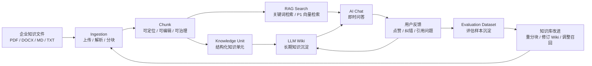
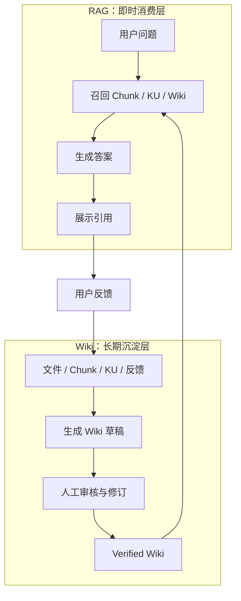
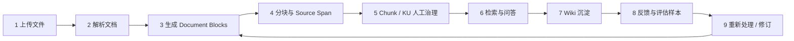
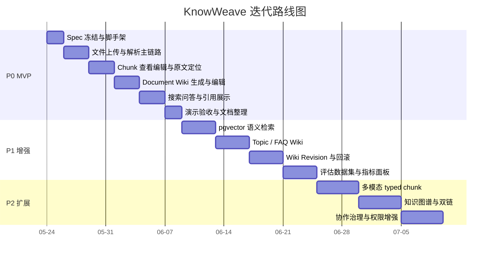
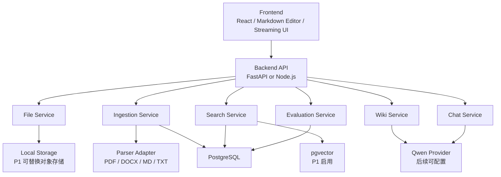
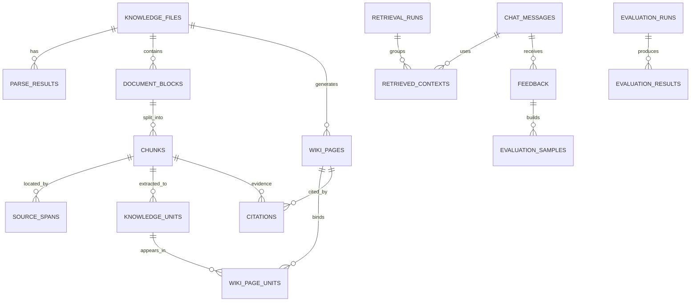
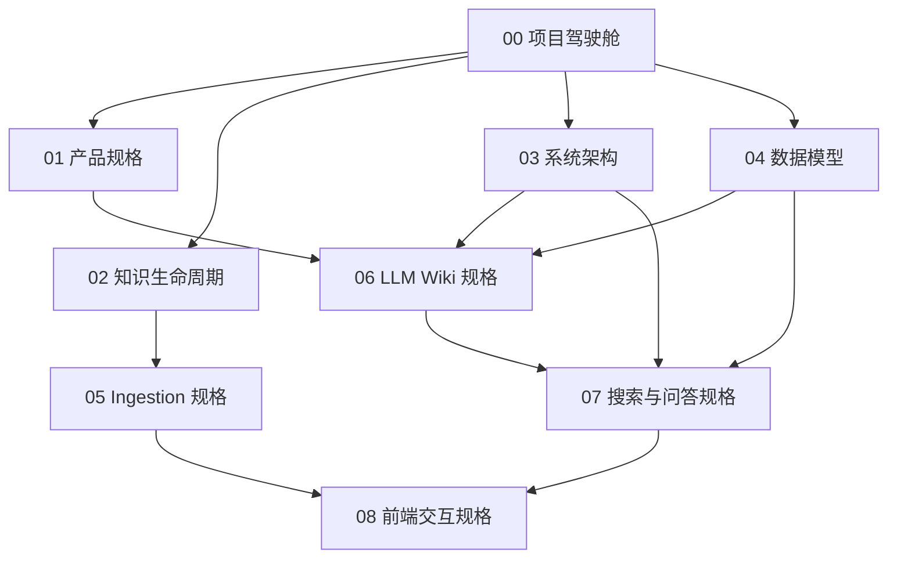

# KnowWeave 项目可视化驾驶舱

版本：v0.2
更新时间：2026-05-24
项目阶段：Spec Coding / P0 方案冻结前

## 1. 一句话定位

KnowWeave 是面向企业知识文件的 LLM Wiki 知识库管理平台。

它不是单纯的文件问答工具，而是把文件上传、解析、分块、检索、问答、反馈和人工治理连接成闭环，让组织知识逐步沉淀为可追溯、可编辑、可评估、可演化的 Wiki。

## 2. 项目总览图

## 3. 核心价值对照

| 问题 | 普通 RAG 的常见做法 | KnowWeave 的做法 |
| --- | --- | --- |
| 文件导入后是否可治理 | 黑盒解析和分块 | 展示 Document Block、Chunk、Source Span，并允许人工编辑 |
| AI 答案是否可信 | 只展示引用或不展示引用 | 回答、Wiki、Knowledge Unit 都必须能回到来源 |
| 知识是否长期沉淀 | 每次问答临时召回 | 高质量结果沉淀为 LLM Wiki |
| 用户反馈是否复用 | 反馈只作为交互结果 | 反馈、召回 chunk、答案、引用沉淀为评估数据 |
| 复杂文档如何扩展 | 一次性抽文本 | 为表格、图片、公式、代码、音视频预留 typed block 和 typed chunk |

## 4. RAG 与 Wiki 的边界

一句话边界：

- RAG 负责把知识用起来。
- Wiki 负责把知识沉淀下来。
- 人工治理负责让知识从“可用”走向“可信”。

## 5. 用户角色与核心任务

| 角色 | 主要目标 | 高频动作 | 需要看到什么 |
| --- | --- | --- | --- |
| 知识管理员 | 把文件稳定导入并治理成知识资产 | 上传、解析、重试、分块检查、生成 Wiki | 解析状态、低质量 chunk、来源定位、Wiki 状态 |
| 领域专家 | 校正 AI 生成内容，确认可信知识 | 编辑 chunk、确认 Knowledge Unit、修订 Wiki、反馈引用错误 | 原文位置、变更说明、引用链路、待审核列表 |
| 普通知识消费者 | 搜索、提问、阅读可信答案 | 搜索、问答、查看引用、浏览 Wiki | 答案、引用、Wiki 摘要、来源可用性 |
| 项目评审/观众 | 快速理解系统差异和工程完整性 | 看演示链路、看边界、看评估指标 | 端到端流程、P0/P1/P2 范围、验收结果 |

## 6. 知识生命周期

| 阶段 | 用户可操作点 | 系统必须记录 | MVP 要求 |
| --- | --- | --- | --- |
| 上传 | 选择文件、查看上传结果、删除文件 | 文件元数据、存储路径、软删除状态 | P0 |
| 解析 | 触发解析、查看失败原因、重试 | parse result、错误信息、block 列表 | P0 |
| 分块 | 选择策略、查看 chunk、编辑 chunk、忽略 chunk | chunk 内容、source span、策略版本 | P0 |
| 检索 | 搜索文件、chunk、KU、Wiki | retrieval run、命中对象、排序分数 | P0/P1 |
| 沉淀 | 生成 Document Wiki、编辑 Wiki、确认状态 | Wiki 页面、引用、状态、变更说明 | P0 |
| 评估 | 反馈答案、标记引用错误、构建样本 | query、answer、retrieved contexts、feedback | P0/P1 |

## 7. P0 / P1 / P2 路线图

## 8. P0 MVP 必须完成

| 模块 | 必须能力 | 验收信号 |
| --- | --- | --- |
| 文件管理 | 上传 txt、md、pdf、docx；软删除；查看元数据 | 文件可入库，可展示，可软删除 |
| 解析 | 文本主链路解析；生成 Document Block | 至少一种 PDF 和一种 Markdown 能进入解析结果 |
| 分块 | 段落/长度分块；chunk 列表；编辑、忽略、确认 | 用户能修改 chunk 并影响后续检索或生成 |
| 原文定位 | chunk 定位到 source span | PDF 至少能定位到页码和文本范围近似位置 |
| 搜索 | 文件、chunk、KU、Wiki 的关键词搜索 | 搜索结果类型清晰，能跳转详情 |
| AI 问答 | 基于召回上下文回答，展示引用 | 答案能看到引用来源 |
| LLM Wiki | 单文件 Document Wiki 生成、编辑、状态流转 | Wiki 有标题、正文、引用和状态 |
| 反馈评估 | 记录 query、召回 chunk、answer、citation、feedback | 可沉淀 evaluation sample |

## 9. P1 / P2 扩展预留

| 扩展方向 | P1 目标 | P2 目标 | 当前文档中已预留 |
| --- | --- | --- | --- |
| 向量检索 | PostgreSQL + pgvector 启用 embedding 检索 | 混合检索调优 | 架构、数据模型 |
| Wiki 类型 | Topic Wiki、FAQ Wiki | Knowledge Network Page | 产品、LLM Wiki |
| Wiki 版本 | wiki_revisions 落地、diff、rollback | 协作审批流 | 数据模型、LLM Wiki |
| 多模态解析 | 表格、图片、公式、代码 typed chunk | 音视频章节化、多模态检索 | 生命周期、Ingestion |
| 评估闭环 | evaluation_runs、准确率、召回率、引用命中率 | 自动回归评测和知识健康分 | 生命周期、数据模型 |
| 协作治理 | 任务状态推送、审核队列 | 多人协作、权限、评论 | 架构、数据模型 |

## 10. 系统边界图

## 11. 核心数据对象关系

## 12. 开发任务拆分

| 阶段 | 任务 | 产出 | 依赖 | 优先级 |
| --- | --- | --- | --- | --- |
| 0 | 初始化工程脚手架 | 前后端目录、配置、README、开发命令 | Spec 文档 | P0 |
| 1 | PostgreSQL + pgvector 数据库基础 | schema、migration、连接配置 | 数据模型 Spec | P0 |
| 2 | 文件上传与文件列表 | upload API、file list、soft delete | 数据库基础 | P0 |
| 3 | 文档解析与 block 生成 | parser adapter、parse result、block list | 文件上传 | P0 |
| 4 | chunking 与 source span | chunk strategy、chunk list、定位元数据 | 解析结果 | P0 |
| 5 | chunk 人工治理 UI | 查看、编辑、忽略、确认、低质量提示 | chunking | P0 |
| 6 | 搜索主链路 | 关键词搜索、结果分组、详情跳转 | chunk/KU/Wiki 数据 | P0 |
| 7 | Qwen LLM Provider | provider interface、Qwen adapter、配置 | 后端服务 | P0 |
| 8 | Document Wiki | 生成、保存、编辑、状态流转、引用 | LLM、chunk、citation | P0 |
| 9 | Chat 与引用展示 | streaming answer、retrieved contexts、citations | 搜索、LLM | P0 |
| 10 | 反馈与评估样本 | feedback、evaluation_samples、基础指标 | Chat、citation | P0/P1 |
| 11 | 演示打磨 | Demo 数据、验收脚本、风险说明 | P0 主链路 | P0 |

## 13. 关键决策记录

| 决策 | 当前结论 | 原因 | 后续观察点 |
| --- | --- | --- | --- |
| 是否引入 LangChain/LlamaIndex | MVP 暂不引入 | 避免过早绑定抽象，先保持可控 | 当检索、工具编排复杂度上升后再评估 |
| 数据库选型 | PostgreSQL + pgvector | 兼顾关系模型、全文检索和向量扩展 | P1 启用 embedding 后验证性能 |
| LLM 选型 | 初期 Qwen 全家桶 | 国内生态易接入，后续做 Provider 抽象 | Web 配置多 Provider |
| Wiki 存储 | 数据库主存储，非 Git 主存储 | 便于权限、状态、引用和版本管理 | 可支持 Markdown 导出 |
| DeepParseX | 只参考架构与功能边界 | 避免照搬代码，保持项目原创性 | 解析器 adapter 可吸收思想 |
| 多模态 | MVP 预留 typed block/chunk | 控制周期，保留扩展位置 | P1/P2 补表格、图片、公式、音视频 |

## 14. 风险与应对

| 风险 | 影响 | 应对 |
| --- | --- | --- |
| Spec 太长，读者难以理解 | 评审和开发沟通成本高 | 用本驾驶舱作为入口，长文档只承载细节 |
| PDF 定位难度高 | chunk 编辑体验和引用可信度受影响 | MVP 先做到页码和文本范围，P1 优化坐标级定位 |
| AI 生成 Wiki 幻觉 | 知识沉淀不可信 | Wiki 关键结论强制 citation，默认 draft |
| 分块质量不稳定 | 检索和回答效果不稳定 | 记录策略版本，允许人工编辑和低质量提示 |
| 多模态解析超期 | 项目范围失控 | P0 只打通文本主链路，typed chunk 预留扩展 |
| 飞书云端和本地文档不一致 | 协作信息漂移 | 本地 docs 为版本化事实源，飞书为可视化协作入口 |

## 15. 评估指标

| 指标 | 说明 | MVP 记录 | P1 目标 |
| --- | --- | --- | --- |
| Recall@K | 标准答案相关 chunk 是否进入前 K 个召回 | 预留 retrieval_run_id 和 retrieved_contexts | 建立评测集后计算 |
| 准确率 | 回答是否正确 | 人工反馈标注 | 形成按数据集统计 |
| 引用命中率 | 答案引用是否支持关键结论 | citation + feedback | 自动/半自动评估 |
| 低质量 chunk 比例 | 过短、过长、无 source span、重复等 chunk 占比 | chunk metadata | 形成质量面板 |
| Wiki 修订采纳率 | AI 或反馈触发的修订被采纳比例 | P0 手工记录，P1 revision | 进入治理指标 |
| 反馈闭环率 | 负反馈是否形成修复动作或评测样本 | feedback + evaluation_samples | 形成闭环报表 |

## 16. 文档阅读路径

| 想了解什么 | 先读哪份 |
| --- | --- |
| 项目是什么、为什么做、MVP 有什么 | `00-project-dashboard.md`、`01-product-spec.md` |
| 上传到沉淀的完整流程 | `02-knowledge-lifecycle-spec.md` |
| 技术架构和模块边界 | `03-system-architecture-spec.md` |
| 表结构、关系、状态和扩展对象 | `04-data-model-spec.md` |
| 文件解析、分块、source span | `05-ingestion-spec.md` |
| LLM Wiki 生成、编辑、引用、revision | `06-llm-wiki-spec.md` |
| 搜索、RAG 问答、流式回答、引用和反馈 | `07-search-and-chat-spec.md` |
| 页面交互、chunk 治理 UI、Source Viewer、Chat/Wiki/Search 展示 | `08-frontend-spec.md` |

## 17. 下一步

1. 将本驾驶舱同步到飞书 `KnowWeave` 文件夹，作为协作入口。
2. 在飞书中为核心流程创建可视化画板。
3. 创建或维护任务/迭代多维表格，按 P0/P1/P2 管理开发状态。
4. 继续拆分 `09-acceptance-test-spec.md`、`10-evaluation-spec.md`。
