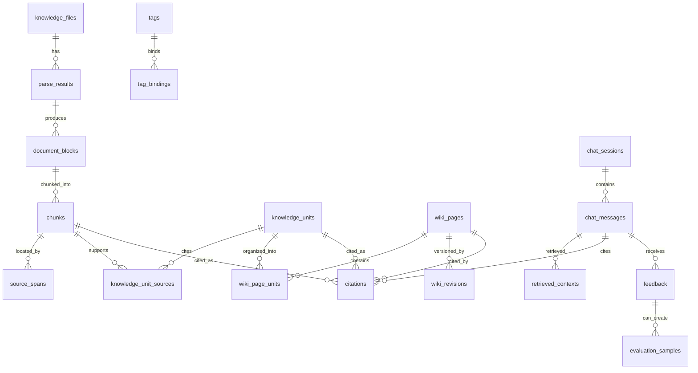
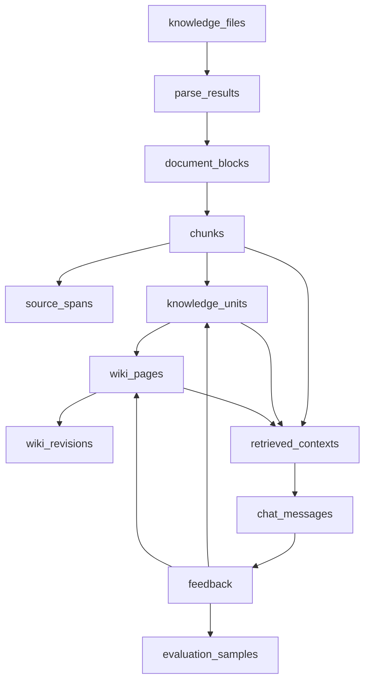

# KnowWeave 数据模型规格说明书

版本：v0.8
日期：2026-05-23
状态：草案
关联文档：`docs/01-product-spec.md`、`docs/02-knowledge-lifecycle-spec.md`、`docs/03-system-architecture-spec.md`

## 1. 文档目标

本文定义 KnowWeave MVP 的核心数据模型，用于指导后续 PostgreSQL、SQLAlchemy、API Schema 和迁移脚本设计。

本文回答以下问题：

- File、Document Block、Chunk、Knowledge Unit、Wiki、Chat、Feedback 等对象如何落表。
- source span 如何支撑 chunk 原文定位。
- 软删除、状态流转、引用失效和审计线索如何表达。
- Wiki Revision 如何记录 Markdown 快照、变更来源、引用快照和可回滚历史。
- MVP 使用 PostgreSQL + pgvector 时，哪些字段先落库，哪些能力 P1/P2 启用。

## 2. 设计原则

### 2.1 原文件是事实源

原始文件记录不可被 AI 生成内容覆盖。AI 生成的 chunk、Knowledge Unit、Wiki 和回答都必须能追溯到 File 或人工来源。

### 2.2 数据模型服务人工治理

KnowWeave 的核心不是只保存 RAG 运行结果，而是保存可被用户查看、编辑、确认、忽略、反馈和评估的知识资产。

### 2.3 MVP 先关系化，向量能力预留

MVP 使用 PostgreSQL 关系表和全文检索完成闭环。pgvector 扩展作为数据库基线安装，但 embedding 字段、向量索引和语义检索在 P1 启用。

### 2.4 typed chunk 不绑定纯文本

Chunk 必须支持 text、table、image、formula、code、transcript、mixed 等类型。MVP 主要生成 text chunk，但表结构不能把 chunk 设计成只能保存纯文本。

### 2.5 软删除优先

MVP 文件删除采用软删除。软删除后，关联 chunk 默认不参与检索和问答，Knowledge Unit、Wiki、Citation、Chat、Evaluation Sample 保留审计线索，并在展示时提示来源不可用。

## 3. 命名与通用字段约定

### 3.1 命名约定

- 表名使用 snake_case 复数形式，例如 `knowledge_files`。
- 主键字段统一为 `id`。
- 外键字段使用 `{entity}_id`。
- 时间字段使用 `created_at`、`updated_at`、`deleted_at`。
- 状态字段使用 `status` 或业务明确的 `{name}_status`。
- JSON 扩展字段统一使用 `metadata` 或更明确的 `{name}_metadata`。

### 3.2 ID 策略

推荐使用 UUID 作为主键。

MVP 允许前端展示短 ID 或序号，但数据库主键不依赖文件名、路径或自增顺序。

### 3.3 通用审计字段

核心表建议包含：

- `id`
- `created_at`
- `updated_at`
- `created_by`
- `updated_by`
- `deleted_at`

MVP 可以采用单用户模式，`created_by` 和 `updated_by` 可为空或使用默认系统用户。

### 3.4 JSON 字段使用边界

允许使用 JSONB 保存多类型扩展信息，例如表格行列、图片 OCR、公式变量、代码符号、模型调用参数。

不应把核心查询条件只放在 JSONB 中。以下字段必须关系化：

- file_id
- chunk_id
- knowledge_unit_id
- wiki_page_id
- status
- type
- source span 的核心定位字段
- 是否参与检索

## 4. 核心实体总览

MVP 核心实体：

```text
knowledge_files
  -> parse_results
      -> document_blocks
          -> chunks
              -> source_spans
              -> knowledge_unit_sources
                  -> knowledge_units
                      -> wiki_page_units
                          -> wiki_pages

chat_sessions
  -> chat_messages
      -> retrieved_contexts
      -> citations
      -> feedback
          -> evaluation_samples

wiki_pages
  -> wiki_revisions
```

P2 预留链路：

```text
knowledge_files(audio/video)
  -> parse_results
      -> timeline_blocks
          -> chunks(transcript/mixed)
              -> source_spans(time range)
```

辅助实体：

```text
tags
tag_bindings
model_provider_configs
```

### 4.1 MVP ER 图



说明：

- `knowledge_files` 是原始事实源。
- `document_blocks` 是解析中间层，负责保留文档结构。
- `chunks` 是检索、引用和知识治理的证据片段。
- `knowledge_units` 是人工可治理的知识点。
- `wiki_pages` 是长期沉淀的结构化页面。
- `wiki_revisions` 保存 Wiki 历史快照，MVP 预留，P1 启用版本对比和回滚。
- `retrieved_contexts` 保存 RAG 召回过程，支撑反馈与评测闭环。
- `tags` 通过 `tag_bindings` 绑定到文件、Knowledge Unit 和 Wiki Page。该关系是多态绑定，ER 图中不强制画出每一条目标外键。

### 4.2 数据流关系图



这张图表达两个闭环：

- Ingestion Loop：文件进入系统后，经过解析、分块、知识单元整理，最终沉淀为 Wiki。
- Usage Feedback Loop：用户问答产生召回、回答和反馈，反馈可以继续沉淀为评测样本、知识单元或 Wiki 修订。

### 4.3 暂不落表但需预留的对象

以下对象对产品长期形态重要，但 MVP 可以先不单独建表，避免数据模型过重。

用户与权限：

- MVP 可采用单用户或默认系统用户。
- `created_by`、`updated_by`、`verified_by` 等字段先预留。
- P1/P2 再引入 `users`、`roles`、`permissions`。

目录树：

- MVP 可以用 `knowledge_files.directory_path` 表达轻量目录。
- 如果后续需要拖拽排序、层级权限、目录统计，再引入 `directories` 表。

任务系统：

- MVP 可以在业务表中记录 `status`、`error_message` 和 `created_at`。
- P1 引入后台任务后，再增加 `jobs` 或 `task_runs`，记录 parsing、chunking、indexing、wiki_generation、evaluation 等任务。

评测运行：

- MVP 保存 `evaluation_samples` 和用户反馈即可。
- P1 如果需要批量运行评测集、计算准确率和召回率，再引入 `evaluation_runs` 和 `evaluation_results`。

解析资产：

- MVP 可用 `document_blocks.asset_ref` 和 `metadata` 记录图片、表格、公式、附件占位。
- P1/P2 如需管理抽取图片、表格文件、OCR 结果、关键帧，再引入 `extracted_assets`。

Wiki 双链与知识网络：

- MVP 可通过 `wiki_page_units`、`citations` 和 `tag_bindings` 支撑基础关联。
- P1/P2 如需类 Obsidian 的页面内链、反链、知识图谱，再引入 `wiki_links` 或 `knowledge_edges`。

## 5. 枚举值

### 5.1 file_status

- `rejected`
- `uploaded`
- `queued_for_parse`
- `parsing`
- `parse_succeeded`
- `parse_failed`
- `parse_needs_review`
- `soft_deleted`

### 5.2 file_type

MVP：

- `txt`
- `markdown`
- `pdf`
- `docx`

P2 预留：

- `pptx`
- `xlsx`
- `html`
- `audio`
- `video`
- `other`

### 5.3 block_type

- `heading`
- `paragraph`
- `list`
- `table`
- `image`
- `formula`
- `code`
- `page_break`
- `mixed`
- `unknown`

### 5.4 chunk_type

- `text`
- `table`
- `image`
- `formula`
- `code`
- `transcript`
- `mixed`

### 5.5 chunk_status

- `draft`
- `needs_review`
- `verified`
- `ignored`
- `archived`

`ignored` 和 `archived` 默认不参与检索、问答和知识单元自动生成。

### 5.5.1 block_status

MVP 不单独引入 `block_status` 枚举。Document Block 是否参与分块由 `document_blocks.is_ignored` 表达：

- `is_ignored = false`：默认参与 chunking。
- `is_ignored = true`：被用户排除，不参与后续自动 chunking。

该字段只控制 block 是否进入重新分块流程，不代表原始文件内容被删除。

### 5.6 curation_status

- `draft`
- `pending_review`
- `verified`
- `archived`

适用于 Knowledge Unit 和 Wiki Page。

### 5.7 feedback_type

- `answer_helpful`
- `answer_wrong`
- `citation_helpful`
- `citation_wrong`
- `retrieval_helpful`
- `retrieval_irrelevant`
- `retrieval_missing`
- `chunk_low_quality`
- `wiki_needs_update`

说明：

- `answer_helpful` / `answer_wrong` 作用于 `chat_message`。
- `citation_helpful` / `citation_wrong` 作用于 `citation`。
- `retrieval_helpful` / `retrieval_irrelevant` 作用于 `retrieved_context`。
- `retrieval_missing` 作用于 `chat_message` 或搜索上下文。
- `chunk_low_quality` 作用于 `chunk`，可联动 `quality_signals`。
- `wiki_needs_update` 作用于 `wiki_page`。

## 6. 表结构

### 6.1 knowledge_files

用途：保存用户上传的原始知识文件记录。

核心字段：

| 字段 | 类型 | MVP | 说明 |
| --- | --- | --- | --- |
| `id` | uuid | 是 | 文件 ID |
| `name` | text | 是 | 展示文件名 |
| `original_filename` | text | 是 | 上传时文件名 |
| `file_type` | text | 是 | txt、markdown、pdf、docx 等 |
| `mime_type` | text | 是 | MIME 类型 |
| `size_bytes` | bigint | 是 | 文件大小 |
| `sha256` | text | 是 | 重复检测 |
| `storage_path` | text | 是 | 原文件存储路径 |
| `directory_path` | text | 是 | 用户目录，可为空 |
| `status` | text | 是 | file_status |
| `summary` | text | 否 | 文件摘要 |
| `source_note` | text | 否 | 来源说明 |
| `deleted_at` | timestamptz | 是 | 软删除时间 |
| `metadata` | jsonb | 是 | 扩展信息 |
| `created_at` | timestamptz | 是 | 创建时间 |
| `updated_at` | timestamptz | 是 | 更新时间 |

约束：

- `storage_path` 不应暴露为公网 URL。
- `sha256` 可用于重复提示，但不强制全局唯一。
- `deleted_at IS NOT NULL` 或 `status = soft_deleted` 时，文件默认不可进入检索和问答。

索引：

- `idx_files_status`
- `idx_files_file_type`
- `idx_files_sha256`
- `idx_files_created_at`

### 6.2 parse_results

用途：保存一次解析运行的结果、版本、警告和错误。

核心字段：

| 字段 | 类型 | MVP | 说明 |
| --- | --- | --- | --- |
| `id` | uuid | 是 | 解析结果 ID |
| `file_id` | uuid | 是 | 关联 knowledge_files |
| `parser_name` | text | 是 | 解析器名称 |
| `parser_version` | text | 是 | 解析器版本 |
| `status` | text | 是 | parse_pending、parsing、parse_succeeded、parse_failed |
| `raw_text` | text | 是 | 解析出的全文文本 |
| `warnings` | jsonb | 是 | 解析警告 |
| `error_message` | text | 否 | 失败原因 |
| `parse_metadata` | jsonb | 是 | 页数、编码、解析模式等 |
| `created_at` | timestamptz | 是 | 创建时间 |

约束：

- 一个文件可以有多个 parse_results。
- 业务层应能识别当前激活的解析结果，MVP 可通过最新成功结果判断，P1 可增加 `is_active`。

索引：

- `idx_parse_results_file_id`
- `idx_parse_results_status`
- `idx_parse_results_created_at`

### 6.3 document_blocks

用途：保存从 PDF、Markdown、DOCX 等容器文档中抽取出的结构化 block。

核心字段：

| 字段 | 类型 | MVP | 说明 |
| --- | --- | --- | --- |
| `id` | uuid | 是 | block ID |
| `file_id` | uuid | 是 | 文件 ID |
| `parse_result_id` | uuid | 是 | 解析结果 ID |
| `parent_block_id` | uuid | 否 | 父 block |
| `block_index` | integer | 是 | 阅读顺序 |
| `block_type` | text | 是 | heading、paragraph、table 等 |
| `raw_content` | text | 是 | block 文本或占位描述 |
| `normalized_content` | text | 否 | 清洗后的内容 |
| `is_ignored` | boolean | 是 | 是否被用户排除在 chunking 之外 |
| `page_number` | integer | 否 | PDF 页码 |
| `char_start` | integer | 否 | 在 raw_text 中的起始字符 |
| `char_end` | integer | 否 | 在 raw_text 中的结束字符 |
| `bbox` | jsonb | 否 | 页面坐标，P1 精细高亮使用 |
| `asset_ref` | text | 否 | 图片、表格、公式等资产路径或编号 |
| `context_before` | text | 否 | 前文 |
| `context_after` | text | 否 | 后文 |
| `metadata` | jsonb | 是 | 类型扩展信息 |
| `created_at` | timestamptz | 是 | 创建时间 |

约束：

- `block_index` 在同一 `parse_result_id` 下必须保持稳定顺序。
- table、image、formula、code block 即使 MVP 不深度解析，也应保留类型、位置和上下文。
- `is_ignored = true` 的 block 不应进入默认 chunking，但原始 block 记录仍应保留。

索引：

- `idx_document_blocks_file_id`
- `idx_document_blocks_parse_result_id`
- `idx_document_blocks_type`
- `idx_document_blocks_order`

### 6.4 timeline_blocks

用途：为音视频时间轴内容预留结构。P2 启用，MVP 只定义表结构边界，不作为上传解析验收。

核心字段：

| 字段 | 类型 | MVP | 说明 |
| --- | --- | --- | --- |
| `id` | uuid | 预留 | timeline block ID |
| `file_id` | uuid | 预留 | 媒体文件 ID |
| `parse_result_id` | uuid | 预留 | 解析结果 ID |
| `block_index` | integer | 预留 | 时间轴顺序 |
| `start_ms` | integer | 预留 | 起始时间毫秒 |
| `end_ms` | integer | 预留 | 结束时间毫秒 |
| `speaker` | text | 预留 | 说话人 |
| `transcript` | text | 预留 | 转写文本 |
| `keyframe_refs` | jsonb | 预留 | 关键帧引用 |
| `screen_ocr_text` | text | 预留 | 屏幕 OCR |
| `metadata` | jsonb | 预留 | 扩展信息 |

约束：

- `start_ms` 必须小于或等于 `end_ms`。
- transcript chunk 后续应通过 source span 指向 timeline block 和时间范围。

### 6.5 chunks

用途：保存可检索、可引用、可治理的证据片段。

核心字段：

| 字段 | 类型 | MVP | 说明 |
| --- | --- | --- | --- |
| `id` | uuid | 是 | chunk ID |
| `file_id` | uuid | 是 | 文件 ID |
| `parse_result_id` | uuid | 是 | 解析结果 ID |
| `document_block_id` | uuid | 否 | 来源文档 block |
| `timeline_block_id` | uuid | 预留 | 来源时间轴 block |
| `parent_chunk_id` | uuid | 否 | 父 chunk |
| `chunk_index` | integer | 是 | 文件内顺序 |
| `chunk_type` | text | 是 | text、table、image 等 |
| `raw_content` | text | 是 | 原始 chunk 内容 |
| `edited_content` | text | 否 | 用户编辑后的内容 |
| `is_manually_edited` | boolean | 是 | 是否被用户手工编辑过 |
| `summary` | text | 否 | 摘要或可检索说明 |
| `status` | text | 是 | chunk_status |
| `quality_signals` | jsonb | 是 | 质量信号 |
| `token_count` | integer | 否 | token 数 |
| `char_count` | integer | 是 | 字符数 |
| `search_text` | text | 是 | 用于全文检索的文本 |
| `metadata` | jsonb | 是 | typed chunk 扩展信息 |
| `is_searchable` | boolean | 是 | 是否参与检索 |
| `created_at` | timestamptz | 是 | 创建时间 |
| `updated_at` | timestamptz | 是 | 更新时间 |

约束：

- `edited_content` 不覆盖 `raw_content`。
- 当 `edited_content` 非空或用户保存过修订时，`is_manually_edited` 应为 true。
- `source_spans` 不应因为用户编辑 `edited_content` 而丢失。
- `status IN ('ignored', 'archived')` 时，`is_searchable` 默认应为 false。
- 文件软删除后，业务层必须排除其 chunk。

索引：

- `idx_chunks_file_id`
- `idx_chunks_status`
- `idx_chunks_type`
- `idx_chunks_parent_id`
- `idx_chunks_is_searchable`
- `idx_chunks_search_text_fts`，MVP 使用 PostgreSQL full text search。

P1 预留：

- `embedding vector(...)`
- `embedding_model`
- `embedded_at`
- pgvector ANN 索引

### 6.6 source_spans

用途：保存 chunk、Knowledge Unit、Wiki、Citation 回溯原文件位置所需的定位信息。

核心字段：

| 字段 | 类型 | MVP | 说明 |
| --- | --- | --- | --- |
| `id` | uuid | 是 | source span ID |
| `file_id` | uuid | 是 | 文件 ID |
| `chunk_id` | uuid | 否 | 关联 chunk |
| `document_block_id` | uuid | 否 | 关联 document block |
| `timeline_block_id` | uuid | 预留 | 关联 timeline block |
| `page_number` | integer | 否 | 页码 |
| `char_start` | integer | 否 | 字符起点 |
| `char_end` | integer | 否 | 字符终点 |
| `line_start` | integer | 否 | 行起点 |
| `line_end` | integer | 否 | 行终点 |
| `column_start` | integer | 否 | 列起点 |
| `column_end` | integer | 否 | 列终点 |
| `bbox` | jsonb | 否 | 页面坐标 |
| `time_start_ms` | integer | 预留 | 媒体起始时间 |
| `time_end_ms` | integer | 预留 | 媒体结束时间 |
| `selector` | jsonb | 否 | 复杂定位选择器 |
| `preview_text` | text | 是 | 引用预览文本 |
| `created_at` | timestamptz | 是 | 创建时间 |

约束：

- 至少应包含一种定位方式：页码、document_block_id、timeline_block_id、字符范围、行列范围、bbox 或时间戳。
- PDF MVP 至少保存 `page_number` 和 `document_block_id`。
- Markdown MVP 优先保存 `line_start` 和 `line_end`。
- 句号、标点或滑动窗口切分的 chunk 应尽量保存 `char_start` 和 `char_end`。

索引：

- `idx_source_spans_file_id`
- `idx_source_spans_chunk_id`
- `idx_source_spans_document_block_id`
- `idx_source_spans_timeline_block_id`

### 6.7 knowledge_units

用途：保存人工可治理的细粒度知识点。

核心字段：

| 字段 | 类型 | MVP | 说明 |
| --- | --- | --- | --- |
| `id` | uuid | 是 | 知识单元 ID |
| `title` | text | 是 | 标题 |
| `unit_type` | text | 是 | concept、rule、process、faq、decision、glossary |
| `content` | text | 是 | 正文 |
| `summary` | text | 否 | 摘要 |
| `status` | text | 是 | curation_status |
| `trust_level` | integer | 否 | 可信等级，可选 |
| `applicable_scope` | text | 否 | 适用范围 |
| `created_from` | text | 是 | chunk、chat、wiki、manual |
| `search_text` | text | 是 | 全文检索文本 |
| `metadata` | jsonb | 是 | 扩展信息 |
| `created_at` | timestamptz | 是 | 创建时间 |
| `updated_at` | timestamptz | 是 | 更新时间 |
| `verified_at` | timestamptz | 否 | 确认时间 |
| `archived_at` | timestamptz | 否 | 废弃时间 |

约束：

- AI 生成的 Knowledge Unit 默认不得直接进入 `verified`。
- `verified` 状态应记录确认时间和确认人，MVP 可先只记录时间。
- `archived` 默认不参与问答召回。
- Knowledge Unit 的来源可用性由 `knowledge_unit_sources.source_available` 和关联文件状态计算，不在本表冗余保存。

索引：

- `idx_knowledge_units_status`
- `idx_knowledge_units_type`
- `idx_knowledge_units_created_from`
- `idx_knowledge_units_search_text_fts`

P1 预留：

- 合并、拆分、版本 diff。
- embedding 字段与语义检索。

### 6.8 knowledge_unit_sources

用途：保存 Knowledge Unit 与 chunk、source span、人工来源之间的引用关系。

核心字段：

| 字段 | 类型 | MVP | 说明 |
| --- | --- | --- | --- |
| `id` | uuid | 是 | 来源关系 ID |
| `knowledge_unit_id` | uuid | 是 | 知识单元 ID |
| `file_id` | uuid | 否 | 来源文件 |
| `chunk_id` | uuid | 否 | 来源 chunk |
| `source_span_id` | uuid | 否 | 来源定位 |
| `source_type` | text | 是 | chunk、manual、chat、wiki |
| `source_label` | text | 是 | 展示标签 |
| `source_available` | boolean | 是 | 来源是否可用 |
| `created_at` | timestamptz | 是 | 创建时间 |

约束：

- 每个 verified Knowledge Unit 至少应有一个可解释来源，人工创建时可使用 `source_type = manual`。
- 文件软删除后，来源关系保留，但 `source_available` 应展示为 false 或由查询时动态计算。

索引：

- `idx_ku_sources_unit_id`
- `idx_ku_sources_chunk_id`
- `idx_ku_sources_file_id`

### 6.9 wiki_pages

用途：保存 LLM Wiki 页面。

核心字段：

| 字段 | 类型 | MVP | 说明 |
| --- | --- | --- | --- |
| `id` | uuid | 是 | Wiki ID |
| `title` | text | 是 | 标题 |
| `wiki_type` | text | 是 | document_wiki、topic_wiki、faq_wiki |
| `status` | text | 是 | curation_status |
| `summary` | text | 否 | 摘要 |
| `content_markdown` | text | 是 | Markdown 正文 |
| `source_file_id` | uuid | 否 | Document Wiki 的文件 ID |
| `generation_prompt_version` | text | 否 | 生成模板版本 |
| `search_text` | text | 是 | 全文检索文本 |
| `metadata` | jsonb | 是 | 扩展信息 |
| `created_at` | timestamptz | 是 | 创建时间 |
| `updated_at` | timestamptz | 是 | 更新时间 |
| `verified_at` | timestamptz | 否 | 确认时间 |

约束：

- MVP 只要求 `document_wiki`。
- Wiki 关键结论必须通过 citation 或 wiki_page_units 追溯来源。
- AI 生成 Wiki 默认是 `draft` 或 `pending_review`。
- MVP 可只保存当前 `content_markdown`，P1 启用 Wiki Revision 历史、版本对比和回滚。
- Document Wiki 的来源文件可用性由 `source_file_id` 关联的文件状态计算，不在本表冗余保存。

索引：

- `idx_wiki_pages_type`
- `idx_wiki_pages_status`
- `idx_wiki_pages_source_file_id`
- `idx_wiki_pages_search_text_fts`

### 6.10 wiki_revisions

用途：保存 Wiki 页面的历史版本。MVP 预留基础表，P1 启用版本对比和回滚。

核心字段：

| 字段 | 类型 | MVP | 说明 |
| --- | --- | --- | --- |
| `id` | uuid | 预留 | Revision ID |
| `wiki_page_id` | uuid | 预留 | Wiki Page ID |
| `revision_number` | integer | 预留 | 页面内递增版本号 |
| `title_snapshot` | text | 预留 | 标题快照 |
| `content_markdown_snapshot` | text | 预留 | Markdown 正文快照 |
| `summary_snapshot` | text | 预留 | 摘要快照 |
| `citation_snapshot` | jsonb | 预留 | 引用快照 |
| `change_summary` | text | 预留 | 变更说明 |
| `edit_source` | text | 预留 | ai_generation、manual_edit、regeneration、rollback |
| `model_provider` | text | 预留 | AI 生成时的模型供应商 |
| `model_name` | text | 预留 | AI 生成时的模型名称 |
| `prompt_version` | text | 预留 | Prompt 版本 |
| `created_by` | uuid | 预留 | 创建人 |
| `created_at` | timestamptz | 预留 | 创建时间 |

约束：

- `wiki_page_id + revision_number` 应唯一。
- Revision 是历史快照，不应被直接覆盖。
- 回滚应生成新的 revision，而不是删除中间历史。
- Citation 正式关系仍以 `citations` 表为准，`citation_snapshot` 只用于版本审查。

索引：

- `idx_wiki_revisions_wiki_page_id`
- `idx_wiki_revisions_revision_number`
- `idx_wiki_revisions_edit_source`

### 6.11 wiki_page_units

用途：保存 Wiki 与 Knowledge Unit 的关联关系。

核心字段：

| 字段 | 类型 | MVP | 说明 |
| --- | --- | --- | --- |
| `id` | uuid | 是 | 关系 ID |
| `wiki_page_id` | uuid | 是 | Wiki ID |
| `knowledge_unit_id` | uuid | 是 | 知识单元 ID |
| `section_anchor` | text | 否 | Wiki 段落锚点 |
| `sort_order` | integer | 是 | 展示顺序 |
| `created_at` | timestamptz | 是 | 创建时间 |

约束：

- 同一个 Wiki 页面内，Knowledge Unit 可以出现多次，但 MVP 建议避免重复绑定。

索引：

- `idx_wiki_page_units_wiki_id`
- `idx_wiki_page_units_unit_id`

### 6.12 citations

用途：保存 Wiki、Chat Answer、Knowledge Unit 等内容与来源证据之间的引用关系。

核心字段：

| 字段 | 类型 | MVP | 说明 |
| --- | --- | --- | --- |
| `id` | uuid | 是 | citation ID |
| `target_type` | text | 是 | wiki_page、chat_message、knowledge_unit |
| `target_id` | uuid | 是 | 被引用对象 ID |
| `file_id` | uuid | 否 | 来源文件 |
| `chunk_id` | uuid | 否 | 来源 chunk |
| `knowledge_unit_id` | uuid | 否 | 来源知识单元 |
| `source_span_id` | uuid | 否 | 来源定位 |
| `label` | text | 是 | 展示标签 |
| `preview_text` | text | 否 | 引用预览 |
| `source_available` | boolean | 是 | 来源是否可用 |
| `created_at` | timestamptz | 是 | 创建时间 |

约束：

- `target_type + target_id` 表示引用挂载对象。
- 文件软删除后 citation 不删除，但展示时提示来源不可用。
- MVP 可以不强制外键到多态 target，但业务层必须校验 target 存在。
- 每条 citation 至少应包含一种来源：`chunk_id`、`knowledge_unit_id`、`source_span_id` 或人工来源 metadata。
- `target_type = chat_message` 时，推荐至少包含 `chunk_id` 或 `source_span_id`，保证回答可回溯到原文证据。
- `target_type = wiki_page` 时，可以引用 `knowledge_unit_id` 或 `chunk_id`；关键结论不得只有无来源文本。
- `target_type = knowledge_unit` 时，推荐优先通过 `knowledge_unit_sources` 维护来源，`citations` 可用于统一展示。

索引：

- `idx_citations_target`
- `idx_citations_file_id`
- `idx_citations_chunk_id`

### 6.13 chat_sessions

用途：保存用户问答会话。

核心字段：

| 字段 | 类型 | MVP | 说明 |
| --- | --- | --- | --- |
| `id` | uuid | 是 | 会话 ID |
| `title` | text | 否 | 会话标题 |
| `scope` | jsonb | 是 | 检索范围 |
| `created_at` | timestamptz | 是 | 创建时间 |
| `updated_at` | timestamptz | 是 | 更新时间 |

### 6.14 chat_messages

用途：保存问答消息和最终回答内容。

核心字段：

| 字段 | 类型 | MVP | 说明 |
| --- | --- | --- | --- |
| `id` | uuid | 是 | 消息 ID |
| `session_id` | uuid | 是 | 会话 ID |
| `role` | text | 是 | user、assistant、system |
| `content_markdown` | text | 是 | 消息内容 |
| `status` | text | 是 | completed、failed、partial |
| `model_provider` | text | 否 | 模型供应商 |
| `model_name` | text | 否 | 模型名称 |
| `prompt_version` | text | 否 | Prompt 版本 |
| `created_at` | timestamptz | 是 | 创建时间 |

约束：

- 流式输出完成后保存的 `content_markdown` 必须与前端最终看到的内容一致。
- 失败或中断时应保留 `partial` 或 `failed` 状态。

索引：

- `idx_chat_messages_session_id`
- `idx_chat_messages_created_at`

### 6.15 retrieved_contexts

用途：保存一次问答或搜索召回了哪些上下文，支撑反馈沉淀和评测集构建。

核心字段：

| 字段 | 类型 | MVP | 说明 |
| --- | --- | --- | --- |
| `id` | uuid | 是 | 召回记录 ID |
| `retrieval_run_id` | uuid | 是 | 一次检索或问答召回的分组 ID |
| `chat_message_id` | uuid | 否 | 关联 assistant 消息 |
| `query_text` | text | 是 | 查询文本 |
| `result_type` | text | 是 | chunk、knowledge_unit、wiki_page、file |
| `result_id` | uuid | 是 | 结果 ID |
| `rank` | integer | 是 | 排名 |
| `score` | numeric | 否 | 分数 |
| `retrieval_strategy` | text | 是 | keyword、semantic、hybrid |
| `retrieval_params` | jsonb | 是 | top_k、过滤条件等 |
| `used_in_answer` | boolean | 是 | 是否进入回答上下文 |
| `created_at` | timestamptz | 是 | 创建时间 |

约束：

- 同一次搜索或问答召回产生的多条结果必须共享同一个 `retrieval_run_id`。
- MVP `retrieval_strategy` 主要为 `keyword`。
- `used_in_answer` 可用于计算引用覆盖和召回质量。

索引：

- `idx_retrieved_contexts_message_id`
- `idx_retrieved_contexts_run_id`
- `idx_retrieved_contexts_result`

### 6.16 feedback

用途：保存用户对搜索结果、问答答案、Wiki 页面或 chunk 的反馈。

核心字段：

| 字段 | 类型 | MVP | 说明 |
| --- | --- | --- | --- |
| `id` | uuid | 是 | 反馈 ID |
| `target_type` | text | 是 | chat_message、retrieved_context、citation、wiki_page、chunk |
| `target_id` | uuid | 是 | 目标对象 ID |
| `feedback_type` | text | 是 | feedback_type |
| `comment` | text | 否 | 用户说明 |
| `metadata` | jsonb | 是 | 扩展信息 |
| `created_at` | timestamptz | 是 | 创建时间 |

索引：

- `idx_feedback_target`
- `idx_feedback_type`

### 6.17 evaluation_samples

用途：保存评测样本，用于后续计算准确率、召回率和引用质量。

核心字段：

| 字段 | 类型 | MVP | 说明 |
| --- | --- | --- | --- |
| `id` | uuid | 是 | 样本 ID |
| `question` | text | 是 | 标准问题 |
| `expected_answer` | text | 否 | 期望回答 |
| `expected_source_files` | jsonb | 是 | 标准来源文件 ID 列表 |
| `expected_source_chunks` | jsonb | 是 | 标准来源 chunk ID 列表 |
| `created_from` | text | 是 | manual、chat_feedback、wiki_review |
| `source_chat_message_id` | uuid | 否 | 来源消息 |
| `status` | text | 是 | draft、verified、archived |
| `difficulty` | text | 否 | easy、medium、hard |
| `metadata` | jsonb | 是 | 标签、范围、评测参数 |
| `created_at` | timestamptz | 是 | 创建时间 |
| `updated_at` | timestamptz | 是 | 更新时间 |

约束：

- MVP 可以先保存候选样本。
- 召回率计算依赖 `expected_source_chunks` 或 `expected_source_files`。

索引：

- `idx_evaluation_samples_status`
- `idx_evaluation_samples_created_from`

### 6.18 tags

用途：保存标签定义。

核心字段：

| 字段 | 类型 | MVP | 说明 |
| --- | --- | --- | --- |
| `id` | uuid | 是 | 标签 ID |
| `name` | text | 是 | 标签名 |
| `description` | text | 否 | 标签说明 |
| `color` | text | 否 | 展示颜色 |
| `created_at` | timestamptz | 是 | 创建时间 |

约束：

- `name` 建议唯一。

### 6.19 tag_bindings

用途：保存标签与文件、Knowledge Unit、Wiki 的多态绑定。

核心字段：

| 字段 | 类型 | MVP | 说明 |
| --- | --- | --- | --- |
| `id` | uuid | 是 | 绑定 ID |
| `tag_id` | uuid | 是 | 标签 ID |
| `target_type` | text | 是 | file、knowledge_unit、wiki_page |
| `target_id` | uuid | 是 | 目标 ID |
| `created_at` | timestamptz | 是 | 创建时间 |

约束：

- `tag_id + target_type + target_id` 应唯一。
- MVP 支持 `target_type` 为 `file`、`knowledge_unit`、`wiki_page`。
- `tag_bindings.target_id` 是多态目标 ID，业务层必须根据 `target_type` 校验目标对象存在。
- MVP 不建议给 chunk 打标签，chunk 优先使用 `chunk_type`、`status`、`quality_signals` 和 `source_spans` 治理；后续如有需要可扩展 `target_type = chunk`。

### 6.20 model_provider_configs

用途：保存模型 Provider 配置。MVP 可只通过环境变量生成默认 Qwen 配置，P1 提供 Web 配置页面。

核心字段：

| 字段 | 类型 | MVP | 说明 |
| --- | --- | --- | --- |
| `id` | uuid | P1 | 配置 ID |
| `provider_name` | text | P1 | qwen、openai_compatible、local |
| `provider_type` | text | P1 | chat、generation、embedding、rerank、vision、audio |
| `base_url` | text | P1 | API 地址 |
| `api_key_ref` | text | P1 | 密钥引用，不直接明文保存 |
| `model_name` | text | P1 | 模型名 |
| `enabled` | boolean | P1 | 是否启用 |
| `is_default` | boolean | P1 | 是否默认 |
| `timeout_seconds` | integer | P1 | 超时 |
| `generation_params` | jsonb | P1 | temperature、max_tokens 等 |
| `created_at` | timestamptz | P1 | 创建时间 |
| `updated_at` | timestamptz | P1 | 更新时间 |

约束：

- 每种 `provider_type` 最多只能有一个默认启用 Provider。
- API Key 不应明文写入代码仓库。

## 7. 关键关系与删除规则

### 7.1 文件软删除

当用户删除文件时：

- `knowledge_files.status` 更新为 `soft_deleted`。
- `knowledge_files.deleted_at` 写入时间。
- 关联 chunk 默认从检索和问答中排除。
- Knowledge Unit、Wiki、Citation、Chat、Evaluation Sample 不级联删除。
- 引用展示时提示“来源文件已删除或不可用”。

MVP 不实现硬删除。

P1/P2 如果支持硬删除，必须先定义：

- 原始文件物理清理策略。
- chunk 和 source span 处理方式。
- Wiki、Chat、Evaluation Sample 的引用失效展示。
- 是否允许导出审计记录后清理。

### 7.2 Chunk 忽略

当 chunk 被标记为 `ignored`：

- `chunks.status = ignored`。
- `chunks.is_searchable = false`。
- 不参与默认检索、问答和知识单元自动生成。
- 已有关联 Knowledge Unit 和 Citation 不删除，只提示该来源片段已被忽略。

### 7.3 Knowledge Unit 废弃

当 Knowledge Unit 被标记为 `archived`：

- 不参与默认问答召回。
- Wiki 中如果仍引用该 Knowledge Unit，应展示过期或废弃提示。
- Chat 历史和 Evaluation Sample 不受影响。

### 7.4 Wiki 废弃

当 Wiki 被标记为 `archived`：

- 不参与默认检索和问答召回。
- 页面仍可从历史记录或管理后台查看。

## 8. 检索数据模型

### 8.1 MVP 全文检索

MVP 使用 PostgreSQL full text search 检索：

- `knowledge_files.name`
- `knowledge_files.summary`
- `chunks.search_text`
- `knowledge_units.search_text`
- `wiki_pages.search_text`

Search Service 应在业务层过滤：

- 文件已软删除。
- chunk 已 ignored 或 archived。
- Knowledge Unit 已 archived。
- Wiki 已 archived。

### 8.2 P1 向量检索

P1 启用 pgvector 后，建议为以下对象增加 embedding：

- chunks
- knowledge_units
- wiki_pages

每条 embedding 必须记录：

- embedding_model
- embedding_dimension
- embedded_at
- embedding_status

切换 embedding 模型后，相关对象需要标记为待重新索引。

### 8.3 召回优先级

默认问答召回优先级：

1. verified Knowledge Unit
2. Wiki Page
3. verified chunk
4. draft raw chunk

Search Service 应返回统一 Search Result，而不是让 Chat Service 直接拼表。

## 9. Source Span 定位策略

### 9.1 PDF

MVP：

- `file_id`
- `document_block_id`
- `page_number`
- `preview_text`

P1：

- `char_start`
- `char_end`
- `bbox`

P2：

- word-level bboxes
- 短语级高亮

### 9.2 Markdown

MVP：

- `line_start`
- `line_end`
- `preview_text`

P1：

- `column_start`
- `column_end`

### 9.3 DOCX

MVP：

- `document_block_id`
- paragraph index 可放入 `selector`
- `preview_text`

P1：

- 字符范围和更精细段落定位。

### 9.4 音视频

P2：

- `timeline_block_id`
- `time_start_ms`
- `time_end_ms`

MVP 只预留字段，不要求实现媒体上传解析。

## 10. MVP 数据范围

MVP 必须落地：

- `knowledge_files`
- `parse_results`
- `document_blocks`
- `chunks`
- `source_spans`
- `knowledge_units`
- `knowledge_unit_sources`
- `wiki_pages`
- `wiki_page_units`
- `citations`
- `chat_sessions`
- `chat_messages`
- `retrieved_contexts`
- `feedback`
- `evaluation_samples`
- `tags`
- `tag_bindings`

MVP 可预留但不必完整实现：

- `timeline_blocks`
- `wiki_revisions`
- `model_provider_configs`
- `evaluation_runs`
- `evaluation_results`
- embedding 字段和 pgvector 索引

## 11. 后续文档衔接

本文已被以下专题 Spec 承接：

1. `docs/05-ingestion-spec.md`
   - 定义文件上传、解析、Document Block 生成、chunking、source span 写入和重新分块接口。

2. `docs/06-llm-wiki-spec.md`
   - 定义 Wiki 页面结构、Prompt 模板、引用生成和人工审核规则。

3. `docs/07-search-and-chat-spec.md`
   - 定义 Search Result、RAG 上下文组织、SSE 协议、Citation 返回格式和 Feedback 写入流程。

4. `docs/08-frontend-spec.md`
   - 定义 chunk 编辑、原文定位、Wiki 编辑、流式 Markdown 渲染和评测反馈交互。

5. `docs/09-acceptance-test-spec.md`
   - 定义数据完整性、source span、retrieval_run_id、soft delete、citation 和 feedback 的验收检查。

6. `docs/10-evaluation-spec.md`
   - 定义 evaluation datasets、evaluation_runs、evaluation_results、指标计算和回归评估。

7. `docs/11-backend-implementation-spec.md`
   - 将本文模型落到 PostgreSQL、SQLAlchemy models、Alembic 迁移和索引策略。

8. `docs/13-devops-and-demo-spec.md`
   - 定义 pgvector 扩展初始化、种子数据和本地演示数据库脚本。

下一步进入工程骨架实现，优先创建数据库迁移基线、pgvector 初始化脚本和 P0 smoke 数据。
