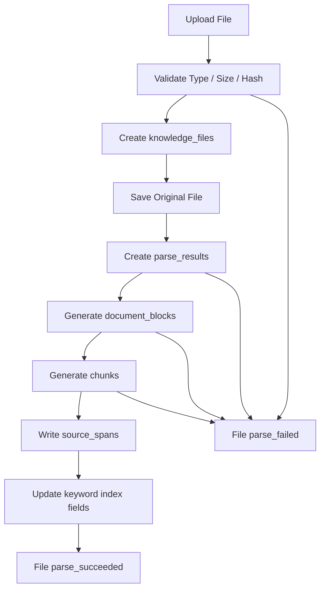
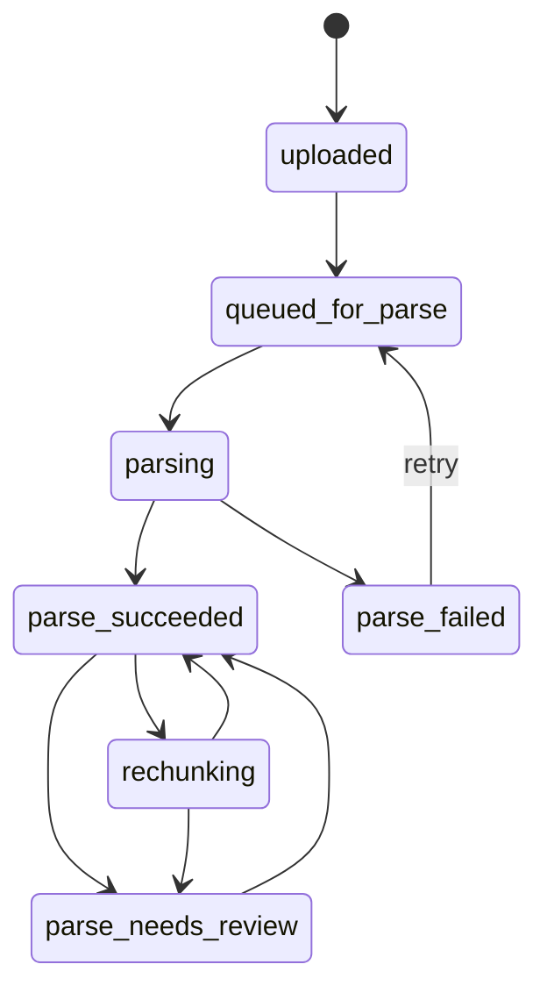

# KnowWeave Ingestion 规格说明书

版本：v0.2
日期：2026-05-24
状态：草案
关联文档：`docs/01-product-spec.md`、`docs/02-knowledge-lifecycle-spec.md`、`docs/03-system-architecture-spec.md`、`docs/04-data-model-spec.md`

## 1. 文档目标

本文定义 KnowWeave MVP 的文件接入链路：上传、解析、Document Block 生成、chunking、source span 写入和重新处理。

本文只覆盖 ingestion，不展开搜索、问答、Wiki 生成和评测运行。

### 1.1 快速阅读摘要

Ingestion 的职责是把用户上传的原始文件，稳定转换为后续可检索、可引用、可人工治理的知识原料。

P0 要跑通的最小闭环是：

```text
文件 -> 解析结果 -> Document Block -> Chunk -> Source Span -> 关键词检索字段
```

P1 重点增强可控性和工程化：

- 批量上传。
- 后台任务队列和状态推送。
- 分块参数可视化调节。
- PDF 区域高亮。
- embedding 索引触发。

P2 重点扩展多模态和深度结构化：

- 表格、图片、公式、代码的专门解析。
- 音视频的 ASR、关键帧、时间轴和片段引用。

本文不会要求 MVP 一次性解决所有复杂格式，但必须把数据结构、状态和扩展点留好，避免后续为了多模态解析推翻 P0 设计。

## 2. MVP 范围

P0 必须实现：

- 上传 txt、md、pdf、docx。
- 保存原始文件和文件记录。
- 校验文件类型、大小和 hash。
- 生成 parse result。
- 生成 document blocks。
- 生成 text chunks。
- 写入 source spans。
- 支持解析失败记录。
- 支持重新解析和重新分块。

P1 再实现：

- 批量上传。
- 分块参数可视化调节。
- PDF bbox 高亮。
- 更完整的 chunk 版本历史。
- 后台任务队列和任务状态推送。
- embedding 索引触发和重建标记。

P2 再实现：

- 音视频上传解析。
- 表格、图片、公式、代码的深度结构化解析。
- OCR、ASR、关键帧、图像描述等多模态能力。

### 2.1 与前四篇文档的优先级对齐

| 能力 | 优先级 | 对齐说明 |
| --- | --- | --- |
| txt、md、pdf、docx 基础解析 | P0 | 对齐产品、生命周期和架构 MVP 范围 |
| Document Blocks 基础生成 | P0 | 支撑 chunk 和 source span |
| text chunk 生成与重新分块 | P0 | 对齐生命周期 P0 分块治理 |
| source span 基础定位 | P0 | 至少支持页码、行号或 block 定位 |
| keyword search 所需 `search_text` | P0 | ingestion 负责写字段，搜索服务负责查询 |
| 批量上传 | P1 | 对齐生命周期 P1 |
| 分块参数可视化调节 | P1 | ingestion 提供参数和重新分块能力 |
| PDF bbox 高亮 | P1 | MVP 只跳页或 block，P1 做区域高亮 |
| embedding 索引触发 | P1 | 对齐 pgvector 语义检索 P1 |
| 后台任务队列和状态推送 | P1 | MVP 同步执行，P1 引入任务系统 |
| 表格、图片、公式、代码深度解析 | P2 | MVP 仅保留 block 或 placeholder |
| 音视频解析 | P2 | MVP 只预留 timeline/source span 字段 |

## 3. 主流程



MVP 可以同步处理小文件。任何步骤失败时，必须保留文件记录、失败状态和错误信息，便于用户重试。

### 3.1 状态流转



状态说明：

| 状态 | 含义 | 用户可见动作 |
| --- | --- | --- |
| `uploaded` | 原始文件已保存，还未进入解析 | 开始解析、删除 |
| `queued_for_parse` | 等待解析 | 查看排队状态、取消任务 P1 |
| `parsing` | 正在解析 | 查看进度 P1 |
| `parse_succeeded` | 已产出 blocks、chunks、source spans | 查看 chunk、重新分块、进入检索 |
| `parse_failed` | 解析失败 | 查看错误、重试 |
| `parse_needs_review` | 解析成功但存在 warning 或质量风险 | 人工检查、确认 |
| `rechunking` | 正在基于已有 blocks 重新生成 chunks | 查看状态 P1 |

## 4. 数据写入顺序

| 步骤 | 写入对象 | 要点 |
| --- | --- | --- |
| 1 | `knowledge_files` | 保存文件名、类型、大小、hash、storage_path、status |
| 2 | 原始文件存储 | 原文件不可被 AI 结果覆盖 |
| 3 | `parse_results` | 记录 parser、版本、状态、raw_text、warnings、error |
| 4 | `document_blocks` | 保留 block 顺序、类型、文本、页码或行号 |
| 5 | `chunks` | 生成 text chunk，写 raw_content、search_text、status |
| 6 | `source_spans` | 记录 chunk 对原文的位置映射 |
| 7 | 索引字段 | MVP 更新 search_text，P1 再生成 embedding |

### 4.1 与数据模型的字段映射

| 模型 | Ingestion 写入字段 | 不由 Ingestion 负责的字段 |
| --- | --- | --- |
| `knowledge_files` | `original_filename`、`content_type`、`file_size`、`sha256`、`storage_path`、`status` | Wiki、对话、评估结果 |
| `parse_results` | `parser_name`、`parser_version`、`status`、`raw_text`、`warnings`、`error_*` | 用户反馈、检索命中记录 |
| `document_blocks` | `block_index`、`block_type`、`raw_content`、`normalized_content`、`metadata` | Wiki 页面结构 |
| `chunks` | `raw_content`、`search_text`、`status`、`chunk_index`、`parent_chunk_id` | answer、citation、feedback |
| `source_spans` | `file_id`、`chunk_id`、`document_block_id`、`page_number`、`line_*`、`char_*`、`preview_text` | 用户对引用是否有用的反馈 |

边界原则：

- Ingestion 负责“从文件到 chunk”的可追溯转换。
- Search 负责“从查询到 chunk”的召回。
- Chat 负责“从 chunk 到回答”的组织。
- Wiki 负责“从 chunk 或 Knowledge Unit 到长期知识页面”的沉淀。

## 5. 上传规则

### 5.1 输入

MVP 支持：

- `.txt`
- `.md`
- `.pdf`
- `.docx`

### 5.2 校验

必须校验：

- 文件是否为空。
- 文件大小是否超过配置上限。
- 文件后缀和 MIME 类型是否允许。
- 是否能计算 sha256。

建议默认上限：

- 单文件不超过 20 MB。
- 单次上传不超过 1 个文件，批量上传放 P1。

### 5.3 上传结果

成功：

- 创建 `knowledge_files`。
- `status = uploaded` 或 `queued_for_parse`。
- 返回 file id。

失败：

- 不创建可用文件记录，或创建 `rejected` 状态记录。
- 返回明确错误原因。

### 5.4 上传请求与响应

请求：

```http
POST /api/files/upload
Content-Type: multipart/form-data
```

字段：

| 字段 | 类型 | 必填 | 说明 |
| --- | --- | --- | --- |
| `file` | file | 是 | 原始文件 |
| `knowledge_base_id` | string | 否 | MVP 可以先使用默认知识库 |
| `auto_parse` | boolean | 否 | 默认 true，上传后自动解析 |

成功响应：

```json
{
  "file_id": "file_01",
  "status": "queued_for_parse",
  "original_filename": "handbook.pdf",
  "content_type": "application/pdf",
  "file_size": 1832048,
  "sha256": "..."
}
```

失败响应：

```json
{
  "error_code": "FILE_TYPE_NOT_SUPPORTED",
  "message": "Only txt, md, pdf and docx files are supported in MVP."
}
```

### 5.5 安全与幂等

- 文件名只能作为展示字段，不能直接拼接为存储路径。
- 存储路径必须由系统生成。
- sha256 相同的文件可提示用户已存在，但 MVP 不强制去重。
- 同一个 `file_id` 同一时间只允许一个解析任务运行。
- 重新解析必须生成新的 `parse_result_id`，不能覆盖历史解析记录。

## 6. Parser 策略

| 文件类型 | MVP Parser | 输出 |
| --- | --- | --- |
| txt | plain text parser | paragraph blocks |
| md | markdown parser | heading、paragraph、list、code、table placeholder |
| pdf | pdf text parser | page/block text，page_number |
| docx | docx text parser | paragraph、heading、table placeholder |

MVP parser 目标不是完美还原版面，而是稳定产出：

- `raw_text`
- `document_blocks`
- 基础 source position
- warnings

表格、图片、公式、代码在 MVP 可以记录为 block 或 placeholder，不做深度理解。

### 6.1 Parser 输出 Schema

Parser 不直接写最终业务表，而是先输出稳定的中间结果，再由 ingestion service 落库。

```json
{
  "parser_name": "pdf_text_parser",
  "parser_version": "0.1.0",
  "raw_text": "full extracted text",
  "metadata": {
    "page_count": 12,
    "language": "zh-CN"
  },
  "warnings": [
    {
      "code": "TABLE_AS_PLACEHOLDER",
      "message": "2 tables were preserved as placeholders."
    }
  ],
  "blocks": [
    {
      "block_index": 0,
      "block_type": "heading",
      "raw_content": "1. Introduction",
      "normalized_content": "1. Introduction",
      "position": {
        "page_number": 1,
        "line_start": null,
        "line_end": null,
        "char_start": 0,
        "char_end": 15
      },
      "metadata": {
        "heading_level": 1
      }
    }
  ]
}
```

字段要求：

| 字段 | 要求 |
| --- | --- |
| `parser_name` | 必须稳定，便于排查不同 parser 的质量差异 |
| `parser_version` | parser 逻辑变化时必须升级 |
| `raw_text` | 允许为空，但为空时必须给出 warning 或 error |
| `blocks` | P0 必须有序，`block_index` 从 0 递增 |
| `position` | 能写多少写多少，不得伪造精确定位 |
| `warnings` | 用于提示低置信解析、placeholder、疑似乱码等问题 |

### 6.2 Placeholder 规则

遇到暂时无法深度解析的内容，MVP 应保留 placeholder，而不是丢弃。

| 原始内容 | MVP block_type | raw_content 建议 | P2 扩展方向 |
| --- | --- | --- | --- |
| 表格 | `table` | 表格文本摘要或 Markdown 表格 | table cells、caption、row/column schema |
| 图片 | `image` 或 `unknown` | `[Image placeholder]` | OCR、图像描述、对象检测 |
| 公式 | `formula` 或 `unknown` | LaTeX 或占位符 | 公式识别、MathML、语义描述 |
| 代码 | `code` | 原始代码块 | language、symbols、imports、调用关系 |

若 parser 无法判断类型，使用 `unknown`，并在 `metadata.detected_reason` 中记录原因。

## 7. Document Block 生成

Document Block 是解析结果和 chunk 之间的中间层。

### 7.1 必填字段

- `file_id`
- `parse_result_id`
- `block_index`
- `block_type`
- `raw_content`
- `metadata`

### 7.2 定位字段

按文件类型尽量写入：

| 文件类型 | MVP 定位 |
| --- | --- |
| txt | line_start、line_end |
| md | line_start、line_end |
| pdf | page_number、block_index |
| docx | block_index，paragraph index 放入 metadata 或 selector |

### 7.3 Block 类型

MVP 至少支持：

- `heading`
- `paragraph`
- `list`
- `table`
- `code`
- `unknown`

检测到但无法解析的内容不得直接丢弃，应保存为 `unknown` 或对应 placeholder。

### 7.4 Block 质量标记

Document Block 可以写入以下 metadata，供 chunk 质量判断和人工治理使用：

| 字段 | 类型 | 说明 |
| --- | --- | --- |
| `confidence` | number | parser 对该 block 的置信度，0 到 1 |
| `has_garbled_text` | boolean | 是否疑似乱码 |
| `is_placeholder` | boolean | 是否为未深度解析内容 |
| `source_selector` | object | docx paragraph index、pdf text object id 等定位信息 |
| `heading_path` | string[] | block 所在标题路径 |

## 8. Chunking 策略

### 8.1 MVP 默认策略

默认使用 hybrid 策略：

```text
heading path + paragraph grouping + max_chars limit
```

推荐默认参数：

| 参数 | 默认值 |
| --- | --- |
| `strategy` | hybrid |
| `max_chars` | 1200 |
| `min_chars` | 80 |
| `overlap_chars` | 120 |
| `include_headings` | true |

### 8.2 生成规则

- chunk 不应跨越不同文件。
- chunk 应尽量保留标题路径。
- chunk 过短时可以与相邻 block 合并。
- chunk 过长时按句号、换行或字符窗口拆分。
- 每个 chunk 必须至少有一个 source span。
- ignored block 不应进入 chunk。

### 8.3 父子分块

MVP 数据模型已支持 `parent_chunk_id`，但 UI 可先只展示字段。

P1 再实现完整父子分块：

- parent chunk 保留较完整上下文。
- child chunk 用于精确检索。
- 命中 child 后可带入 parent 或相邻 child。

### 8.4 分块参数 Schema

```json
{
  "strategy": "hybrid",
  "max_chars": 1200,
  "min_chars": 80,
  "overlap_chars": 120,
  "include_headings": true,
  "respect_block_boundary": true,
  "split_separators": ["\n\n", "。", "；", ".", "\n"],
  "parent_child": {
    "enabled": false,
    "parent_max_chars": 3000,
    "child_max_chars": 800
  }
}
```

参数说明：

| 参数 | P0/P1 | 说明 |
| --- | --- | --- |
| `strategy` | P0 | `hybrid`、`fixed_window`、`paragraph`，MVP 默认 `hybrid` |
| `max_chars` | P0 | 单个 chunk 最大字符数 |
| `min_chars` | P0 | 过短 chunk 可与相邻 block 合并 |
| `overlap_chars` | P0 | 长文本切分时的重叠字符数 |
| `include_headings` | P0 | 是否把标题路径写入 chunk |
| `respect_block_boundary` | P0 | 优先不跨 block；长 block 可在内部切分 |
| `split_separators` | P0 | 长 block 内部分割顺序 |
| `parent_child.enabled` | P1 | 是否生成父子 chunk |

### 8.5 Chunk 质量初筛

Ingestion 不负责最终质量评估，但可以给 chunk 写入基础质量标记，供 UI 提醒用户检查。

| 低质量信号 | 判定方式 | P0 处理 |
| --- | --- | --- |
| 过短 | `raw_content.length < min_chars` | 标记 `needs_review` 或合并 |
| 过长 | `raw_content.length > max_chars` | 尝试二次切分 |
| 定位缺失 | 没有 source span | 阻断入库或标记失败 |
| placeholder 占比高 | 多数内容来自 placeholder block | 标记 `needs_review` |
| 疑似乱码 | parser metadata 命中乱码规则 | 标记 `needs_review` |
| 信息密度低 | 只有页眉、页脚、目录编号 | P1 引入规则或模型辅助判断 |

## 9. Source Span 写入

Source Span 负责把 chunk 定位回原始文件。

### 9.1 MVP 要求

| 文件类型 | 最低要求 |
| --- | --- |
| txt | file_id + line_start/line_end + preview_text |
| md | file_id + line_start/line_end + preview_text |
| pdf | file_id + page_number + document_block_id + preview_text |
| docx | file_id + document_block_id + preview_text |

### 9.2 句子级分块

如果 chunk 是按句号、标点或滑动窗口切分：

- 能计算字符范围时，写入 `char_start`、`char_end`。
- 不能精确计算时，至少保留 `document_block_id` 和 `preview_text`。
- 不得因为用户编辑 chunk 而覆盖 source span。

### 9.3 PDF 定位

MVP：

- 支持跳到页码。
- 展示引用预览。

P1：

- 保存 block bbox。
- 支持页面区域高亮。

P2：

- 保存 word bboxes。
- 支持短语级高亮。

### 9.4 Source Span 示例

Markdown 行号定位：

```json
{
  "chunk_id": "chunk_01",
  "file_id": "file_01",
  "document_block_id": "block_03",
  "line_start": 18,
  "line_end": 27,
  "char_start": 420,
  "char_end": 910,
  "preview_text": "KnowWeave supports..."
}
```

PDF 页码定位：

```json
{
  "chunk_id": "chunk_02",
  "file_id": "file_02",
  "document_block_id": "block_11",
  "page_number": 5,
  "bbox": null,
  "preview_text": "The evaluation metrics include..."
}
```

PDF P1 区域定位：

```json
{
  "chunk_id": "chunk_02",
  "file_id": "file_02",
  "document_block_id": "block_11",
  "page_number": 5,
  "bbox": {
    "x": 72,
    "y": 144,
    "width": 420,
    "height": 96,
    "unit": "pt"
  },
  "preview_text": "The evaluation metrics include..."
}
```

### 9.5 用户编辑后的定位规则

用户编辑 chunk 时，系统必须区分两类文本：

| 文本 | 含义 | 是否影响 source span |
| --- | --- | --- |
| `raw_content` | parser 和 chunking 生成的原始 chunk 内容 | 影响 |
| `edited_content` | 用户修正后的展示或治理文本 | 不直接覆盖 |

规则：

- source span 始终指向原文件位置。
- 用户编辑 chunk 后，source span 保持不变。
- 若用户编辑导致内容与原文明显不一致，chunk 应标记 `manually_edited`。
- 后续 Wiki 可以引用 `edited_content`，但 citation 仍应能回到原文。

## 10. 重新解析与重新分块

### 10.1 重新解析

触发条件：

- 用户手动点击重新解析。
- parser 配置变化。
- 原解析失败或存在严重 warning。

规则：

- 新建 parse result，不覆盖历史 parse result。
- 基于新的 parse result 重新生成 document blocks 和 chunks。
- 旧 chunk 默认标记为 archived 或保留但退出检索。
- 已确认 Knowledge Unit 和 Wiki 不自动删除，只标记来源可能变化。

### 10.2 重新分块

触发条件：

- 用户修改 chunk 参数。
- 用户排除某些 block。
- 用户修正解析文本后要求重新生成 chunk。

规则：

- 新 chunk 必须重新写 source spans。
- 旧 chunk 默认 archived。
- 与旧 chunk 相关的 Knowledge Unit 应进入待检查状态，P1 可做差异提示。

### 10.3 影响矩阵

| 操作 | parse_results | document_blocks | chunks | source_spans | Knowledge Unit / Wiki |
| --- | --- | --- | --- | --- | --- |
| 首次解析 | 新建 | 新建 | 新建 | 新建 | 无影响 |
| 重新解析 | 新建 | 新建 | 重新生成 | 重新生成 | 标记来源可能变化 |
| 重新分块 | 不变 | 不变 | 重新生成 | 重新生成 | 相关 KU 标记待检查 |
| 编辑 chunk | 不变 | 不变 | 更新 `edited_content` | 不变 | 可进入 KU 候选 |
| 忽略 chunk | 不变 | 不变 | `status=ignored` | 保留 | 不进入默认检索 |

### 10.4 并发与重试

- 同一文件正在解析时，重复点击解析应返回当前任务状态。
- 解析失败后允许重试，重试必须生成新的 `parse_result_id`。
- 重新分块不能与重新解析并发执行。
- P1 引入任务队列后，任务应具备 `task_id`、`file_id`、`operation`、`status`、`progress`、`error`。
- 用户删除文件后，未完成的解析任务应取消或在写入前检查文件状态。

## 11. 状态与错误

### 11.1 文件状态

```text
uploaded -> queued_for_parse -> parsing -> parse_succeeded
uploaded -> queued_for_parse -> parsing -> parse_failed
parse_succeeded -> parse_needs_review
```

### 11.2 错误信息

解析失败必须记录：

- error_code
- error_message
- parser_name
- parser_version
- failed_stage

建议 failed_stage：

- upload_validate
- file_store
- parse
- block_detect
- chunking
- source_span

### 11.3 错误码

| error_code | failed_stage | 含义 | 用户提示 |
| --- | --- | --- | --- |
| `FILE_EMPTY` | upload_validate | 文件为空 | 请上传非空文件 |
| `FILE_TOO_LARGE` | upload_validate | 超出大小限制 | 请压缩或拆分文件 |
| `FILE_TYPE_NOT_SUPPORTED` | upload_validate | 类型不支持 | MVP 支持 txt、md、pdf、docx |
| `FILE_HASH_FAILED` | upload_validate | hash 计算失败 | 请重试上传 |
| `FILE_STORE_FAILED` | file_store | 原文件保存失败 | 请重试，若持续失败联系管理员 |
| `PARSER_NOT_FOUND` | parse | 找不到 parser | 当前文件类型暂无可用解析器 |
| `PARSER_TIMEOUT` | parse | parser 超时 | 请重试或拆分文件 |
| `PARSER_OUTPUT_EMPTY` | parse | parser 没有产出文本或 block | 请检查文件内容 |
| `BLOCK_DETECT_FAILED` | block_detect | block 生成失败 | 请重试解析 |
| `CHUNKING_FAILED` | chunking | 分块失败 | 请调整分块参数后重试 |
| `SOURCE_SPAN_MISSING` | source_span | chunk 无法定位回原文 | 请重新解析或联系管理员 |

### 11.4 Warning 码

| warning_code | 含义 | 默认状态 |
| --- | --- | --- |
| `LOW_TEXT_COVERAGE` | 提取文本少于预期，常见于扫描版 PDF | `parse_needs_review` |
| `TABLE_AS_PLACEHOLDER` | 表格未深度结构化 | `parse_succeeded` |
| `IMAGE_AS_PLACEHOLDER` | 图片未 OCR 或描述 | `parse_succeeded` |
| `FORMULA_AS_PLACEHOLDER` | 公式未识别 | `parse_succeeded` |
| `GARBLED_TEXT_SUSPECTED` | 疑似乱码 | `parse_needs_review` |
| `MISSING_PAGE_POSITION` | PDF 未能获取页码 | `parse_needs_review` |

## 12. API 草案

本节只定义 MVP 端点形态，具体 request/response 可在后续 API Spec 中细化。

```text
POST   /api/files/upload
GET    /api/files
GET    /api/files/{file_id}
POST   /api/files/{file_id}/parse
POST   /api/files/{file_id}/reparse
GET    /api/files/{file_id}/parse-results
GET    /api/files/{file_id}/document-blocks
GET    /api/files/{file_id}/chunks
POST   /api/files/{file_id}/rechunk
PATCH  /api/chunks/{chunk_id}
POST   /api/chunks/{chunk_id}/ignore
POST   /api/chunks/{chunk_id}/verify
```

### 12.1 重新分块请求

```json
{
  "strategy": "hybrid",
  "max_chars": 1000,
  "min_chars": 80,
  "overlap_chars": 100,
  "include_headings": true,
  "respect_block_boundary": true
}
```

响应：

```json
{
  "file_id": "file_01",
  "status": "parse_succeeded",
  "archived_chunk_count": 24,
  "new_chunk_count": 31
}
```

### 12.2 Chunk 编辑请求

```json
{
  "edited_content": "用户修正后的 chunk 内容",
  "change_note": "修正 PDF 解析出的错别字"
}
```

响应：

```json
{
  "chunk_id": "chunk_01",
  "status": "verified",
  "manually_edited": true,
  "source_span_preserved": true
}
```

### 12.3 文件详情响应字段

```json
{
  "file_id": "file_01",
  "original_filename": "handbook.pdf",
  "status": "parse_succeeded",
  "content_type": "application/pdf",
  "file_size": 1832048,
  "sha256": "...",
  "latest_parse_result_id": "parse_03",
  "block_count": 128,
  "chunk_count": 42,
  "warning_count": 1,
  "created_at": "2026-05-24T10:00:00+08:00",
  "updated_at": "2026-05-24T10:05:00+08:00"
}
```

## 13. 验收场景

### 13.1 上传并解析 Markdown

1. 用户上传 `.md` 文件。
2. 系统创建 file record。
3. 系统解析 heading、paragraph、list、code block。
4. 系统生成 chunks 和 source spans。

验收：

- 文件状态为 `parse_succeeded`。
- chunk 可以定位到 markdown 行号。

### 13.2 上传并解析 PDF

1. 用户上传 `.pdf` 文件。
2. 系统提取文本和页码。
3. 系统生成 document blocks。
4. 系统生成 chunks 和 source spans。

验收：

- chunk 至少能定位到 PDF 页码。
- 解析失败时能看到失败原因。

### 13.3 调整分块参数

1. 用户查看 chunk 列表。
2. 用户发现 chunk 过长。
3. 用户降低 `max_chars`。
4. 用户重新分块。

验收：

- 新 chunk 生效。
- 旧 chunk 不参与默认检索。
- 新 chunk 仍保留 source spans。

### 13.4 解析低质量 PDF

1. 用户上传扫描版或文本覆盖率较低的 PDF。
2. parser 只提取到少量文本。
3. 系统保存 parse result、warnings 和可用 blocks。

验收：

- 文件不应静默成功。
- 系统显示 `LOW_TEXT_COVERAGE` warning。
- 文件状态可进入 `parse_needs_review`。
- 用户可以决定是否保留、删除或后续使用 OCR 能力重跑。

### 13.5 用户编辑 Chunk

1. 用户打开 chunk 详情。
2. 用户看到原文定位、raw content 和可编辑内容。
3. 用户修正解析错误。

验收：

- `edited_content` 被保存。
- source span 不被覆盖。
- chunk 标记 `manually_edited`。
- 后续 citation 仍能定位到原文件。

### 13.6 验收检查清单

| 检查项 | P0 必须满足 |
| --- | --- |
| 上传失败有明确错误 | 是 |
| 文件成功上传后可追踪状态 | 是 |
| parser 输出可复现 | 是 |
| 每个 chunk 至少有一个 source span | 是 |
| 用户能查看 chunk 原文定位 | 是 |
| 用户能编辑 chunk 且不破坏定位 | 是 |
| 重新分块后旧 chunk 退出默认检索 | 是 |
| 解析 warning 可见 | 是 |
| 表格、图片、公式、代码不被静默丢弃 | 是 |
| PDF MVP 至少能定位页码 | 是 |

## 14. 非目标

MVP 不做：

- 音视频解析。
- OCR。
- ASR。
- 表格深度结构化。
- PDF bbox 精确高亮。
- 异步任务队列。
- 多用户权限。
