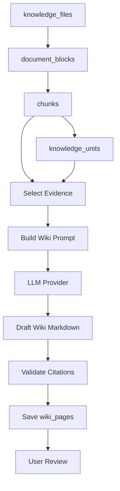
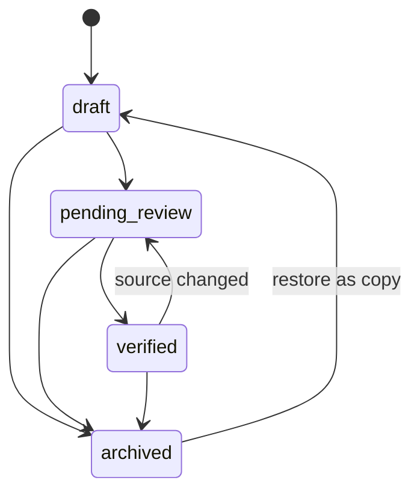

# KnowWeave LLM Wiki 规格说明书

版本：v0.1
日期：2026-05-24
状态：草案
关联文档：`docs/01-product-spec.md`、`docs/02-knowledge-lifecycle-spec.md`、`docs/03-system-architecture-spec.md`、`docs/04-data-model-spec.md`、`docs/05-ingestion-spec.md`

## 1. 文档目标

本文定义 KnowWeave 中 LLM Wiki 的生成、编辑、引用、状态、修订和扩展规则。

LLM Wiki 是 KnowWeave 区别于普通 RAG 问答系统的核心沉淀层。它不是一次性问答结果，也不是原始文件的简单摘要，而是由文件、chunk、Knowledge Unit、问答反馈和人工编辑共同构成的长期可维护知识页面。

本文回答以下问题：

- Wiki 页面有哪些类型。
- Document Wiki、Topic Wiki、FAQ Wiki 分别如何生成。
- Wiki 页面应该包含哪些结构。
- AI 生成内容如何进入人工治理流程。
- Wiki 如何保存引用和 source span。
- Wiki Revision 记录什么，何时生成，如何回滚。
- MVP 做到什么程度，P1/P2 如何扩展。

## 2. 核心定位

### 2.1 RAG 与 Wiki 的关系

RAG 负责即时消费：

- 围绕一次用户问题进行检索。
- 临时组织上下文。
- 生成一次性回答。
- 保存 retrieved_contexts、citations 和 feedback。

Wiki 负责长期沉淀：

- 把文件、chunk、Knowledge Unit、问答反馈和人工修订沉淀为页面。
- 面向人阅读，也可作为后续 RAG 的高质量上下文。
- 必须支持编辑、确认、废弃、引用校正和修订历史。
- 关键结论必须能追溯到 chunk、Knowledge Unit、source span 或人工来源。

一句话边界：

```text
RAG answers a question.
Wiki maintains knowledge.
```

### 2.2 Wiki 不是什么

Wiki 不是：

- LLM 直接生成后不可修改的静态摘要。
- 没有引用来源的 AI 文本。
- Git 仓库中的 Markdown 文件主链路。
- 替代原始文件的事实源。
- 自动进入 verified 状态的可信知识。

Wiki 可以导出为 Markdown，但 KnowWeave 的主链路使用数据库中的 `wiki_pages` 和后续 `wiki_revisions` 管理页面和版本。

## 3. Wiki 类型

| 类型 | 优先级 | 说明 |
| --- | --- | --- |
| Document Wiki | P0 | 基于单个文件生成的结构化知识页面 |
| Topic Wiki | P1 | 基于主题、搜索结果、选中文件或多个 Knowledge Unit 生成的聚合页面 |
| FAQ Wiki | P1 | 基于文件内容、问答记录、反馈或高频问题生成的问答页面 |
| Knowledge Network Page | P2 | 类 Obsidian/知识图谱的节点页、反链页或关系页 |

### 3.1 Document Wiki

Document Wiki 是 MVP 必须实现的 Wiki 类型。

来源：

- `knowledge_files`
- `document_blocks`
- `chunks`
- `knowledge_units`
- `source_spans`

适用场景：

- 用户上传一个制度文档后，希望快速得到结构化知识页。
- 用户浏览文件详情时，需要看摘要、关键规则、流程、术语和引用位置。
- 用户希望从文件中沉淀 Knowledge Unit，再组织成可维护页面。

### 3.2 Topic Wiki

Topic Wiki 放在 P1。

来源：

- 用户输入的主题。
- 搜索结果集合。
- 选中的多个文件。
- 多个 Knowledge Unit。
- 用户收藏或保存的一组 retrieved_contexts。

适用场景：

- “请汇总公司请假制度相关知识。”
- “把多个项目文档里的上线流程整理成一个页面。”
- “把同一主题下的多份政策文件组织成统一说明。”

### 3.3 FAQ Wiki

FAQ Wiki 放在 P1。

来源：

- 用户真实问答记录。
- 高频问题。
- 正反馈回答。
- 负反馈修正。
- Evaluation Sample。
- Knowledge Unit。

适用场景：

- 将高频问答沉淀为可复用知识。
- 将用户反馈过的错误答案修订为标准答案。
- 将评测样本反向转化为知识库维护项。

## 4. MVP 范围

P0 必须实现：

- 基于单个文件生成 Document Wiki。
- 保存 Wiki 标题、摘要、正文、状态、来源文件和检索文本。
- Wiki 正文使用 Markdown。
- Wiki 页面至少关联来源 chunk 或 Knowledge Unit。
- Wiki 关键结论必须有 citation。
- 用户可以查看 Wiki 列表和详情。
- 用户可以用基础 textarea 编辑 Wiki Markdown。
- 用户可以重新生成 Wiki。
- 用户可以将 Wiki 标记为 draft、pending_review、verified、archived。
- 文件软删除后，Wiki 保留，但提示来源不可用。

P1 再实现：

- Topic Wiki。
- FAQ Wiki。
- 更完整的 Markdown 编辑体验，例如预览、目录、引用插入和快捷操作。
- Wiki Revision 历史。
- 版本 diff。
- 从历史 revision 回滚。
- 引用人工校正。
- 从 retrieved_contexts 和 feedback 生成 Wiki 修订建议。
- Wiki 页面内链和反链的基础能力。

P2 再实现：

- 类 Obsidian 的知识网络视图。
- Wiki Links 双链图谱。
- Knowledge Edges。
- 多人审核流。
- 发布流程。
- Wiki 模板市场或领域模板。

## 5. Wiki 页面结构

### 5.1 基础字段

对应 `wiki_pages`：

| 字段 | MVP | 说明 |
| --- | --- | --- |
| `id` | 是 | Wiki ID |
| `wiki_type` | 是 | document_wiki、topic_wiki、faq_wiki |
| `title` | 是 | 页面标题 |
| `summary` | 是 | 页面摘要 |
| `content_markdown` | 是 | Markdown 正文 |
| `status` | 是 | draft、pending_review、verified、archived |
| `source_file_id` | 是 | Document Wiki 的来源文件 |
| `search_text` | 是 | 用于全文检索 |
| `metadata` | 是 | 生成参数、模板、质量信号等扩展信息 |

### 5.2 Markdown 正文结构

Document Wiki 推荐结构：

```markdown
# {Document Title}

## 摘要

## 关键结论

## 规则与流程

## 术语与定义

## 风险与注意事项

## 来源引用
```

不同文档类型可以使用不同模板，但 MVP 至少支持一个通用 Document Wiki 模板。

### 5.3 页面区块

Wiki 页面中的段落应尽量能映射到来源。

推荐区块类型：

| 区块 | 说明 | Citation 要求 |
| --- | --- | --- |
| 摘要 | 对文件整体的概括 | 建议有来源 |
| 关键结论 | 可直接指导行动的结论 | 必须有来源 |
| 规则 | 制度、约束、判断条件 | 必须有来源 |
| 流程 | 步骤、审批链路、操作顺序 | 必须有来源 |
| 术语 | 概念定义 | 建议有来源 |
| 待确认项 | AI 低置信或来源不足内容 | 必须标记待确认 |

## 6. 生成流程

### 6.1 Document Wiki 生成流程



### 6.2 证据选择规则

MVP 证据来源优先级：

1. verified Knowledge Unit。
2. pending_review 或 draft Knowledge Unit。
3. verified chunk。
4. draft raw chunk。

过滤规则：

- ignored chunk 不参与生成。
- archived chunk 不参与生成。
- soft_deleted 文件下的 chunk 不参与新生成。
- source span 缺失的 chunk 不应作为关键结论来源。

### 6.3 Prompt 输入

Wiki 生成 Prompt 应包含：

- 文件标题。
- 文件类型。
- 文件摘要，可为空。
- 标题路径。
- 候选 chunk 列表。
- Knowledge Unit 列表。
- 每条证据的 source span 摘要。
- 输出 Markdown 模板。
- citation 输出要求。
- 禁止编造来源的约束。

### 6.4 LLM 输出要求

LLM 应输出结构化结果，而不是只输出纯 Markdown。

建议中间格式：

```json
{
  "title": "员工请假制度说明",
  "summary": "本文总结员工请假申请、审批和销假要求。",
  "sections": [
    {
      "heading": "请假申请规则",
      "markdown": "员工请假需至少提前 1 个工作日提交申请。",
      "citation_refs": ["chunk_023"]
    }
  ],
  "warnings": [
    {
      "code": "LOW_SOURCE_COVERAGE",
      "message": "部分段落缺少强来源，需要人工确认。"
    }
  ]
}
```

落库前由 Wiki Service 转换为：

- `wiki_pages.title`
- `wiki_pages.summary`
- `wiki_pages.content_markdown`
- `citations`
- `wiki_page_units`
- `metadata.generation_warnings`

## 7. Citation 规则

### 7.1 Citation 目标

Wiki Citation 的 `target_type = wiki_page`。

每条 citation 至少包含一种来源：

- `chunk_id`
- `knowledge_unit_id`
- `source_span_id`
- 人工来源 metadata

### 7.2 允许组合

| 组合 | 是否允许 | 说明 |
| --- | --- | --- |
| wiki_page -> chunk | 允许 | MVP 主要引用方式 |
| wiki_page -> knowledge_unit | 允许 | 推荐用于已治理知识 |
| wiki_page -> source_span | 允许 | 精确到原文位置 |
| wiki_page -> chunk + source_span | 推荐 | 能同时定位 chunk 和原文位置 |
| wiki_page -> knowledge_unit + chunk | 允许 | KU 由 chunk 支撑时使用 |
| wiki_page -> manual metadata | 允许 | 人工补充来源 |
| wiki_page -> 无来源文本 | 不允许作为关键结论 | 只能放入待确认项 |

### 7.3 引用展示

Wiki 页面展示 citation 时，应展示：

- 来源文件名。
- chunk 或 Knowledge Unit 标题。
- 页码、行号或 block 定位。
- preview_text。
- 来源是否可用。

文件软删除后：

- citation 不删除。
- Wiki 页面不自动删除。
- UI 显示“来源文件已删除或不可用”。
- verified 状态可保留，但建议提示需要复核。

## 8. Wiki 状态流转

Wiki 使用 `curation_status`：

- draft
- pending_review
- verified
- archived

状态流转：



规则：

- AI 新生成页面默认是 draft。
- AI 生成但存在低置信 warning 时，可进入 pending_review。
- verified 必须由用户确认。
- archived 不参与默认问答召回。
- 来源文件重新解析或重新分块后，相关 Wiki 应标记为 source changed，P0 可通过 metadata 记录，P1 可进入 pending_review。

## 9. 用户编辑与重新生成

### 9.1 编辑规则

用户可以编辑：

- title
- summary
- content_markdown
- status
- tag bindings

用户编辑不应自动修改：

- 原始文件。
- chunk raw_content。
- source_spans。
- 历史 citation。

### 9.2 重新生成规则

触发条件：

- 用户手动重新生成。
- 文件重新解析。
- 文件重新分块。
- 来源 chunk 或 Knowledge Unit 变化。
- 用户反馈提示 Wiki 错误。

规则：

- P0 可以覆盖当前 `content_markdown`，但必须保留 `updated_at` 和 metadata。
- P1 启用 Wiki Revision 后，每次重新生成都必须生成 revision。
- 重新生成不得直接进入 verified。
- 原有 citation 应重新校验。
- 缺失来源的关键结论必须进入待确认项。

### 9.3 人工修订说明

用户保存编辑时，应记录 change_summary。

P0 可以放在 `wiki_pages.metadata.last_change_summary`。

P1 启用 `wiki_revisions.change_summary` 后，记录到 revision。

## 10. Wiki Revision

### 10.1 定位

Wiki Revision 是 Wiki 页面的历史快照，用于审查、对比和回滚。

MVP：

- 数据模型预留 `wiki_revisions`。
- 不强制实现 diff/rollback UI。
- 当前可见内容仍保存在 `wiki_pages.content_markdown`。

P1：

- 每次 AI 生成、人工编辑、重新生成、确认发布或回滚都生成 revision。
- 支持版本列表。
- 支持 diff。
- 支持从历史 revision 恢复。

### 10.2 Revision 字段

对应 `wiki_revisions`：

| 字段 | 说明 |
| --- | --- |
| `wiki_page_id` | 所属 Wiki |
| `revision_number` | 页面内递增版本号 |
| `content_markdown` | Markdown 快照 |
| `change_summary` | 修改说明 |
| `edit_source` | ai_generation、manual_edit、regeneration、rollback、status_change |
| `citation_snapshot` | 当时的引用快照 |
| `created_by` | 创建人，可为空 |
| `created_at` | 创建时间 |

### 10.3 change_summary 记录什么

change_summary 应描述“为什么改”和“改了什么”，不是记录完整正文。

示例：

- “AI 基于 handbook.pdf 首次生成 Document Wiki。”
- “人工修正请假提前时间，并补充审批角色。”
- “因文件重新解析，重新生成 Wiki 草稿。”
- “根据用户反馈修正引用来源。”
- “从 revision 3 回滚，并保留当前引用快照。”

### 10.4 edit_source 规则

| edit_source | 触发者 | 说明 |
| --- | --- | --- |
| `ai_generation` | 系统 | 首次生成 |
| `manual_edit` | 用户 | 人工编辑 |
| `regeneration` | 用户或系统 | 基于新证据重新生成 |
| `rollback` | 用户 | 从历史版本恢复 |
| `status_change` | 用户 | 只修改状态 |

### 10.5 回滚规则

P1 回滚规则：

- 回滚不删除历史 revision。
- 回滚会创建新的 revision。
- 回滚后的 `wiki_pages.content_markdown` 等于被选中的历史快照。
- 回滚时应保存 rollback change_summary。
- citation_snapshot 用于审查，但当前正式 citation 仍以 `citations` 表为准。

## 11. 与 Knowledge Unit 的关系

Wiki Page 可以包含多个 Knowledge Unit。

对应关系表：

- `wiki_page_units`

规则：

- Wiki 页面可以组织多个 Knowledge Unit。
- 一个 Knowledge Unit 可以出现在多个 Wiki 页面中。
- MVP 建议避免同一个 Knowledge Unit 在同一个页面重复绑定。
- verified Knowledge Unit 在 Wiki 生成中优先使用。
- draft Knowledge Unit 可以使用，但生成内容应保持 draft 或 pending_review。

Wiki 中的段落可通过 `section_anchor` 关联 Knowledge Unit。

示例：

```text
wiki_page_id = wiki_001
knowledge_unit_id = ku_023
section_anchor = "leave-approval-rules"
```

## 12. 与反馈闭环的关系

用户反馈可以驱动 Wiki 维护。

反馈来源：

- Chat answer_wrong。
- Chat citation_wrong。
- Search retrieval_missing。
- Wiki 页面反馈。
- 人工 review。

P0：

- 保存 feedback。
- 用户手动基于反馈编辑 Wiki。

P1：

- 从 feedback 生成 Wiki 修订建议。
- 从高质量问答生成 FAQ Wiki。
- 从负反馈生成待修复任务。
- 将 Wiki 修订前后的效果纳入 evaluation_samples。

## 13. 搜索与问答使用 Wiki

Wiki 既是人看的页面，也是 RAG 的高质量上下文。

检索规则：

- P0 使用 `wiki_pages.search_text` 参与关键词检索。
- verified Wiki 优先级高于 draft Wiki。
- archived Wiki 不参与默认召回。
- Document Wiki 可以作为文件摘要类上下文。
- Topic Wiki 和 FAQ Wiki P1 启用后，可作为更高层上下文。

问答规则：

- Chat Service 可以召回 Wiki Page。
- 回答引用 Wiki 时，仍应尽量提供 Wiki 背后的 chunk 或 Knowledge Unit citation。
- 如果只引用 Wiki 页面本身，UI 应提示这是二级来源。
- 高风险答案不得只依赖无 citation 的 Wiki 文本。

## 14. API 草案

本节定义 MVP 端点形态，详细 API 后续在 Search/Chat 或 Frontend Spec 中细化。

```text
POST   /api/v1/files/{file_id}/wiki
GET    /api/v1/wiki/pages
GET    /api/v1/wiki/pages/{wiki_page_id}
PATCH  /api/v1/wiki/pages/{wiki_page_id}
POST   /api/v1/wiki/pages/{wiki_page_id}/regenerate
POST   /api/v1/wiki/pages/{wiki_page_id}/verify
POST   /api/v1/wiki/pages/{wiki_page_id}/archive
GET    /api/v1/wiki/pages/{wiki_page_id}/citations
GET    /api/v1/wiki/pages/{wiki_page_id}/knowledge-units
```

P1：

```text
GET    /api/v1/wiki/pages/{wiki_page_id}/revisions
GET    /api/v1/wiki/pages/{wiki_page_id}/revisions/{revision_id}
POST   /api/v1/wiki/pages/{wiki_page_id}/rollback
POST   /api/v1/wiki/pages/topic/generate
POST   /api/v1/wiki/pages/faq/generate
```

### 14.1 生成 Document Wiki 请求

```json
{
  "file_id": "file_01",
  "wiki_type": "document_wiki",
  "template": "default_document",
  "include_knowledge_units": true,
  "include_draft_chunks": true
}
```

响应：

```json
{
  "wiki_page_id": "wiki_01",
  "status": "draft",
  "title": "员工手册知识页",
  "citation_count": 12,
  "knowledge_unit_count": 8,
  "warnings": []
}
```

### 14.2 编辑 Wiki 请求

```json
{
  "title": "员工请假制度",
  "summary": "整理请假申请、审批和销假要求。",
  "content_markdown": "# 员工请假制度\n\n...",
  "status": "pending_review",
  "change_summary": "人工修正审批角色描述。"
}
```

## 15. 验收场景

### 15.1 生成 Document Wiki

1. 用户上传并解析一个 PDF。
2. 系统生成 chunks 和 source spans。
3. 用户点击生成 Document Wiki。
4. 系统生成 Wiki 草稿。
5. 用户打开 Wiki 详情。

验收：

- Wiki 页面状态为 draft。
- 页面包含标题、摘要、正文。
- 至少一个关键结论有 citation。
- citation 可以回到 chunk 或 source span。

### 15.2 编辑并确认 Wiki

1. 用户打开 Wiki 页面。
2. 用户编辑 Markdown。
3. 用户填写修改说明。
4. 用户将状态改为 verified。

验收：

- Wiki 内容更新。
- 状态变为 verified。
- source spans 不被编辑内容覆盖。
- 修改说明被保存到 metadata 或 revision。

### 15.3 来源文件软删除

1. 用户软删除某个文件。
2. 系统保留该文件生成过的 Wiki。
3. 用户打开 Wiki。

验收：

- Wiki 不被自动删除。
- 页面提示来源文件不可用。
- citation 展示 source_available = false 或等效状态。
- archived 状态不强制自动触发，交给用户判断。

### 15.4 重新生成 Wiki

1. 用户对文件重新分块。
2. 系统标记相关 Wiki 来源可能变化。
3. 用户点击重新生成。

验收：

- Wiki 重新生成后仍为 draft 或 pending_review。
- 原 verified 状态不自动保留。
- 新 citation 重新校验。
- 旧 citation 不应被静默当作新 citation。

## 16. 非目标

MVP 不做：

- Topic Wiki。
- FAQ Wiki。
- Wiki Revision diff UI。
- Wiki rollback。
- 多人审核流。
- 页面内链和反链图谱。
- Git 作为 Wiki 主存储。
- 自动发布系统。

## 17. 后续扩展

后续可扩展：

- Topic Wiki 生成模板。
- FAQ Wiki 生成模板。
- Wiki Links 双链。
- Knowledge Graph。
- Wiki Review Task。
- 多角色审核。
- 导出 Markdown。
- 导出 PDF。
- Wiki 与外部知识库同步。
