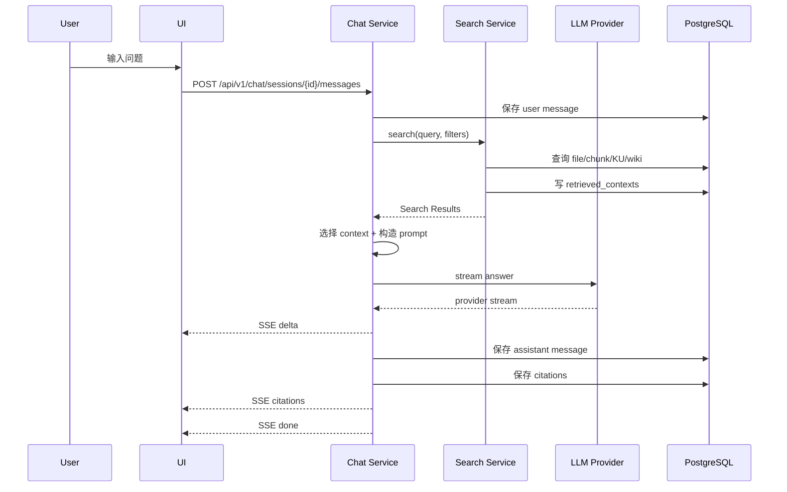

# KnowWeave 搜索与问答规格说明书

版本：v0.4
更新时间：2026-05-25
状态：草案
关联文档：

- `docs/01-product-spec.md`
- `docs/02-knowledge-lifecycle-spec.md`
- `docs/03-system-architecture-spec.md`
- `docs/04-data-model-spec.md`
- `docs/05-ingestion-spec.md`
- `docs/06-llm-wiki-spec.md`

## 1. 文档目标

本文定义 KnowWeave 中搜索、RAG 问答、上下文组织、流式输出、引用返回、反馈沉淀和评估样本构建的规格。

Search and Chat 是 KnowWeave 的知识消费层。它不只是“把检索结果塞给模型回答”，而是要把每一次搜索、召回、回答、引用和用户反馈都沉淀为可追溯、可评估、可改进的数据资产。

本文回答以下问题：

- Search Service 支持检索哪些对象。
- Search Result 的统一结构是什么。
- RAG 问答如何组织上下文。
- Chat Service 如何使用 chunk、Knowledge Unit 和 Wiki。
- SSE 流式回答事件如何定义。
- citations 如何返回、保存和展示。
- 用户反馈如何关联 retrieved_contexts、chat_messages 和 evaluation_samples。
- MVP 做到什么程度，P1/P2 如何扩展。

## 2. 文档边界

本文覆盖：

- 搜索入口和结果结构。
- 关键词检索、过滤、排序和上下文扩展。
- Chat 问答流程和 prompt 输入。
- Qwen Provider 调用边界。
- 流式回答事件协议。
- citation 返回格式和保存规则。
- retrieved_contexts 写入规则。
- feedback 与 evaluation sample 的沉淀规则。
- P0/P1/P2 范围和验收场景。

本文不覆盖：

- 文件上传、解析、分块和 source span 生成，见 `05-ingestion-spec.md`。
- Wiki 页面生成模板和 Wiki 修订规则，见 `06-llm-wiki-spec.md`。
- 完整前端交互、Markdown 编辑器和页面布局已在 `08-frontend-spec.md` 中定义。
- 完整评测运行、批量指标计算和评测报表，后续可在 evaluation spec 中展开。

## 3. 核心定位

### 3.1 Search 的定位

Search 负责从知识库中找到可用证据。

MVP Search 不追求复杂语义检索，而是先完成稳定、可解释、可过滤的关键词检索：

- 搜索文件。
- 搜索 chunk。
- 搜索 Knowledge Unit。
- 搜索 Wiki Page。
- 返回统一 Search Result。
- 写入 retrieved_contexts，支撑后续反馈和评估。

P1 再引入 pgvector 语义检索和 hybrid search。

### 3.2 Chat 的定位

Chat 负责把搜索结果组织为回答。

Chat Service 不是 Search Service 的替代品。Chat Service 不应绕过 Search Service 直接拼表，也不应直接把模型厂商的原始 stream 透传给前端。

Chat Service 的职责是：

- 接收用户问题。
- 调用 Search Service 获取候选上下文。
- 选择进入 prompt 的上下文。
- 调用 LLM Provider。
- 标准化流式事件。
- 保存最终 answer_markdown。
- 保存 retrieved_contexts、citations 和 feedback 入口。

### 3.3 RAG 与 Wiki 的关系

RAG 是即时消费层，Wiki 是长期沉淀层。

RAG 负责：

- 回答用户当前问题。
- 暂时组织 chunk、Knowledge Unit 和 Wiki 上下文。
- 产生 retrieved_contexts、citations、chat_messages 和 feedback。

Wiki 负责：

- 将文件、chunk、Knowledge Unit、问答反馈和人工修订沉淀为长期页面。
- 作为人可读的知识页面。
- 作为后续 RAG 的高质量上下文。

一句话边界：

```text
RAG answers a question.
Wiki maintains knowledge.
Feedback improves both.
```

## 4. MVP 范围

P0 必须实现：

- 关键词搜索文件、chunk、Knowledge Unit、Wiki Page。
- 搜索结果统一为 Search Result。
- 支持基础过滤：对象类型、标签、状态、来源文件、来源可用性。
- 搜索时过滤 soft_deleted 文件、ignored/archived chunk、archived Knowledge Unit、archived Wiki。
- 每次搜索或问答召回生成 `retrieval_run_id`。
- 将搜索或问答召回结果保存到 `retrieved_contexts`。
- Chat 基于 Search Service 返回的结果组织 prompt。
- Chat 支持 SSE 流式回答。
- Chat 保存 user message、assistant message、answer_markdown、status。
- Chat 保存 citations，且 citation 能回到 chunk、Knowledge Unit、Wiki 或 source span。
- 用户可以对搜索结果、回答、引用和 Wiki 进行反馈。
- 用户反馈可以生成 evaluation sample 候选。

P1 再实现：

- pgvector semantic search。
- hybrid search：keyword + vector + status/tag/source filters。
- rerank。
- parent-child chunk 上下文扩展。
- Topic Wiki、FAQ Wiki 进入检索上下文。
- 从高质量问答自动生成 FAQ Wiki 候选。
- evaluation_runs 和自动指标计算。
- 模型 Provider Web 配置。

P2 再实现：

- 多模态检索：table、image、formula、code、audio、video typed chunk。
- 知识图谱和 Wiki Links 参与召回。
- 个性化召回和权限感知召回。
- 自动诊断低召回问题并推荐重分块或 Wiki 修订。

## 5. 检索对象

Search Service 返回的结果必须统一抽象为 Search Result。底层对象可以来自不同表，但对前端和 Chat Service 应表现为一致结构。

| result_type | P0 | 来源表 | 用途 |
| --- | --- | --- | --- |
| `file` | 是 | `knowledge_files` | 搜索文件名、摘要、标签，进入文件详情 |
| `chunk` | 是 | `chunks` | 作为 RAG 主要证据和 citation 来源 |
| `knowledge_unit` | 是 | `knowledge_units` | 作为更结构化、更可信的问答上下文 |
| `wiki_page` | 是 | `wiki_pages` | 作为长期沉淀后的高质量上下文 |
| `document_block` | 否 | `document_blocks` | P1 可用于块级定位和调试 |
| `table_chunk` | 否 | `chunks` typed | P2 多模态扩展 |
| `media_segment` | 否 | `timeline_blocks` typed | P2 音视频扩展 |

### 5.1 文件结果

文件结果用于回答“系统里有哪些资料”，也用于进入文件详情和触发后续 Wiki 生成。

P0 文件结果应包含：

- 文件 ID。
- 文件名。
- 文件类型。
- 摘要。
- 标签。
- 上传时间。
- 解析状态。
- source availability。

文件软删除后默认不参与搜索。

### 5.2 Chunk 结果

Chunk 是 P0 RAG 的主要证据对象。

P0 chunk 结果应包含：

- chunk ID。
- 文件 ID。
- 文件名。
- chunk title 或 heading path。
- preview_text。
- score。
- source span。
- chunk_status。
- edited_content 是否存在。

如果 chunk 有 `edited_content`，Search Result 展示和 Chat 上下文应优先使用 edited_content，但 citation 仍应指向原始 source span。

### 5.3 Knowledge Unit 结果

Knowledge Unit 是人工或 AI 整理后的结构化知识单元。

P0 Knowledge Unit 结果应包含：

- unit ID。
- title。
- summary。
- content。
- status，使用 `curation_status` 枚举。
- source chunks。
- tags。

问答召回时，verified Knowledge Unit 优先级高于 raw chunk。

### 5.4 Wiki Page 结果

Wiki Page 是长期沉淀知识页面。

P0 Wiki 结果应包含：

- wiki_page_id。
- title。
- summary。
- wiki_type。
- status，使用 `curation_status` 枚举。
- source_file_id。
- citation_count。
- updated_at。

verified Wiki 优先级高于 draft Wiki。archived Wiki 不参与默认召回。

## 6. Search Result 结构

Search API 和 Chat Service 内部使用统一 Search Result。

```json
{
  "result_id": "chunk_001",
  "result_type": "chunk",
  "title": "请假审批流程",
  "summary": "员工请假需要提交申请，直属主管审批。",
  "preview_text": "员工请假 3 天以内由直属主管审批...",
  "score": 0.82,
  "rank": 1,
  "source": {
    "file_id": "file_001",
    "file_name": "员工手册.pdf",
    "source_span_id": "span_001",
    "page_number": 12,
    "line_start": null,
    "line_end": null,
    "source_available": true
  },
  "status": {
    "chunk_status": "verified",
    "source_file_deleted": false
  },
  "metadata": {
    "heading_path": ["人事制度", "请假"],
    "chunk_index": 23,
    "retrieval_strategy": "keyword",
    "matched_fields": ["search_text", "heading_path"]
  }
}
```

字段说明：

| 字段 | MVP | 说明 |
| --- | --- | --- |
| `result_id` | 是 | 结果对象 ID |
| `result_type` | 是 | file、chunk、knowledge_unit、wiki_page |
| `title` | 是 | 展示标题 |
| `summary` | 否 | 结构化摘要 |
| `preview_text` | 是 | 命中预览 |
| `score` | 否 | 检索分数 |
| `rank` | 是 | 当前返回顺序 |
| `source` | 是 | 来源信息 |
| `status` | 是 | curation 和 source availability |
| `metadata` | 是 | 扩展信息 |

## 7. 检索策略

### 7.1 P0 Keyword Search

MVP 使用 PostgreSQL full text search 和基础 SQL 过滤。

检索字段：

- `knowledge_files.name`
- `knowledge_files.summary`
- `chunks.search_text`
- `knowledge_units.search_text`
- `wiki_pages.search_text`
- 标签名称，可通过 join 或冗余字段实现

P0 不强制实现复杂中文分词优化，但应保证中文关键词可以基础匹配。可以先使用：

- `to_tsvector` + `plainto_tsquery`，适合英文和部分混合文本。
- `ILIKE` 作为中文 fallback。
- 后续 P1 再引入更好的中文分词、trigram 或专用检索配置。

### 7.2 P1 Semantic Search

P1 启用 pgvector 后，以下对象可生成 embedding：

- chunks
- knowledge_units
- wiki_pages

每条 embedding 必须记录：

- embedding_model。
- embedding_dimension。
- embedded_at。
- embedding_status。
- source_content_hash。

模型切换后，相关对象应标记为待重新索引。

### 7.3 P1 Hybrid Search

Hybrid Search 合并：

- keyword score。
- vector similarity。
- curation boost。
- source availability。
- object type priority。
- tags/filter match。

建议 P1 使用可解释的加权策略，而不是直接黑盒排序：

```text
final_score =
  keyword_score * keyword_weight
  + vector_score * vector_weight
  + curation_boost
  + type_boost
  - source_penalty
```

P0 不需要实现该公式，但 Search Result metadata 应预留 `score_breakdown`。

## 8. 过滤与排序

### 8.1 默认过滤

默认搜索和问答召回应过滤：

- `knowledge_files.status = soft_deleted`
- `chunks.status in ignored, archived`
- `knowledge_units.status = archived`
- `wiki_pages.status = archived`
- `source_available = false` 的对象默认不进入 Chat 上下文，但可以在普通搜索结果中提示

`source_available` 是前端和 Chat 使用的最终可用性标记。`source_file_deleted`、解析结果失效、source span 缺失等只作为原因字段或诊断字段，不应替代 `source_available`。

### 8.2 用户可选过滤

P0 搜索过滤：

| filter | P0 | 说明 |
| --- | --- | --- |
| `types` | 是 | file、chunk、knowledge_unit、wiki_page |
| `file_ids` | 是 | 限定来源文件 |
| `tags` | 是 | 按标签过滤 |
| `status` | 是 | draft、verified、archived 等；chunk 使用 `chunk_status` 枚举，Knowledge Unit 和 Wiki 使用 `curation_status` 枚举 |
| `source_available` | 是 | 是否只看来源可用 |
| `created_at_range` | 否 | P1 |
| `updated_at_range` | 否 | P1 |
| `wiki_type` | 是 | document_wiki、topic_wiki、faq_wiki |

### 8.3 默认排序

普通搜索默认排序：

1. 文本匹配分数。
2. verified 优先。
3. source available 优先。
4. updated_at 新的优先。

问答召回默认优先级：

1. verified Knowledge Unit。
2. verified Wiki Page。
3. verified chunk。
4. draft Knowledge Unit。
5. draft Wiki Page。
6. draft raw chunk。

如果多个对象引用同一 chunk，Chat 上下文应去重，避免 prompt 重复。

## 9. 检索运行记录

每次 Search 或 Chat 召回必须生成一个 `retrieval_run_id`。

### 9.1 retrieval_run_id 规则

同一次搜索请求：

- 返回的所有结果共享同一个 `retrieval_run_id`。
- 写入多条 `retrieved_contexts`。
- 如果用户翻页，是否复用 run ID 由业务决定。MVP 可每次请求生成新 run ID。

同一次 Chat 问答：

- 用户问题触发一次检索。
- 检索结果写入 retrieved_contexts。
- 被选入 prompt 的结果 `used_in_answer = true`。
- 未被选入 prompt 但曾召回的结果 `used_in_answer = false`。

### 9.2 retrieved_contexts 写入

P0 写入字段对齐 `04-data-model-spec.md`：

| 字段 | P0 | 说明 |
| --- | --- | --- |
| `retrieval_run_id` | 是 | 分组 ID |
| `chat_message_id` | 否 | Chat 场景关联 assistant message |
| `query_text` | 是 | 用户查询 |
| `result_type` | 是 | chunk、knowledge_unit、wiki_page、file |
| `result_id` | 是 | 结果 ID |
| `rank` | 是 | 排名 |
| `score` | 否 | 检索分数 |
| `retrieval_strategy` | 是 | keyword、semantic、hybrid |
| `retrieval_params` | 是 | top_k、filters 等 |
| `used_in_answer` | 是 | 是否进入回答上下文 |

### 9.3 记录价值

retrieved_contexts 用于：

- 用户查看“为什么系统这么回答”。
- 引用错误反馈定位。
- 检索漏召回分析。
- 构建 evaluation_samples。
- 后续生成 Topic Wiki 或 FAQ Wiki 候选。

## 10. 上下文组织

### 10.1 Chat 上下文输入

Chat Service 从 Search Result 组织 prompt context。

每个 context item 建议结构：

```json
{
  "context_id": "ctx_001",
  "result_type": "knowledge_unit",
  "result_id": "ku_001",
  "title": "请假审批规则",
  "content": "3 天以内由直属主管审批，超过 3 天由部门负责人审批。",
  "source": {
    "file_id": "file_001",
    "chunk_id": "chunk_023",
    "source_span_id": "span_023",
    "label": "员工手册.pdf p.12"
  },
  "trust_level": "verified",
  "citation_key": "S1"
}
```

### 10.2 内容选择规则

P0 内容选择：

- 只选择 source_available = true 的结果进入 prompt。
- 优先选择 verified Knowledge Unit。
- Wiki Page 可以作为摘要上下文，但高风险答案不得只引用 Wiki。
- chunk 内容过长时按字符长度截断，但不得破坏 source span 关系。
- 同一来源 chunk 被 Knowledge Unit 和 Wiki 同时覆盖时，优先使用 Knowledge Unit，但 citation 可指回原 chunk。

### 10.3 Context Budget

MVP 需要控制 prompt 长度，避免将所有结果直接塞给模型。

建议默认参数：

| 参数 | MVP 默认 | 说明 |
| --- | --- | --- |
| `top_k_retrieval` | 10 | 初始召回数量 |
| `top_k_context` | 5 | 进入 prompt 的上下文数量 |
| `max_context_chars` | 8000 | 上下文总字符上限 |
| `max_single_context_chars` | 1800 | 单条上下文字符上限 |

如果上下文不足以回答，应要求模型明确说明“不确定”或“知识库中没有足够依据”。

### 10.4 父子分块上下文扩展

P0：

- 支持 `parent_chunk_id` 字段存在。
- 命中 child chunk 后可展示 parent 信息，但不强制完整父子召回。

P1：

- 命中 child chunk 时可扩展 parent chunk 或相邻 sibling chunk。
- 扩展内容应记录在 `retrieval_params.context_expansion` 中。
- citation 仍应优先指向真正支持答案的 child chunk 或 source span。

## 11. Chat 流程

### 11.1 主流程



### 11.2 错误流程

如果检索无结果：

- Chat 应返回可解释回答。
- 不应编造来源。
- 可建议用户扩大范围、检查文件是否已解析、或调整关键词。

如果 LLM 调用失败：

- 保存 assistant message status = failed。
- SSE 发送 error。
- retrieved_contexts 保留。
- 前端可允许重试。

如果 stream 中断：

- 保存 assistant message status = partial。
- 保存已生成部分 answer_markdown。
- SSE 发送 error 或 done with partial metadata。

## 12. Prompt 规则

### 12.1 Prompt 输入

Chat Prompt 应包含：

- 系统角色。
- 回答规则。
- 引用规则。
- 用户问题。
- 检索上下文列表。
- 输出格式要求。

### 12.2 回答规则

模型必须遵守：

- 只基于提供的上下文回答。
- 不确定时明确说明。
- 高风险结论必须引用来源。
- 不得把 Wiki 二级来源伪装成原始文件来源。
- 如果上下文互相冲突，应指出冲突并列出来源。
- 不输出不存在的 citation key。

### 12.3 Prompt 示例

```text
你是 KnowWeave 的知识库问答助手。

回答要求：
1. 优先使用 verified Knowledge Unit，其次使用 Wiki，再使用 raw chunk。
2. 只能基于给定上下文回答。
3. 每个关键结论必须引用来源标记，如 [S1]。
4. 如果上下文不足，请说明“知识库中没有足够依据”。
5. 如果引用的是 Wiki，请说明这是二级沉淀来源，必要时同时引用其背后的 chunk。

用户问题：
{question}

上下文：
[S1] type=knowledge_unit title=请假审批规则 source=员工手册.pdf p.12
...
```

P0 可以由 Chat Service 在服务端拼接 prompt。P1 可引入 prompt_versions 管理模板变更。

## 13. SSE 流式事件协议

### 13.1 事件类型

Chat Service 对前端暴露统一 SSE 协议。

```text
event: start
data: {"message_id":"msg_001","retrieval_run_id":"run_001"}

event: retrieval
data: {"retrieval_run_id":"run_001","results":[...]}

event: delta
data: {"message_id":"msg_001","delta":"员工请假需要"}

event: citations
data: {"message_id":"msg_001","citations":[...]}

event: done
data: {"message_id":"msg_001","status":"completed"}

event: error
data: {"message_id":"msg_001","status":"failed","message":"模型调用失败"}
```

P0 必须实现：

- `start`
- `delta`
- `citations`
- `done`
- `error`

P1 可增加：

- `retrieval`
- `usage`
- `debug`
- `rewrite`

### 13.2 后端流式规则

- Chat Service 不直接透传模型厂商原始 stream。
- Chat Service 必须累积完整 answer_markdown。
- 前端最终看到的文本必须与数据库保存的 `content_markdown` 一致。
- citations 可以在回答结束前发送，也可以在 `done` 前发送。
- error event 必须包含用户可读错误信息和内部 error_code。

### 13.3 Markdown 流式渲染约束

Markdown 流式渲染的详细前端方案放入 `08-frontend-spec.md`，但后端需要保证：

- delta 按 UTF-8 字符边界输出，不切断多字节字符。
- 不在 delta 中混入 citation JSON。
- answer_markdown 最终保存完整 Markdown。
- citations 单独通过 citations event 返回。
- 如果需要在正文中显示 `[S1]`，模型输出和 citations 列表必须能对齐。

## 14. Citation 规则

### 14.1 Citation 目标

Chat citation 的 `target_type = chat_message`。

每条 citation 至少包含一种来源：

- `chunk_id`
- `knowledge_unit_id`
- `source_span_id`
- `wiki_page_id`
- 人工来源 metadata

P0 推荐：

- 回答关键结论优先引用 chunk + source_span。
- 如果回答来自 Knowledge Unit，应同时保留 Knowledge Unit 和其来源 chunk。
- 如果回答来自 Wiki，应尽量补充 Wiki 背后的 chunk 或 Knowledge Unit。

### 14.2 Citation 返回结构

```json
{
  "citation_id": "cit_001",
  "key": "S1",
  "target_type": "chat_message",
  "target_id": "msg_001",
  "source_type": "chunk",
  "file_id": "file_001",
  "file_name": "员工手册.pdf",
  "chunk_id": "chunk_023",
  "knowledge_unit_id": "ku_007",
  "wiki_page_id": null,
  "source_span_id": "span_023",
  "label": "员工手册.pdf p.12",
  "preview_text": "员工请假 3 天以内由直属主管审批...",
  "source_available": true,
  "locator": {
    "page_number": 12,
    "line_start": null,
    "line_end": null,
    "bbox": null
  }
}
```

### 14.3 允许组合

| 组合 | P0 | 说明 |
| --- | --- | --- |
| chat_message -> chunk | 是 | P0 主要方式 |
| chat_message -> chunk + source_span | 推荐 | 最可追溯 |
| chat_message -> knowledge_unit + chunk | 推荐 | KU 作为可信语义层，chunk 作为证据层 |
| chat_message -> wiki_page + chunk | 允许 | Wiki 作为二级来源，chunk 作为原始证据 |
| chat_message -> wiki_page only | 谨慎 | UI 必须提示二级来源 |
| chat_message -> file only | 不推荐 | 只能用于文件级摘要，不适合关键结论 |

### 14.4 引用失效

文件软删除或来源不可用后：

- citation 不删除。
- `source_available = false`。
- UI 展示“来源文件已删除或不可用”。
- Chat 历史和 evaluation sample 仍保留。
- 新的问答默认不使用该来源。

## 15. Feedback 规则

### 15.1 反馈对象

用户可以反馈：

| target_type | 说明 |
| --- | --- |
| `chat_message` | 回答整体是否正确 |
| `retrieved_context` | 某条召回是否有用 |
| `citation` | 某条引用是否支持结论 |
| `wiki_page` | Wiki 是否准确或需要修订 |
| `chunk` | chunk 是否低质量、切分错误、定位错误 |

### 15.2 feedback_type

P0 支持：

| feedback_type | 目标 | 说明 |
| --- | --- | --- |
| `answer_helpful` | chat_message | 回答有帮助 |
| `answer_wrong` | chat_message | 回答错误 |
| `citation_helpful` | citation | 引用有效 |
| `citation_wrong` | citation | 引用不支持结论 |
| `retrieval_helpful` | retrieved_context | 召回有用 |
| `retrieval_missing` | chat_message/search | 缺少应召回内容 |
| `chunk_low_quality` | chunk | chunk 质量差 |
| `wiki_needs_update` | wiki_page | Wiki 需要修订 |

### 15.3 反馈写入示例

```json
{
  "target_type": "chat_message",
  "target_id": "msg_001",
  "feedback_type": "answer_wrong",
  "comment": "审批人不应该是 HR，应该是直属主管。",
  "metadata": {
    "retrieval_run_id": "run_001",
    "expected_source_hint": "员工手册第 12 页"
  }
}
```

### 15.4 反馈处理

P0：

- 保存反馈。
- 允许用户将反馈标记为 evaluation sample 候选。
- 用户手动基于反馈修订 Wiki 或 chunk。

P1：

- 从负反馈生成待修复任务。
- 从高质量问答生成 FAQ Wiki 候选。
- 自动将 verified 反馈转为 evaluation sample。
- 统计 feedback closure rate。

## 16. Evaluation Sample 沉淀

### 16.1 样本来源

Evaluation Sample 可以来自：

- 用户手工创建。
- Chat 正反馈。
- Chat 负反馈。
- citation_wrong 反馈。
- retrieval_missing 反馈。
- Wiki review。

### 16.2 P0 候选样本

P0 不要求自动计算完整评测指标，但必须能沉淀候选样本。

候选样本至少包含：

- question。
- actual_answer。
- retrieved_contexts。
- citations。
- feedback。
- expected_source_files。
- expected_source_chunks。
- status = draft。

### 16.3 P1 指标

P1 可计算：

| 指标 | 说明 |
| --- | --- |
| Recall@K | 标准来源 chunk 是否出现在前 K 个召回 |
| Precision@K | 前 K 个召回中有多少是相关来源 |
| Answer Accuracy | 回答是否正确 |
| Citation Precision | 引用是否支持关键结论 |
| Source Coverage | 回答关键结论是否都有来源 |
| Feedback Closure Rate | 负反馈是否形成修复动作 |

## 17. API 草案

### 17.1 Search API

```text
POST /api/v1/search
GET  /api/v1/search/runs/{retrieval_run_id}
```

请求：

```json
{
  "query": "请假审批流程",
  "types": ["chunk", "knowledge_unit", "wiki_page"],
  "filters": {
    "file_ids": ["file_001"],
    "tags": ["人事"],
    "status": ["verified", "draft"],
    "source_available": true
  },
  "top_k": 10,
  "strategy": "keyword"
}
```

响应：

```json
{
  "retrieval_run_id": "run_001",
  "query": "请假审批流程",
  "strategy": "keyword",
  "results": [
    {
      "result_id": "chunk_023",
      "result_type": "chunk",
      "title": "请假审批流程",
      "preview_text": "员工请假 3 天以内由直属主管审批...",
      "score": 0.82,
      "rank": 1
    }
  ]
}
```

### 17.2 Chat API

```text
POST /api/v1/chat/sessions
GET  /api/v1/chat/sessions
GET  /api/v1/chat/sessions/{session_id}
POST /api/v1/chat/sessions/{session_id}/messages
GET  /api/v1/chat/messages/{message_id}/citations
POST /api/v1/chat/messages/{message_id}/to-evaluation-sample
```

发送消息：

```json
{
  "question": "员工请假 3 天以内谁审批？",
  "scope": {
    "file_ids": ["file_001"],
    "tags": ["人事"]
  },
  "retrieval": {
    "strategy": "keyword",
    "top_k": 10,
    "top_k_context": 5
  },
  "stream": true
}
```

非流式响应：

```json
{
  "message_id": "msg_001",
  "status": "completed",
  "answer_markdown": "员工请假 3 天以内由直属主管审批。[S1]",
  "retrieval_run_id": "run_001",
  "citations": [
    {
      "key": "S1",
      "label": "员工手册.pdf p.12",
      "chunk_id": "chunk_023",
      "source_span_id": "span_023"
    }
  ]
}
```

### 17.3 Feedback API

```text
POST /api/v1/feedback
GET  /api/v1/feedback?target_type=&target_id=
```

Search、Chat、Citation、Chunk 和 Wiki 的反馈统一写入 `POST /api/v1/feedback`，不在 Search 或 Chat 下保留单独 feedback endpoint。调用方通过 `target_type`、`target_id` 和 `metadata.message_id` / `metadata.retrieval_run_id` 建立关联。

请求：

```json
{
  "target_type": "citation",
  "target_id": "cit_001",
  "feedback_type": "citation_wrong",
  "comment": "该引用没有说明审批人。",
  "metadata": {
    "message_id": "msg_001",
    "retrieval_run_id": "run_001"
  }
}
```

## 18. 权限与安全边界

MVP 可先不实现复杂权限系统，但 Search/Chat 设计必须预留：

- 用户只能检索自己有权限访问的文件和 Wiki。
- citation 不应泄露无权限文件名或内容。
- retrieved_contexts 中如果含权限敏感内容，展示时应再次校验权限。
- API Key 不得返回给前端。
- LLM Provider 配置中的密钥只保存引用，不保存明文。

P1/P2 引入权限系统后，Search Service 必须在检索阶段做权限过滤，而不是只在展示阶段隐藏。

## 19. 可观察性

P0 应记录：

- search query。
- retrieval_run_id。
- retrieval_strategy。
- top_k。
- filters。
- result count。
- selected context count。
- LLM provider、model_name。
- chat status。
- latency。
- error_code。

P1 可增加：

- token usage。
- prompt version。
- score breakdown。
- rerank details。
- answer citation coverage。
- feedback closure status。

## 20. 验收场景

### 20.1 关键词搜索

1. 用户上传并解析一个文档。
2. 系统生成 chunks 和 Wiki。
3. 用户搜索关键词。

验收：

- 返回 file、chunk、Knowledge Unit 或 Wiki 结果。
- 每条结果有 result_type、title、preview_text、rank。
- ignored/archived chunk 不出现在默认结果。
- 软删除文件不出现在默认结果。

### 20.2 问答引用

1. 用户提出一个可以由知识库回答的问题。
2. 系统检索上下文。
3. 系统流式返回答案。
4. 系统返回 citations。

验收：

- assistant message status = completed。
- answer_markdown 与前端最终展示一致。
- citations 至少包含 chunk 或 source span。
- citations 可以定位到原文件位置。
- retrieved_contexts 记录本次召回结果。

### 20.3 无依据回答

1. 用户提出知识库中没有依据的问题。
2. 系统检索无相关结果或相关性不足。

验收：

- 系统明确说明知识库中没有足够依据。
- 不生成伪 citation。
- 可建议用户上传资料或扩大搜索范围。

### 20.4 引用错误反馈

1. 用户查看回答。
2. 用户标记某条 citation_wrong。
3. 用户填写说明。

验收：

- feedback 被保存。
- feedback 关联 citation、message 和 retrieval_run_id。
- 可以将该反馈沉淀为 evaluation sample 候选。

### 20.5 来源文件软删除

1. 用户删除某个文件。
2. 用户查看历史 Chat。

验收：

- 历史回答仍保留。
- citation 显示 source_available = false。
- 新问答默认不召回该文件下的 chunk。
- evaluation sample 不被级联删除。

## 21. 非目标

MVP 不做：

- 复杂向量检索调优。
- rerank 模型。
- 多模态检索。
- 自动生成 FAQ Wiki。
- 自动评测运行和完整报表。
- 多用户权限系统。
- 长上下文全量文档问答。
- 模型 Provider Web 配置页面。

这些能力在 P1/P2 逐步实现。

## 22. 后续扩展

前端交互规格已拆分完成：

1. `08-frontend-spec.md`
   - 定义 Search UI、Chat UI、流式 Markdown 渲染、citation 面板、chunk 原文定位、feedback 交互。

验收测试规格也已拆分完成：

1. `09-acceptance-test-spec.md`
   - 定义端到端验收用例、演示脚本、数据准备和评审检查清单。

评测规格也已拆分完成：

1. `10-evaluation-spec.md`
   - 定义 evaluation_runs、指标计算、评测集管理和回归评估。

工程实现规格也已拆分完成：

1. `11-backend-implementation-spec.md`
   - 定义 Search、Chat、Feedback、Evaluation API 的 Service 层实现、Provider 抽象和测试策略。
2. `12-frontend-implementation-spec.md`
   - 定义 Search UI、Chat SSE、Citation、Feedback 和 Evaluation Candidate 的前端落地方式。
3. `13-devops-and-demo-spec.md`
   - 定义本地启动、演示数据、Smoke 脚本和答辩流程。

下一步进入工程骨架实现，优先跑通 Search -> Chat -> Citation -> Feedback -> Evaluation Candidate 的 P0 smoke。
