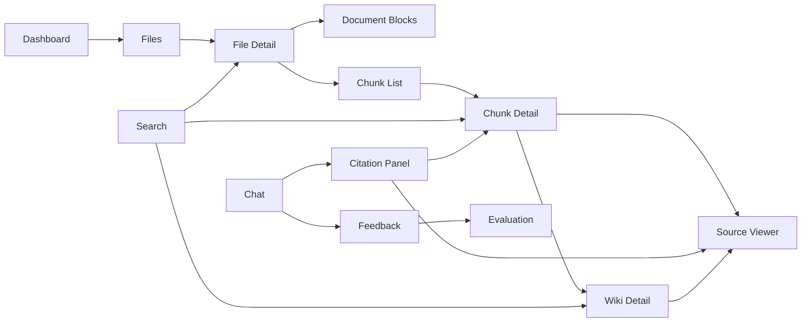
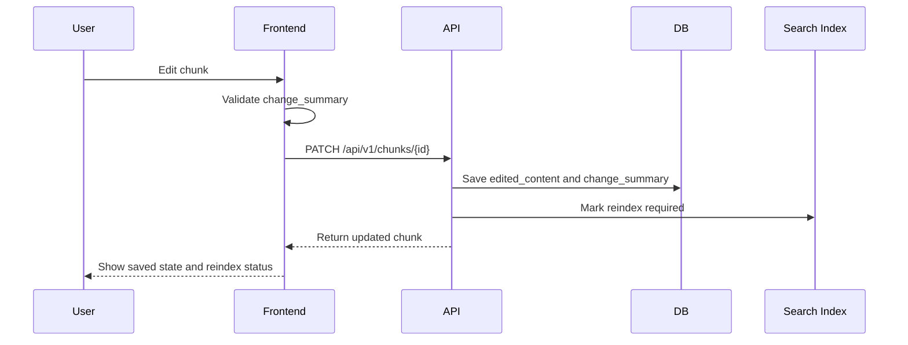
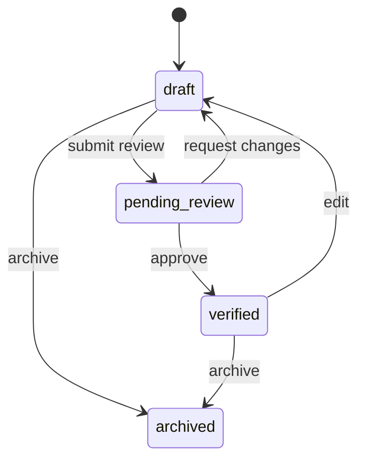
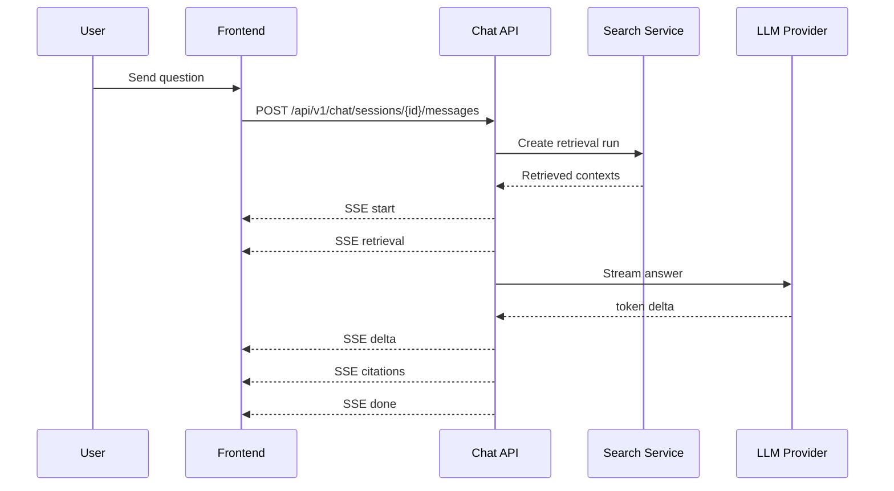

# KnowWeave 前端交互规格说明书

版本：v0.3
更新时间：2026-05-24
状态：Draft
关联文档：

- `docs/01-product-spec.md`
- `docs/02-knowledge-lifecycle-spec.md`
- `docs/03-system-architecture-spec.md`
- `docs/04-data-model-spec.md`
- `docs/05-ingestion-spec.md`
- `docs/06-llm-wiki-spec.md`
- `docs/07-search-and-chat-spec.md`

## 1. 文档目标

本文定义 KnowWeave P0/P1/P2 的前端页面、交互流程、状态呈现和演示路径。

KnowWeave 的前端不是简单的文件上传和聊天入口，而是知识治理工作台。前端必须让用户看见并控制以下过程：

- 文件如何被上传、解析和分块。
- chunk 如何从原文件中来，如何被编辑、忽略、确认和重新索引。
- Search 如何命中文件、chunk、Knowledge Unit 和 Wiki。
- Chat 如何基于 retrieved contexts 生成答案，并展示 citation。
- Wiki 如何从文件、chunk、Knowledge Unit、问答和反馈沉淀出来。
- 反馈如何进入 evaluation sample，形成闭环治理。

## 2. 范围边界

### 2.1 本文负责

- 前端信息架构。
- 页面清单和页面职责。
- 核心用户操作流程。
- chunk 查看、编辑、定位和低质量提示交互。
- Wiki 页面编辑、引用查看和状态流转交互。
- Search UI 和 Chat UI。
- SSE 流式回答和 Markdown 渲染策略。
- citation 面板、retrieved contexts 面板和 feedback 交互。
- P0/P1/P2 前端能力拆分。
- 前端验收场景。

### 2.2 本文不负责

- 数据库表结构。见 `04-data-model-spec.md`。
- 文件解析和 chunking 算法。见 `05-ingestion-spec.md`。
- LLM Wiki 生成规则。见 `06-llm-wiki-spec.md`。
- Search、RAG 和 SSE 后端协议细节。见 `07-search-and-chat-spec.md`。
- 完整测试用例矩阵已在 `09-acceptance-test-spec.md` 中定义。
- 评测运行和指标计算已在 `10-evaluation-spec.md` 中定义。

## 3. 前端产品定位

前端应定位为企业知识治理工作台，优先满足重复操作、扫描、审查和定位，而不是营销展示。

设计原则：

| 原则 | 说明 |
| --- | --- |
| 可追溯 | 用户看到答案、Wiki、KU 或 chunk 时，应能回到来源文件、页码、文本块或行号 |
| 可编辑 | 用户可以修正 AI 解析、分块和生成结果，但系统必须保留原始内容和来源关系 |
| 可解释 | 检索命中、召回上下文、引用和低质量提示需要可查看 |
| 可闭环 | 用户反馈不只是按钮状态，应进入反馈记录、评测样本候选和知识改进流程 |
| 可扩展 | P0 只做文本主链路，但页面结构应容纳表格、图片、公式、代码、音视频 typed chunk |

## 4. 推荐前端技术栈

本文只定义推荐方案。工程脚手架阶段可根据团队熟悉度微调，但不得破坏已定义的交互边界。

| 类别 | P0 推荐 | P1/P2 扩展 | 说明 |
| --- | --- | --- | --- |
| 框架 | React + TypeScript | Next.js 可选 | P0 更适合 SPA 工作台；需要 SSR 时再评估 Next.js |
| 构建 | Vite | Monorepo 工具可选 | 启动快，适合 MVP |
| 路由 | React Router | 路由权限守卫 | 文件、Wiki、Chat、设置等页面需要清晰路径 |
| Server State | TanStack Query | 持久化缓存、预取 | 管理列表、详情、任务状态、feedback 提交 |
| Local State | Zustand 或 React Context | URL 状态同步 | 管理布局、筛选器、临时编辑态 |
| UI 组件 | Ant Design v5 或 Semi Design | 领域组件库沉淀 | 知识治理偏后台工具，表格、表单、抽屉、Tabs、Tree 使用频繁 |
| 图标 | lucide-react | 与组件库图标并用 | 操作按钮优先用清晰图标和 tooltip |
| Markdown 渲染 | react-markdown + remark-gfm + rehype-sanitize | rehype-highlight 或 Shiki | Wiki、Chat、citation、chunk preview 复用 |
| Markdown 编辑 | textarea + preview | Milkdown / TipTap / Monaco Markdown | P0 先保障可用，P1 再升级编辑体验 |
| PDF 预览 | 文件页码跳转 + 文本块定位 | PDF.js / react-pdf + bbox 高亮 | P0 至少展示 page_number 和 source span |
| 流式通信 | SSE | WebSocket 用于任务状态推送 | Chat 使用 SSE；长任务 P0 可轮询，P1 WebSocket |
| 图表 | ECharts 或 AntV 可选 | 质量面板、评估面板 | P0 可先用表格，P1 做指标图 |

## 5. 信息架构

### 5.1 一级导航

| 导航 | P0 | 主要用途 |
| --- | --- | --- |
| Dashboard | 是 | 查看文件、解析、chunk、Wiki、反馈等整体状态 |
| Files | 是 | 上传、列表、详情、解析和分块入口 |
| Chunks | 是 | 跨文件治理 chunk，处理低质量 chunk |
| Knowledge Units | 是 | 查看和确认候选知识单元 |
| Wiki | 是 | 查看、生成、编辑和审核 Wiki 页面 |
| Search | 是 | 搜索文件、chunk、KU、Wiki |
| Chat | 是 | 基于知识库问答，查看引用和反馈 |
| Evaluation | P1 | 评测样本、评测运行和指标 |
| Settings | P1 | LLM Provider、Embedding、解析策略、权限 |

### 5.2 页面路径建议

| 页面 | 路径 | P0 | 说明 |
| --- | --- | --- | --- |
| Dashboard | `/` | 是 | 项目概览和待处理事项 |
| File List | `/files` | 是 | 文件列表、上传、状态筛选 |
| File Detail | `/files/:fileId` | 是 | 文件元数据、解析结果、blocks、chunks、Wiki |
| Chunk Workspace | `/chunks` | 是 | 全局 chunk 治理 |
| Chunk Detail | `/chunks/:chunkId` | 是 | chunk 详情、编辑、source span、关联对象 |
| KU Workspace | `/knowledge-units` | 是 | KU 列表、状态、来源 |
| Wiki List | `/wiki` | 是 | Wiki 页面列表 |
| Wiki Detail | `/wiki/:wikiPageId` | 是 | Wiki 阅读、编辑、引用、状态 |
| Search | `/search` | 是 | 关键词搜索和结果解释 |
| Chat | `/chat` | 是 | 会话、回答、引用和反馈 |
| Evaluation | `/evaluation` | P0 candidate / P1 run | 样本候选、运行和指标 |
| Settings | `/settings` | P1 | 模型与系统配置 |

### 5.3 页面关系图



## 6. 全局布局

P0 推荐采用三栏工作台结构：

| 区域 | 内容 |
| --- | --- |
| 左侧导航 | 一级导航、当前模块、系统状态入口 |
| 主内容区 | 列表、详情、编辑器、聊天内容 |
| 右侧上下文栏 | citation、source span、retrieved contexts、任务状态、质量提示 |

交互约束：

- 右侧上下文栏可以折叠。
- 文件详情、Chunk 详情、Wiki 详情和 Chat 都应复用上下文栏。
- 列表页优先使用表格和筛选器。
- 详情页优先使用 Tabs：Overview、Content、Source、Relations、History。
- 长内容编辑不要放在小弹窗中，应使用主内容区或大抽屉。

## 7. Dashboard

Dashboard 用于让评审和用户快速理解系统状态，不承载复杂编辑。

### 7.1 P0 指标卡片

| 指标 | 说明 |
| --- | --- |
| 文件总数 | knowledge_files 总数，排除 hard delete |
| 解析成功率 | parse_results 成功数 / 总解析数 |
| chunk 总数 | chunks 总数 |
| 低质量 chunk 数 | quality_signals 命中的 chunk 数 |
| Wiki 页面数 | wiki_pages 总数 |
| 待审核 Wiki 数 | status = pending_review |
| Chat 会话数 | chat_sessions 总数 |
| 反馈数 | feedback 总数 |

### 7.2 P0 待处理列表

| 待处理项 | 跳转 |
| --- | --- |
| 解析失败文件 | File Detail |
| 待治理低质量 chunk | Chunk Detail |
| 待审核 Wiki | Wiki Detail |
| citation_wrong 反馈 | Chat Message / Citation |
| 可沉淀 evaluation sample 的反馈 | Evaluation Sample Candidate |

## 8. Files 页面

### 8.1 文件列表

文件列表应展示：

| 字段 | P0 | 说明 |
| --- | --- | --- |
| 文件名 | 是 | 支持跳转详情 |
| 文件类型 | 是 | txt、md、pdf、docx |
| 上传时间 | 是 | 排序字段 |
| 解析状态 | 是 | pending、running、succeeded、failed |
| chunk 数 | 是 | 解析完成后展示 |
| Wiki 状态 | 是 | none、draft、pending_review、verified |
| source_available | 是 | 来源是否可用于引用和问答 |
| 标签 | P1 | tags 过滤 |
| 操作 | 是 | 详情、重新解析、软删除 |

### 8.2 上传交互

P0 上传流程：

1. 用户点击上传。
2. 选择一个或多个文件。
3. 前端显示上传进度。
4. 上传完成后创建 file record。
5. 用户可以立即触发解析，或进入文件详情页。

上传限制：

- P0 文件类型：txt、md、pdf、docx。
- 文件大小限制由后端返回配置，前端不得写死。
- 上传失败需要展示失败原因、重试入口和错误码。

### 8.3 文件删除

P0 删除是软删除。

前端展示规则：

- 默认列表隐藏 deleted 文件。
- 用户可通过筛选查看 deleted 文件。
- deleted 文件详情页应展示来源不可用提示。
- 关联 chunk、Wiki、citation 不直接消失，但默认不进入新问答召回。

## 9. File Detail 页面

文件详情是 P0 的核心页面之一，用于连接原始文件、解析结果、chunk、Wiki 和问答。

### 9.1 Tabs

| Tab | P0 | 内容 |
| --- | --- | --- |
| Overview | 是 | 文件元数据、解析状态、统计、风险提示 |
| Parse Result | 是 | parse result、错误、重试 |
| Blocks | 是 | Document Blocks 列表和预览 |
| Chunks | 是 | 当前文件 chunk 列表 |
| Wiki | 是 | 当前文件关联 Document Wiki |
| Chat | P1 | 针对当前文件的问答入口 |
| History | P1 | 解析、分块、编辑、Wiki 生成记录 |

### 9.2 文件详情状态

| 状态 | 前端行为 |
| --- | --- |
| uploaded | 展示“开始解析” |
| parsing | 展示任务进度，P0 轮询 |
| parsed | 展示 blocks 和 chunking 操作 |
| chunked | 展示 chunk 列表和 Wiki 生成入口 |
| failed | 展示错误原因和重试 |
| deleted | 展示 source unavailable，不允许新解析 |

## 10. Document Blocks 交互

Document Block 是原文件解析后的结构化中间层，用于帮助用户理解 chunk 来源。

### 10.1 Block 列表字段

| 字段 | P0 | 说明 |
| --- | --- | --- |
| block_index | 是 | 文件内顺序 |
| block_type | 是 | text、heading、table、image、formula、code、audio、video |
| heading_path | 是 | 文档层级 |
| page_number | PDF P0 | PDF 页码 |
| text_preview | 是 | 文本预览 |
| source_span | 是 | 定位信息 |
| chunk_count | 是 | 关联 chunk 数 |

### 10.2 typed block 预留

P0 不深度解析多模态内容，但 UI 不应假设所有 block 都是纯文本。

| 类型 | P0 展示 | P1/P2 扩展 |
| --- | --- | --- |
| table | 显示占位和 caption/文本化结果 | 表格网格预览、单元格定位、表格问答 |
| image | 显示图片占位、OCR/alt 文本 | 图片预览、区域标注、视觉模型摘要 |
| formula | 显示 LaTeX/文本化结果 | 公式渲染、公式解释、符号检索 |
| code | 显示代码文本 | 语法高亮、语言识别、函数级切分 |
| audio | 显示转写占位 | 时间轴、章节、说话人 |
| video | 显示转写占位 | 关键帧、字幕、时间轴定位 |

## 11. Chunk Workspace

Chunk Workspace 是 KnowWeave 与普通 RAG 工具的关键差异页面。用户需要在这里对知识片段进行细粒度管理。

### 11.1 Chunk 列表字段

| 字段 | P0 | 说明 |
| --- | --- | --- |
| chunk_index | 是 | 文件内顺序 |
| title / heading | 是 | chunk 所属标题路径 |
| content_preview | 是 | 优先展示 edited_content，否则 raw_content |
| file_name | 是 | 来源文件 |
| source_span | 是 | 页码、行号、block 或字符范围 |
| chunk_status | 是 | draft、verified、ignored、archived |
| quality_flags | 是 | 低质量提示 |
| token_count / char_count | 是 | 大小判断 |
| parent_chunk | P1 | 父子分块关系 |
| related_wiki | P1 | 被哪些 Wiki 引用 |
| actions | 是 | 查看、编辑、忽略、确认、定位 |

### 11.2 筛选器

P0 筛选：

- 文件。
- 文件类型。
- chunk_status。
- quality_flags。
- source_available。
- 是否有 edited_content。
- 是否被 Wiki 或 citation 引用。

P1 筛选：

- chunk_strategy。
- parser_version。
- embedding_status。
- parent_chunk_id。
- feedback 类型。

### 11.3 批量操作

P0 可选，P1 必须：

| 操作 | 说明 |
| --- | --- |
| 批量确认 | 将选中 chunk 标记为 verified |
| 批量忽略 | 将选中 chunk 标记为 ignored |
| 批量重新索引 | edited_content 变化后触发索引刷新 |
| 批量导出 | 导出 chunk 内容和 source span，用于调试 |

## 12. Chunk Detail

Chunk Detail 应使用详情页或右侧大抽屉。它必须同时展示内容、来源、质量、关系和操作。

### 12.1 内容结构

| 区域 | P0 | 说明 |
| --- | --- | --- |
| Header | 是 | chunk ID、状态、文件、标题路径 |
| Content | 是 | raw_content 和 edited_content |
| Source | 是 | source span、原文件定位入口 |
| Quality | 是 | 低质量 flags 和原因 |
| Relations | 是 | 关联 KU、Wiki、citation |
| Actions | 是 | 保存、确认、忽略、重新索引 |
| History | P1 | 编辑历史、diff、rechunk 记录 |

### 12.2 raw_content 与 edited_content

前端规则：

- raw_content 只读。
- edited_content 可编辑。
- 如果 edited_content 存在，预览、搜索上下文和 Chat prompt 默认使用 edited_content。
- citation 仍指向原始 source span。
- 保存 edited_content 时必须填写 change_summary。
- 保存后 chunk_status 可保持 draft，也可由用户显式设为 verified。

### 12.3 编辑保存流程



### 12.4 编辑校验

| 校验 | P0 | 说明 |
| --- | --- | --- |
| edited_content 非空 | 是 | 不能保存空内容 |
| change_summary 必填 | 是 | 记录修改原因 |
| 长度限制 | 是 | 超过配置上限提示 |
| source_span 不可被编辑覆盖 | 是 | 保持追溯关系 |
| 内容变化 diff | P1 | 展示 raw vs edited |

## 13. 低质量 chunk 界定与展示

低质量 chunk 不等于错误 chunk。前端应将它展示为“需要人工检查”的提示，而不是自动删除。

### 13.1 P0 quality flags

| flag | 含义 | 前端展示 |
| --- | --- | --- |
| too_short | 内容过短 | 黄色提示，可批量忽略 |
| too_long | 内容过长 | 黄色提示，建议拆分 |
| missing_source_span | 缺少来源定位 | 红色提示，不建议进入 Chat |
| duplicate_content | 与其他 chunk 高度重复 | 黄色提示，显示重复对象 |
| low_information_density | 信息密度低 | 黄色提示 |
| parse_noise | 页眉页脚、目录噪声、乱码 | 黄色提示 |
| negative_feedback | 被用户反馈为低质量 | 红色提示 |

### 13.2 质量提示交互

- 列表中用标签展示 flags。
- 详情页展示具体原因和关联证据。
- 用户可以确认“接受该 chunk”，系统保留 flags 但 chunk_status 变为 verified。
- 用户可以忽略 chunk，ignored chunk 默认不参与搜索、问答和 Wiki 生成。
- 用户可以编辑 chunk，保存后重新计算质量 flags。

## 14. Source Viewer

Source Viewer 是统一的来源定位组件。它需要被 Chunk Detail、Wiki Detail、Search Result、Citation Panel 复用。

### 14.1 SourceLocator 输入

```json
{
  "source_type": "chunk",
  "file_id": "file_001",
  "chunk_id": "chunk_023",
  "document_block_id": "block_045",
  "source_span": {
    "page_number": 12,
    "line_start": 120,
    "line_end": 138,
    "char_start": 3210,
    "char_end": 3780,
    "bbox": null
  },
  "source_available": true
}
```

### 14.2 不同文件类型定位

| 文件类型 | P0 定位 | P1/P2 定位 |
| --- | --- | --- |
| Markdown | line_start / line_end | column_start / column_end，标题树同步高亮 |
| TXT | line_start / line_end 或 char range | 文本范围高亮 |
| PDF | page_number + text preview | PDF.js bbox 高亮、搜索文本命中 |
| DOCX | paragraph index / document_block_id | 段落高亮、结构树定位 |
| 表格 | table block + caption | 单元格范围、sheet-like 预览 |
| 图片 | image block + OCR 文本 | 图片区域 bbox、视觉引用 |
| 公式 | formula block + LaTeX | 公式渲染和符号级定位 |
| 代码 | code block + 行号 | 函数/类级定位 |
| 音频 | transcript segment | timestamp、speaker、章节 |
| 视频 | transcript segment | timestamp、key frame、subtitle |

### 14.3 句号、标点或语义切分下的定位

如果 chunk 不是完整段落，而是基于句号、标点、语义边界或滑动窗口生成，前端按以下规则定位：

- source span 仍指向原始 block。
- 如果存在 char_start / char_end，Source Viewer 在 block 内高亮字符范围。
- 如果只存在 block_id 和 chunk_index，前端展示 block 文本并用“近似定位”提示。
- 如果 PDF 无 bbox，P0 跳到 page_number 并展示命中文本 preview。
- 如果 edited_content 与 raw_content 差异较大，定位仍回到 raw_content 对应位置，并提示“当前展示内容已人工编辑”。

### 14.4 source_available 展示

| source_available | 展示 |
| --- | --- |
| true | 可点击定位 |
| false | 展示来源不可用，保留 citation 文本快照 |

source_available = false 的常见原因：

- 原文件被软删除。
- source span 缺失。
- 解析结果失效。
- 权限不足。
- 文件存储不可访问。

## 15. Knowledge Unit 页面

Knowledge Unit 是介于 raw chunk 和 Wiki 页面之间的治理对象。

### 15.1 KU 列表字段

| 字段 | P0 | 说明 |
| --- | --- | --- |
| title | 是 | 知识单元标题 |
| summary | 是 | 摘要 |
| status | 是 | draft、verified、archived |
| source chunks | 是 | 来源 chunk 数 |
| confidence | P1 | AI 生成置信度 |
| related wiki | P1 | 关联 Wiki |

### 15.2 KU 操作

P0：

- 查看来源 chunk。
- 查看引用。
- 编辑标题和摘要。
- 确认为 verified。
- archived。

P1：

- 合并 KU。
- 拆分 KU。
- 从 Chat 反馈创建 KU。
- 将 verified KU 批量加入 Wiki。

## 16. Wiki 页面

Wiki 是长期沉淀层，前端必须让用户看见“AI 生成内容”和“来源证据”之间的关系。

### 16.1 Wiki 列表字段

| 字段 | P0 | 说明 |
| --- | --- | --- |
| title | 是 | Wiki 标题 |
| wiki_type | 是 | document、topic、faq |
| status | 是 | draft、pending_review、verified、archived |
| source_count | 是 | 引用来源数量 |
| updated_at | 是 | 最近更新 |
| source_available | 是 | 来源整体可用性 |
| revision_count | P1 | 修订数量 |

### 16.2 Wiki Detail 布局

| 区域 | P0 | 说明 |
| --- | --- | --- |
| Header | 是 | 标题、类型、状态、操作 |
| Outline | 是 | Markdown 标题目录 |
| Content | 是 | Markdown 阅读视图 |
| Editor | 是 | textarea + preview |
| Citation Panel | 是 | 当前页面引用 |
| Source Panel | 是 | 引用定位 |
| Revision Panel | P1 | 历史版本、diff、rollback |

### 16.3 Wiki 编辑规则

- P0 使用 Markdown textarea + preview。
- 保存时必须填写 change_summary。
- 修改后默认回到 draft 或 pending_review，不自动 verified。
- 关键结论应保留 citation key。
- 如果删除 citation key，前端提示可能降低可信度。
- 如果 source_available = false，Wiki 仍可阅读，但引用区域标记来源不可用。

### 16.4 Wiki 状态流转



## 17. Search 页面

Search 页面用于解释“系统搜到了什么”，不是只返回一串文本。

### 17.1 Search 输入区

P0 支持：

- 关键词输入。
- 类型筛选：file、chunk、knowledge_unit、wiki_page。
- 文件类型筛选。
- source_available 筛选。
- 搜索按钮。

P1 支持：

- 混合检索参数。
- rerank 开关。
- 时间范围。
- tags。
- chunk strategy。

### 17.2 Search Result 卡片

每条结果展示：

| 字段 | P0 | 说明 |
| --- | --- | --- |
| result_type | 是 | file、chunk、KU、Wiki |
| title | 是 | 标题 |
| snippet | 是 | 命中片段 |
| score | P1 | 排序分数 |
| source | 是 | 来源文件和位置 |
| source_available | 是 | 可用性 |
| actions | 是 | 打开、定位、加入 Chat 上下文 |

### 17.3 Search 结果分组

P0 默认按 result_type 分组：

1. Wiki。
2. Knowledge Unit。
3. Chunk。
4. File。

如果同一来源 chunk 同时被 KU 和 Wiki 覆盖，前端应展示“同源关系”，避免用户误以为是完全不同证据。

### 17.4 retrieval_run_id 展示

Search 页面不需要默认显示 retrieval_run_id，但应在调试信息中可查看，用于后续评测、反馈定位和问题复现。

## 18. Chat 页面

Chat 页面是知识消费入口，同时也是反馈和评估样本沉淀入口。

### 18.1 Chat 布局

| 区域 | P0 | 说明 |
| --- | --- | --- |
| Session List | 是 | 会话列表 |
| Message Stream | 是 | 用户问题和 AI 回答 |
| Input Box | 是 | 输入问题 |
| Citation Panel | 是 | 回答引用 |
| Retrieved Context Panel | 是 | 本轮召回上下文 |
| Feedback Actions | 是 | 点赞、点踩、引用错误、答案错误 |
| Debug Panel | P1 | prompt、score、rerank、token |

### 18.2 Chat 发送流程



### 18.3 回答状态

| 状态 | 前端行为 |
| --- | --- |
| pending | 展示占位和停止按钮 |
| retrieving | 展示正在检索 |
| streaming | 增量渲染回答 |
| citations_ready | citation 面板可点击 |
| done | 固化最终 Markdown |
| error | 展示错误、允许重试 |
| partial_done | 展示部分回答和失败原因 |

### 18.4 Citation Panel

Citation Panel 展示当前回答的证据。

字段：

- citation_key，例如 `[S1]`。
- source_type：chunk、knowledge_unit、wiki_page、file。
- source title。
- snippet。
- source_available。
- source span。
- 打开来源。
- 标记 citation_wrong。

交互：

- 点击 `[S1]`，右侧面板滚动到对应 citation。
- 点击 citation，打开 Source Viewer。
- citation_wrong 反馈必须关联 message_id、citation_id、retrieval_run_id。
- source_available = false 时，保留 citation 快照，但定位按钮 disabled。

### 18.5 Retrieved Context Panel

Retrieved Context Panel 用于解释答案上下文。

P0 展示：

- retrieval_run_id。
- result_type。
- title。
- snippet。
- rank。
- source_available。
- 是否进入 prompt。

P1 展示：

- BM25 score。
- vector score。
- rerank score。
- parent-child chunk 扩展关系。
- 被截断原因。

## 19. 流式 Markdown 渲染

Chat 回答和部分 Wiki 生成状态会使用流式 Markdown。前端必须处理未闭合 Markdown 语法、citation 延迟到达和最终内容固化。

### 19.1 输入事件

前端只消费 KnowWeave SSE 协议，不直接依赖 Qwen 或其他 Provider 的原始事件。

P0 事件：

- start。
- retrieval。
- delta。
- citations。
- done。
- error。

P1 事件：

- usage。
- debug。
- rewrite。

### 19.2 渲染策略

P0 策略：

1. 收到 start 后创建 assistant message 占位。
2. 收到 delta 后追加到本地 `answerMarkdownBuffer`。
3. 以 50 到 100ms 节流渲染 `react-markdown`。
4. streaming 期间关闭复杂代码高亮。
5. 不在 delta 中解析 citation JSON。
6. citations event 到达后绑定 citation panel。
7. done event 到达后使用服务端返回的最终 `answer_markdown` 或本地 buffer 做最终渲染。
8. 最终渲染时开启 GFM、sanitize 和代码高亮。

### 19.3 Markdown 安全规则

- 禁止渲染原始 HTML。
- 使用 rehype-sanitize。
- 外链默认新窗口打开。
- 图片默认不直接加载远程 URL，P1 再加入白名单。
- code block 在 streaming 期间按普通 pre 展示，done 后再高亮。
- 表格在 streaming 期间允许布局不完整，done 后重新排版。

### 19.4 Citation key 规则

- 正文中出现 `[S1]`、`[S2]` 等 citation key 时，前端将其渲染为可点击锚点。
- 如果正文出现 citation key，但 citations 列表没有对应项，前端标记“引用未返回”，并上报前端诊断。
- 如果 citations 列表存在但正文没有 key，Citation Panel 仍展示该 citation。
- citation key 不应由前端编造。

## 20. Feedback 交互

Feedback 是 KnowWeave 闭环能力的入口。

### 20.1 Feedback 类型

| 类型 | target_type | P0 | 说明 |
| --- | --- | --- | --- |
| answer_helpful | chat_message | 是 | 答案有帮助 |
| answer_wrong | chat_message | 是 | 答案错误 |
| citation_helpful | citation | 是 | 引用有效 |
| citation_wrong | citation | 是 | 引用不支持结论 |
| chunk_low_quality | chunk | 是 | chunk 质量差 |
| wiki_needs_update | wiki_page | 是 | Wiki 需要更新 |

### 20.2 Feedback 表单

P0 字段：

- feedback_type。
- target_type。
- target_id。
- comment，可选。
- retrieval_run_id，如果来自 Search 或 Chat。
- create_evaluation_candidate，是否沉淀为评测样本候选。

### 20.3 Feedback 后续动作

| feedback | P0 后续 | P1 后续 |
| --- | --- | --- |
| answer_wrong | 标记消息，允许生成 evaluation candidate | 触发 Wiki 或 chunk 修订建议 |
| citation_wrong | 标记 citation，进入待处理列表 | 触发 citation 修复任务 |
| chunk_low_quality | chunk 增加 quality flag | 触发 rechunk 建议 |
| wiki_needs_update | Wiki 回到 draft 或 pending_review | 创建修订任务 |

## 21. Evaluation 前端预留

P0 不强制做完整 Evaluation 页面，但反馈交互必须为 P1 留出入口。

### 21.1 Evaluation Sample Candidate

当用户提交 answer_wrong 或 citation_wrong 时，前端可以提供“加入评测样本候选”开关。

候选样本展示：

- query。
- answer。
- expected_answer，可后补。
- expected_source_chunks，可后补。
- retrieved_contexts。
- citations。
- feedback comment。

### 21.2 Evaluation Runs

P1 页面展示：

- evaluation_run 列表。
- 数据集版本。
- 模型配置。
- Recall@K。
- Precision@K。
- Answer Accuracy。
- Citation Precision。
- 失败样本列表。

## 22. 长任务状态

KnowWeave 中上传、解析、分块、索引、Wiki 生成和评测运行都可能是长任务。

### 22.1 P0 轮询

P0 可使用 TanStack Query 定时 refetch：

- parsing。
- chunking。
- indexing。
- wiki_generation。

轮询间隔由后端返回或前端配置，默认 2 到 5 秒。

### 22.2 P1 WebSocket

WebSocket 保留给任务状态推送，而不是 Chat 流式回答。

适用任务：

- 文件解析。
- chunking。
- indexing。
- Wiki 生成。
- evaluation run。

消息最小字段：

```json
{
  "task_id": "task_001",
  "task_type": "parsing",
  "status": "running",
  "progress": 0.42,
  "message": "Parsing page 12",
  "related_object_type": "file",
  "related_object_id": "file_001"
}
```

## 23. 多类型内容前端扩展

多类型内容可能嵌入在 PDF、Markdown、DOCX 中，而不是独立文件。前端必须以 typed block / typed chunk 方式承接。

### 23.1 通用 typed chunk 卡片

每个 typed chunk 都应有统一外壳：

- 类型图标。
- 来源文件。
- 来源位置。
- 内容预览。
- 文本化结果。
- 原始对象预览入口。
- chunk_status。
- quality_flags。
- citation 状态。

### 23.2 表格

P0：

- 展示 table placeholder。
- 展示 caption 或 parser 提取的 markdown table。
- 支持作为普通文本 chunk 检索。

P1/P2：

- 表格网格预览。
- 单元格范围 source span。
- 表头识别。
- 表格摘要。
- 表格问答。

### 23.3 图片和图表

P0：

- 展示 image placeholder。
- 展示 OCR 或 alt 文本。
- 保留 image block ID。

P1/P2：

- 图片预览。
- 图表标题、图例、坐标轴结构化。
- 图片区域 bbox。
- 视觉模型生成描述。
- 图片 citation 定位到区域。

### 23.4 公式

P0：

- 展示公式文本化结果或 LaTeX。

P1/P2：

- 公式渲染。
- 符号解释。
- 公式与上下文段落绑定。
- 支持公式级 citation。

### 23.5 代码

P0：

- 作为 code block 展示。
- 记录语言，如果 parser 能识别。

P1/P2：

- 语法高亮。
- 函数/类级 chunk。
- 文件路径、行号、符号索引。
- 代码解释和调用关系。

### 23.6 音视频

P0：

- 不要求直接解析音视频文件。
- 如果 PDF、Markdown 或 DOCX 中包含音视频链接，作为 external media block 展示。
- 如果已有转写文本，可作为 text chunk 管理。

P1/P2：

- 通过转写服务生成 transcript。
- 按 timestamp 分块。
- 支持 speaker、chapter、key frame。
- citation 定位到时间段。
- Source Viewer 支持跳转到时间轴。

## 24. 空状态、错误状态和权限状态

### 24.1 空状态

| 页面 | 空状态 |
| --- | --- |
| Files | 提示上传文件 |
| Chunks | 提示先解析文件 |
| Wiki | 提示从文件或 chunk 生成 Wiki |
| Search | 提示输入关键词 |
| Chat | 提示选择知识范围并提问 |
| Evaluation | 提示从反馈沉淀样本 |

### 24.2 错误状态

错误展示必须包含：

- 用户可读错误。
- 错误码。
- 重试入口。
- 是否需要联系管理员。

### 24.3 权限状态

P0 可以不做复杂权限，但前端文案和组件状态要预留：

- 无权限查看文件。
- 无权限编辑 Wiki。
- 无权限查看 citation 原文。
- source_available = false 但 citation 快照可见。

## 25. P0 / P1 / P2 拆分

### 25.1 P0 必须实现

| 能力 | 页面 |
| --- | --- |
| 文件上传、列表、详情 | Files、File Detail |
| 解析状态和重试 | File Detail |
| Document Block 列表 | File Detail |
| Chunk 列表、详情、编辑、忽略、确认 | Chunks、Chunk Detail |
| Source Viewer 基础定位 | Chunk、Wiki、Chat |
| Document Wiki 生成、编辑、状态 | Wiki |
| Search 文件/chunk/KU/Wiki | Search |
| Chat SSE 流式回答 | Chat |
| Citation Panel | Chat、Wiki |
| Feedback 提交 | Chat、Chunk、Wiki |

### 25.2 P1 增强

| 能力 | 页面 |
| --- | --- |
| pgvector 混合检索调试 | Search |
| Wiki Revision diff/rollback | Wiki |
| Evaluation Sample 管理 | Evaluation |
| Evaluation Runs 指标 | Evaluation |
| WebSocket 任务状态推送 | 全局任务中心 |
| PDF bbox 高亮 | Source Viewer |
| Markdown 高级编辑器 | Wiki |
| parent-child chunk 可视化 | Chunk |

### 25.3 P2 扩展

| 能力 | 页面 |
| --- | --- |
| 表格、图片、公式、代码 typed chunk 深度治理 | Chunk、Source Viewer |
| 音视频 timestamp chunk | Chunk、Source Viewer |
| 知识图谱和双链 | Wiki、KU |
| 协作审核、评论、权限 | 全局 |
| 多模型配置和对比 | Settings、Evaluation |

## 26. 前端验收场景

### 26.1 上传到 chunk 治理

Given 用户上传一个 PDF

When 系统解析并生成 chunk

Then 用户可以在 File Detail 中看到解析状态、Document Blocks、chunk 列表

And 用户可以打开某个 chunk，查看 raw_content、edited_content、quality_flags 和 source span

And 用户可以跳转到 PDF 页码或文本预览位置

### 26.2 chunk 编辑影响搜索

Given 用户编辑某个 chunk 的 edited_content

When 用户保存并触发重新索引

Then Search Result 展示 edited_content 的预览

And citation 仍能定位到原 source span

### 26.3 Chat 流式回答与 citation

Given 知识库中已有可用 chunk 和 Wiki

When 用户发起问题

Then 前端以 SSE 流式展示 Markdown 回答

And done 后展示完整 citation 列表

And 用户点击 citation 可以打开 Source Viewer

### 26.4 citation_wrong 反馈沉淀

Given 用户发现某条 citation 不支持答案结论

When 用户点击 citation_wrong 并填写说明

Then 系统保存 feedback

And feedback 关联 message_id、citation_id、retrieval_run_id

And 用户可以选择沉淀为 evaluation sample candidate

### 26.5 Wiki 编辑与来源

Given 系统生成 Document Wiki

When 用户编辑 Markdown 正文并保存

Then 用户必须填写 change_summary

And Wiki 状态回到 draft 或 pending_review

And citation 面板仍能查看来源，source_available = false 的来源要明确提示

## 27. 与其他 Spec 的对齐

| 主题 | 本文前端行为 | 来源文档 |
| --- | --- | --- |
| chunk source span | Source Viewer 展示 page、line、char、block、bbox | `05-ingestion-spec.md` |
| raw/edited content | raw 只读，edited 可编辑，citation 指向 source span | `04-data-model-spec.md`、`05-ingestion-spec.md` |
| Wiki 引用 | Wiki Detail 展示 citation panel 和 source_available | `06-llm-wiki-spec.md` |
| Search Result | Search UI 统一展示 file、chunk、KU、Wiki | `07-search-and-chat-spec.md` |
| SSE | Chat 消费 start/retrieval/delta/citations/done/error | `07-search-and-chat-spec.md` |
| Feedback | feedback 可沉淀 evaluation sample candidate | `07-search-and-chat-spec.md` |
| WebSocket | P1 用于任务状态推送 | `03-system-architecture-spec.md` |

## 28. 已承接与后续实现

1. `09-acceptance-test-spec.md`
   - 已将本文验收场景展开为可执行检查清单。
   - 已明确演示数据、演示步骤和失败处理。

2. `10-evaluation-spec.md`
   - 定义 Evaluation 页面背后的数据集、运行、指标和回归评估。
   - 细化准确率、召回率、引用命中率和知识健康指标。

下一步进入工程实现 Spec：

1. 前端实现 Spec
   - 定义前端目录结构、组件命名、API client、状态管理和测试策略。
