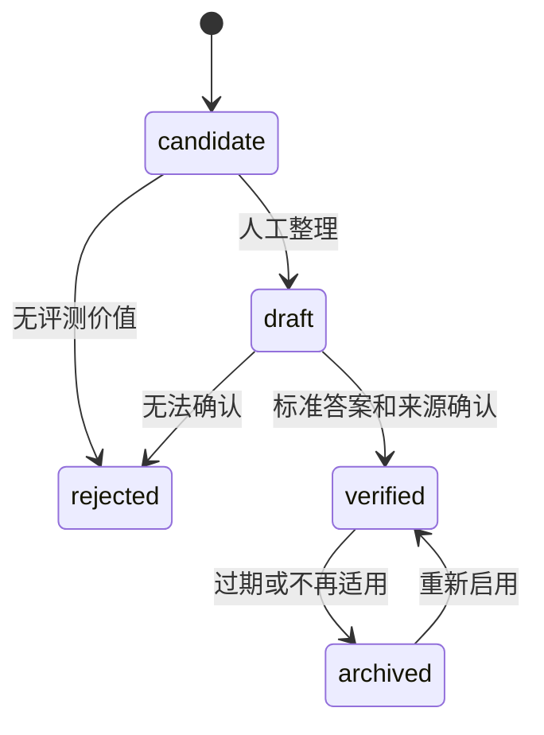
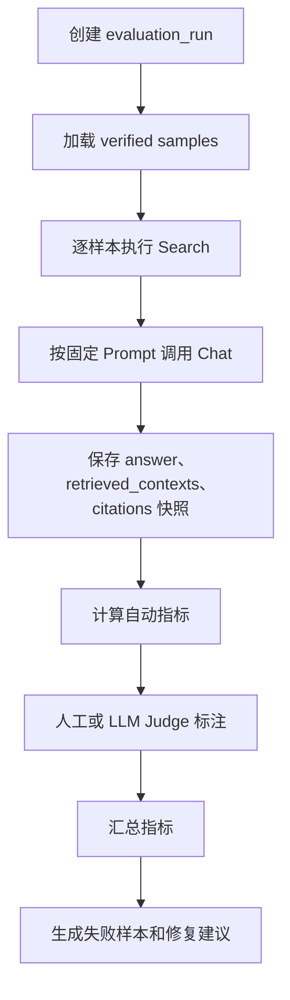
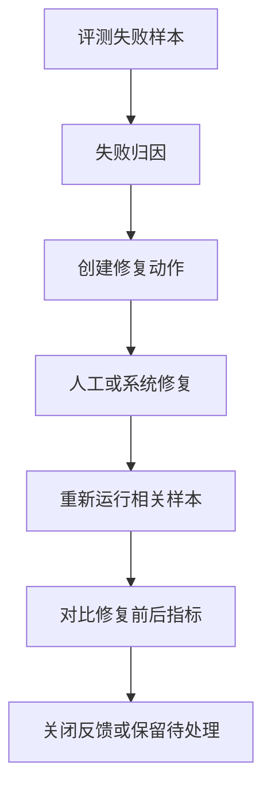

# KnowWeave 评测与反馈闭环规格说明书

版本：v0.2
日期：2026-05-24
状态：草案
关联文档：`docs/02-knowledge-lifecycle-spec.md`、`docs/04-data-model-spec.md`、`docs/07-search-and-chat-spec.md`、`docs/08-frontend-spec.md`、`docs/09-acceptance-test-spec.md`

## 0. 文档边界

本文定义 KnowWeave 的评测样本、评测集、评测运行、指标计算、人工评审和回归对比机制。

本文承接前面文档中已经预留但未展开的内容：

- `02-knowledge-lifecycle-spec.md` 中的评估闭环、准确率、召回率、引用准确率和反馈转评测样本。
- `04-data-model-spec.md` 中的 `evaluation_samples`、预留 `evaluation_runs`、`evaluation_results`。
- `07-search-and-chat-spec.md` 中的 `retrieved_contexts`、`citations`、`feedback` 和 evaluation sample candidate。
- `08-frontend-spec.md` 中的 Evaluation 页面、评测运行指标和反馈入口。
- `09-acceptance-test-spec.md` 中的 P0 evaluation sample candidate 验收。

本文不负责：

- 文件上传、解析、分块和 source span 生成，见 `05-ingestion-spec.md`。
- Search、Chat、SSE 和 citation 保存细节，见 `07-search-and-chat-spec.md`。
- 页面布局、组件交互和 Markdown 渲染细节，见 `08-frontend-spec.md`。
- 工程代码目录、测试框架和 CI 实现，后续放入工程实现 Spec。

## 1. 文档目标

KnowWeave 的评测体系不是独立的测试工具，而是知识库治理闭环的一部分。它要回答：

- 当前知识库能不能找回正确证据。
- LLM 回答是否正确、完整、可追溯。
- citation 是否真的支撑回答结论。
- 用户反馈是否被沉淀为可复用评测样本。
- 文件、chunk、Wiki、Prompt、模型或检索策略变更后，系统效果是变好还是变差。

第一阶段目标是把 P0 的“反馈与候选样本沉淀”做实，P1 再支持批量评测运行和指标计算，P2 才做自动回归平台、趋势看板和知识健康分。

## 2. 核心定位

### 2.1 Evaluation 在 KnowWeave 中的位置

```mermaid
flowchart LR
  File["File"] --> Parse["Parse"]
  Parse --> Chunk["Chunk"]
  Chunk --> Search["Search"]
  Search --> Chat["Chat"]
  Chat --> Citation["Citation"]
  Citation --> Feedback["Feedback"]
  Feedback --> Candidate["Evaluation Sample Candidate"]
  Candidate --> Dataset["Verified Evaluation Dataset"]
  Dataset --> Run["Evaluation Run"]
  Run --> Metrics["Metrics"]
  Metrics --> Repair["Repair Actions"]
```



Evaluation 不是替代人工判断，而是把人工判断结构化、可复用、可回归。

### 2.2 RAG、Wiki 与 Evaluation 的关系

RAG 是即时消费层：

- 接收用户问题。
- 召回 chunk、Knowledge Unit、Wiki。
- 生成回答。
- 产生 retrieved contexts、citations、chat messages 和 feedback。

Wiki 是长期沉淀层：

- 将文件和问答中的高价值知识组织为人可读页面。
- 保留 citation 和人工修订。
- 为后续 RAG 提供更高质量上下文。

Evaluation 是质量闭环层：

- 把真实问题、标准答案、标准来源和历史反馈沉淀为样本。
- 用同一批样本比较不同检索策略、Prompt、模型和知识库版本。
- 发现召回漏掉、引用错误、回答幻觉、Wiki 过期、chunk 质量差等问题。

## 3. 优先级边界

| 阶段 | 范围 | 必须做到 | 不要求做到 |
| --- | --- | --- | --- |
| P0 | 候选样本沉淀 | 从 Chat/Feedback 创建 evaluation sample candidate，保存 question、answer、retrieved contexts、citations、feedback、expected source hints | 自动批量运行、完整指标计算、趋势图 |
| P1 | 评测集与评测运行 | 管理 verified datasets，运行 evaluation_runs，计算 Recall@K、Precision@K、Answer Accuracy、Citation Precision 等指标 | 自动修复、复杂多模型竞赛、在线 A/B |
| P2 | 自动回归与健康看板 | 对知识库、chunk 策略、Prompt、模型变更做自动回归，展示趋势、失败聚类和知识健康分 | 完全自动替代人工评审 |

P0 的关键是“可沉淀、可追溯、可人工确认”。P1 的关键是“可运行、可比较、可复现”。P2 的关键是“可自动触发、可诊断、可驱动修复”。

## 4. 核心概念

### 4.1 Evaluation Sample

Evaluation Sample 是一个可复用的评测样本，描述一个问题、期望答案、标准来源和评审要求。

P0 中样本可以是 candidate，不要求全部 verified。

核心内容：

- question：标准问题。
- expected_answer：期望答案，可为空，P0 可以先只保存人工提示。
- expected_source_files：期望命中的文件。
- expected_source_chunks：期望命中的 chunk。
- expected_source_spans：P1/P2 可增加，用于精确引用验证。
- source_chat_message_id：从真实对话沉淀时的来源消息。
- source_feedback_id：从用户反馈沉淀时的来源反馈。
- status：candidate、draft、verified、rejected、archived。
- difficulty：easy、medium、hard。
- tags：业务域、文件类型、问题类型、风险级别。

### 4.2 Evaluation Dataset

Evaluation Dataset 是一组 verified samples 的集合，用于稳定回归。

MVP 数据模型可以先不单独建 `evaluation_datasets` 表，而是在 `evaluation_samples.metadata.dataset_key` 中预留。P1 再独立落表。

数据集示例：

| dataset_key | 用途 | 样本来源 |
| --- | --- | --- |
| `mvp_smoke` | P0 演示和冒烟验收 | 手工创建 + 演示反馈 |
| `security_policy` | 制度文档问答回归 | PDF/DOCX 文件 + Chat 反馈 |
| `citation_regression` | 引用质量专项 | citation_wrong 反馈 |
| `retrieval_hard_cases` | 召回困难样本 | retrieval_missing 反馈 |

### 4.3 Evaluation Run

Evaluation Run 是一次评测执行记录，描述用哪一组样本、哪套知识库版本、哪套检索参数、哪个模型和哪个 Prompt 运行。

P1 引入 `evaluation_runs` 后，必须记录：

- dataset_key 或 dataset_id。
- sample_count。
- knowledge_base_snapshot。
- parser_version。
- chunk_strategy_version。
- index_version。
- retrieval_config。
- prompt_version。
- model_provider。
- model_name。
- run_status。
- started_at、finished_at。
- aggregate_metrics。

### 4.4 Evaluation Result

Evaluation Result 是某个 sample 在某次 run 中的结果。

P1 引入 `evaluation_results` 后，必须记录：

- evaluation_run_id。
- evaluation_sample_id。
- actual_answer。
- retrieved_contexts_snapshot。
- citations_snapshot。
- metric_scores。
- judge_result。
- human_review_result。
- failure_reasons。
- repair_action_id，可选。

### 4.5 Metric

Metric 是评估指标。KnowWeave 指标分为四类：

- Retrieval Metrics：衡量是否找回正确证据。
- Answer Metrics：衡量回答是否正确、完整、无幻觉。
- Citation Metrics：衡量引用是否支撑答案。
- Loop Metrics：衡量反馈是否形成知识库治理动作。

## 5. 样本来源

### 5.1 人工创建

用户可以直接创建评测样本：

- 输入 question。
- 填写 expected_answer。
- 选择 expected_source_files。
- 选择 expected_source_chunks 或 source spans。
- 设置 difficulty 和 tags。
- 保存为 draft 或 verified。

适用于：

- 课程答辩演示问题。
- 企业制度中的高频问答。
- 关键业务规则。
- 已知容易答错的问题。

### 5.2 Chat 正反馈

当用户标记回答有帮助时，可以沉淀为样本候选。

默认规则：

- question 来自用户问题。
- expected_answer 可先使用当前 answer_markdown。
- expected_source_chunks 来自 used_in_answer = true 的 retrieved contexts 或 citations。
- status = candidate。
- created_from = chat_positive_feedback。

风险：

- 正反馈不代表答案完全正确。
- 用户可能只是觉得有帮助，而不是严格校验过来源。

因此正反馈生成的样本必须人工确认后才能进入 verified dataset。

### 5.3 Chat 负反馈

当用户标记 answer_wrong、not_helpful 或 retrieval_missing 时，可以沉淀为高价值样本候选。

默认规则：

- question 来自用户问题。
- actual_answer 保存当前错误回答。
- feedback.comment 保存用户说明。
- expected_source_hint 保存用户给出的正确来源提示。
- status = candidate。
- failure_type 初始可为 answer_wrong 或 retrieval_missing。

负反馈样本比正反馈更重要，因为它直接代表系统弱点。

### 5.4 Citation 反馈

citation_wrong 是 KnowWeave 评测闭环中最重要的信号之一。

当 citation_wrong 发生时，候选样本应保存：

- message_id。
- citation_id。
- retrieval_run_id。
- answer_span，可选，表示 citation 支撑的回答片段。
- cited_source。
- user_comment。
- expected_source_hint。

后续评测时可以检查：

- 是否仍引用错误来源。
- 是否能引用正确来源。
- 是否回答中删除了无依据结论。

### 5.5 Search 反馈

Search 结果反馈可以生成检索评测样本。

来源：

- retrieval_helpful。
- retrieval_irrelevant。
- retrieval_missing。

沉淀字段：

- query。
- retrieved_contexts。
- user_selected_relevant_results。
- expected_source_files。
- expected_source_chunks。

Search 样本主要用于计算 Recall@K、Precision@K、MRR 和 NDCG。

### 5.6 Wiki Review

Wiki 页面审核也可以生成样本：

- Wiki 关键结论被标记错误。
- Wiki citation 不支持结论。
- Wiki 内容过期。
- Wiki 缺少某个来源。

沉淀字段：

- wiki_page_id。
- wiki_revision_id，可选。
- problematic_section。
- expected_source_chunks。
- corrected_statement。

## 6. 样本状态流转

### 6.1 状态定义

| 状态 | 说明 | 是否参与正式评测 |
| --- | --- | --- |
| candidate | 从反馈或对话自动沉淀，尚未整理 | 否 |
| draft | 人工开始编辑，但未确认标准答案和来源 | 否 |
| verified | 已确认 question、expected answer 和 expected sources | 是 |
| rejected | 不适合作为评测样本 | 否 |
| archived | 历史样本，不再参与默认评测 | 否 |

### 6.2 状态流转图



### 6.3 验证规则

样本进入 verified 前必须满足：

- question 不为空。
- expected_source_files 或 expected_source_chunks 至少有一个。
- 如果评估 Answer Accuracy，则 expected_answer 必须存在。
- 如果评估 Citation Precision，则 expected_source_chunks 或 expected_source_spans 应尽量存在。
- 如果样本来自反馈，应保留 source_feedback_id 或 metadata.feedback_snapshot。

## 7. 评测集管理

### 7.1 数据集字段

P1 独立 `evaluation_datasets` 后建议字段：

| 字段 | 说明 |
| --- | --- |
| id | 数据集 ID |
| dataset_key | 稳定 key，例如 `mvp_smoke` |
| name | 展示名称 |
| description | 数据集说明 |
| scope | file、wiki、chat、search、mixed |
| status | draft、active、archived |
| sample_count | 样本数量 |
| owner | 负责人 |
| tags | 业务域、文件类型、风险级别 |
| version | 数据集版本 |
| created_at / updated_at | 时间 |

MVP 可先用 `evaluation_samples.metadata.dataset_key` 承载。

### 7.2 数据集版本

数据集变化会影响指标可比性，因此 P1 必须记录版本。

版本变更触发条件：

- 新增 verified sample。
- 删除或 archive sample。
- 修改 expected_answer。
- 修改 expected_source_chunks。
- 修改 difficulty 或权重。

版本命名：

```text
dataset_key@v1
dataset_key@v2
```

Evaluation Run 必须记录 dataset version，避免两个不同样本集合的结果被错误比较。

### 7.3 数据集分层

推荐将样本分层：

| 层级 | 用途 | 数量建议 |
| --- | --- | --- |
| smoke | 快速冒烟，适合本地演示 | 5 到 20 |
| regression | 常规回归，覆盖主要场景 | 30 到 200 |
| hard_cases | 历史失败样本，重点防回退 | 10 到 100 |
| domain | 某个业务域专项 | 按业务域拆分 |

## 8. 评测运行

### 8.1 运行类型

| run_type | 说明 | 优先级 |
| --- | --- | --- |
| manual | 用户手动触发 | P1 |
| smoke | 提交前或演示前快速运行 | P1 |
| regression | 知识库或模型变更后的回归 | P2 |
| compare | 两组配置对比 | P2 |

### 8.2 运行配置

一次评测运行必须固定以下配置：

```json
{
  "dataset_key": "mvp_smoke",
  "dataset_version": "v1",
  "knowledge_base_snapshot": "kb_2026_05_24_001",
  "retrieval_config": {
    "strategy": "keyword",
    "top_k": 8,
    "filters": {
      "source_available": true
    }
  },
  "prompt_version": "chat_qa_v1",
  "model_provider": "qwen",
  "model_name": "qwen-plus",
  "judge_config": {
    "mode": "human_first",
    "llm_judge_model": "qwen-plus"
  }
}
```

### 8.3 执行流程



### 8.4 运行状态

| 状态 | 说明 |
| --- | --- |
| queued | 已创建，等待执行 |
| running | 正在执行 |
| completed | 全部样本完成 |
| partial_failed | 部分样本失败 |
| failed | 运行失败 |
| cancelled | 用户取消 |

P1 如果引入异步任务，WebSocket 可用于推送评测运行状态；MVP/P1 初期也可以用轮询。

## 9. 指标体系

### 9.1 Retrieval Recall@K

含义：标准来源是否出现在前 K 个召回结果中。

计算：

```text
Recall@K = 命中的 expected_source_chunks 数 / expected_source_chunks 总数
```

如果样本只维护 expected_source_files，则可以先计算 File Recall@K。

验收口径：

- P0 不要求自动计算。
- P1 要支持 Recall@3、Recall@5、Recall@10。
- 如果 expected_source_chunks 为空，则该样本不参与 chunk-level Recall@K。

### 9.2 Retrieval Precision@K

含义：前 K 个召回结果中有多少是真正相关的。

计算：

```text
Precision@K = 前 K 个结果中相关结果数 / K
```

相关性来源：

- expected_source_chunks。
- 人工标注。
- retrieval_helpful / retrieval_irrelevant 反馈。

### 9.3 MRR

MRR 衡量第一个正确结果出现得有多靠前。

计算：

```text
MRR = 1 / 第一个相关结果的排名
```

适用场景：

- 用户通常只看前几个结果。
- 搜索结果排序优化。

### 9.4 Answer Accuracy

含义：回答是否正确。

判定方式：

- P0：用户 answer_helpful / answer_wrong 作为弱信号。
- P1：人工评审标注 correct、partially_correct、wrong、unjudgeable。
- P2：LLM Judge 辅助，但必须允许人工覆盖。

推荐分值：

| 标注 | 分值 |
| --- | --- |
| correct | 1.0 |
| partially_correct | 0.5 |
| wrong | 0 |
| unjudgeable | 不参与平均 |

### 9.5 Answer Completeness

含义：回答是否覆盖问题要求的关键点。

适用场景：

- 多步骤流程。
- 政策条款。
- FAQ 综合问题。

P1 可先用人工评分：

| 分值 | 说明 |
| --- | --- |
| 1.0 | 覆盖全部关键点 |
| 0.5 | 覆盖部分关键点 |
| 0 | 未覆盖关键点 |

### 9.6 Groundedness

含义：回答内容是否能被 retrieved contexts 或 citations 支撑。

判定：

- 回答中的关键结论是否能找到 citation。
- citation 是否确实包含对应信息。
- 未被支撑的新增结论视为 hallucination risk。

P1 可人工标注，P2 可引入 LLM Judge 辅助抽取 claim 并检查来源。

### 9.7 Citation Precision

含义：返回的 citation 中有多少真正支撑回答结论。

计算：

```text
Citation Precision = 支撑结论的 citation 数 / citation 总数
```

如果 citation 只是相关但不支撑结论，应视为不命中。

### 9.8 Citation Recall

含义：标准支撑来源中有多少被回答引用覆盖。

计算：

```text
Citation Recall = 被 citation 覆盖的 expected_source_chunks 数 / expected_source_chunks 总数
```

Citation Recall 比 Retrieval Recall 更严格，因为“召回了”不代表“引用了”。

### 9.9 Citation Coverage

含义：回答中的关键结论有多少带 citation。

计算：

```text
Citation Coverage = 有 citation 的关键结论数 / 关键结论总数
```

P1 可以人工抽取关键结论；P2 再考虑自动 claim extraction。

### 9.10 Feedback Closure Rate

含义：负反馈是否形成后续处理。

闭环动作包括：

- 创建 evaluation sample candidate。
- 修正 chunk。
- 修正 Wiki。
- 标记 citation 错误。
- 添加 expected source。
- 创建修复任务。

计算：

```text
Feedback Closure Rate = 已闭环负反馈数 / 负反馈总数
```

P0 可以只统计“是否生成 evaluation sample candidate”。

### 9.11 Knowledge Health Score

P2 可引入知识健康分，不作为 MVP 或 P1 必需。

建议组成：

| 组成 | 权重示例 |
| --- | --- |
| Retrieval Recall@K | 30% |
| Answer Accuracy | 25% |
| Citation Precision | 20% |
| Source Availability | 10% |
| Feedback Closure Rate | 10% |
| Low Quality Chunk Rate | 5% |

健康分只能作为趋势参考，不应替代明细指标。

## 10. LLM Judge 规则

### 10.1 定位

LLM Judge 是辅助评审工具，不是最终事实源。

允许使用场景：

- 批量初筛回答是否可能正确。
- 判断 citation 是否可能支撑结论。
- 提取回答中的关键 claim。
- 为人工评审提供建议。

不允许使用场景：

- 单独决定高风险业务答案正确。
- 覆盖人工评审结果。
- 读取无权限来源。
- 在没有 expected source 的情况下强行判断召回率。

### 10.2 默认模型

初期默认使用 Qwen 系列模型：

- answer judge：`qwen-plus`。
- citation judge：`qwen-plus`。
- summary judge：`qwen-turbo` 可选。

但模型必须通过 Provider 接口抽象，后续用户可以在 Web 界面选择其他 LLM。

### 10.3 Judge 输出结构

```json
{
  "answer_accuracy": "partially_correct",
  "answer_accuracy_score": 0.5,
  "groundedness": "partially_grounded",
  "citation_precision_score": 0.67,
  "missing_points": [
    "没有说明审批时限"
  ],
  "unsupported_claims": [
    "声称 HR 是最终审批人，但来源未支持"
  ],
  "recommended_failure_reasons": [
    "answer_incomplete",
    "citation_not_supporting_claim"
  ],
  "confidence": 0.72
}
```

### 10.4 Human Override

任何 LLM Judge 结果都必须允许人工覆盖：

- override_score。
- override_label。
- override_comment。
- reviewer_id。
- reviewed_at。

最终报表中应区分 automatic_score 和 human_score。

## 11. 失败类型

### 11.1 分类

| failure_reason | 说明 | 常见修复 |
| --- | --- | --- |
| retrieval_miss | 正确来源未被召回 | 调整 chunk、索引、关键词、embedding |
| retrieval_noise | 召回结果噪音过多 | 调整过滤、排序、rerank |
| answer_wrong | 回答事实错误 | 修 Prompt、补来源、修 Wiki |
| answer_incomplete | 回答缺少关键点 | 调整上下文组织或 expected answer |
| citation_missing | 关键结论缺 citation | 强化引用生成规则 |
| citation_wrong | citation 不支持结论 | 修 citation 选择 |
| source_unavailable | 来源已删除或不可用 | 提醒来源失效或替换来源 |
| chunk_low_quality | chunk 过短、过长、截断或噪音 | 重新分块或人工编辑 |
| wiki_outdated | Wiki 内容过期 | 重新生成或人工修订 |
| judge_unreliable | 自动评审不可靠 | 人工复核 |

### 11.2 失败归因

一个失败样本可以有多个 failure_reason。

归因原则：

- 正确来源没有进入 retrieved contexts，优先标记 retrieval_miss。
- 正确来源进入 retrieved contexts，但回答没用，标记 answer_wrong 或 answer_incomplete。
- 回答正确但 citation 错误，标记 citation_wrong。
- citation 指向软删除来源，标记 source_unavailable。
- 来源存在但 chunk 内容截断，标记 chunk_low_quality。

## 12. 修复闭环

### 12.1 修复动作类型

| repair_action | 说明 | 优先级 |
| --- | --- | --- |
| edit_chunk | 编辑 chunk 的 edited_content | P0/P1 |
| ignore_chunk | 忽略噪音 chunk | P0 |
| re_chunk_file | 重新分块文件 | P1 |
| update_wiki | 修订 Wiki 页面 | P0/P1 |
| add_expected_source | 补充标准来源 | P1 |
| adjust_prompt | 调整 Prompt | P1 |
| adjust_retrieval_config | 调整 top_k、过滤、排序 | P1 |
| switch_model | 切换模型或 Provider | P2 |

### 12.2 闭环流程



### 12.3 P0 闭环要求

P0 不要求自动修复，但必须能做到：

- 从 feedback 生成 evaluation sample candidate。
- 保留 feedback 与 candidate 的关联。
- 在 candidate 中保留 retrieved_contexts 和 citations 快照。
- 人工能查看这个候选样本，并知道它来自哪次问答或哪条 citation。

## 13. 前端交互

### 13.1 P0 入口

P0 不要求完整 Evaluation 页面，但必须有入口：

- Chat feedback 提交时可勾选“沉淀为评测样本候选”。
- Citation panel 中 citation_wrong 可生成候选样本。
- Dashboard 可显示 evaluation sample candidate 数量。
- 候选样本至少能在后台或调试页查看。

### 13.2 P1 Evaluation 页面

P1 增加 Evaluation 页面：

| 区域 | 功能 |
| --- | --- |
| Dataset List | 查看数据集、版本、样本数、状态 |
| Sample Table | 查看、筛选、编辑样本 |
| Sample Detail | question、expected answer、expected sources、历史反馈 |
| Run Config | 选择 dataset、模型、Prompt、检索参数 |
| Run History | 查看每次 evaluation_run |
| Metrics Panel | 展示汇总指标 |
| Failure Table | 查看失败样本、失败原因和修复建议 |

### 13.3 P2 看板

P2 增加：

- 指标趋势图。
- 不同模型对比。
- 不同 chunk 策略对比。
- 不同 Prompt 版本对比。
- 知识健康分。
- 失败原因聚类。
- 反馈闭环率趋势。

## 14. API 草案

### 14.1 Evaluation Samples

```text
POST   /api/evaluation-samples
GET    /api/evaluation-samples
GET    /api/evaluation-samples/{sample_id}
PATCH  /api/evaluation-samples/{sample_id}
POST   /api/evaluation-samples/{sample_id}/verify
POST   /api/evaluation-samples/{sample_id}/archive
POST   /api/chat/messages/{message_id}/to-evaluation-sample
POST   /api/feedback/{feedback_id}/to-evaluation-sample
```

创建样本：

```json
{
  "question": "员工请假 3 天以内谁审批？",
  "expected_answer": "3 天以内由直属主管审批。",
  "expected_source_files": ["file_001"],
  "expected_source_chunks": ["chunk_012"],
  "created_from": "manual",
  "status": "draft",
  "difficulty": "easy",
  "metadata": {
    "dataset_key": "mvp_smoke",
    "tags": ["hr_policy", "leave"]
  }
}
```

从反馈生成样本：

```json
{
  "feedback_id": "fb_001",
  "question": "员工请假 3 天以内谁审批？",
  "expected_source_hint": "员工手册第 12 页",
  "status": "candidate"
}
```

### 14.2 Datasets

P1 增加：

```text
POST   /api/evaluation-datasets
GET    /api/evaluation-datasets
GET    /api/evaluation-datasets/{dataset_id}
PATCH  /api/evaluation-datasets/{dataset_id}
POST   /api/evaluation-datasets/{dataset_id}/versions
GET    /api/evaluation-datasets/{dataset_id}/samples
POST   /api/evaluation-datasets/{dataset_id}/samples/{sample_id}
DELETE /api/evaluation-datasets/{dataset_id}/samples/{sample_id}
```

### 14.3 Runs

P1 增加：

```text
POST   /api/evaluation-runs
GET    /api/evaluation-runs
GET    /api/evaluation-runs/{run_id}
POST   /api/evaluation-runs/{run_id}/cancel
GET    /api/evaluation-runs/{run_id}/results
GET    /api/evaluation-runs/{run_id}/metrics
```

创建运行：

```json
{
  "dataset_key": "mvp_smoke",
  "dataset_version": "v1",
  "run_type": "manual",
  "retrieval_config": {
    "strategy": "keyword",
    "top_k": 8
  },
  "prompt_version": "chat_qa_v1",
  "model_provider": "qwen",
  "model_name": "qwen-plus"
}
```

### 14.4 Result Review

P1 增加：

```text
PATCH /api/evaluation-results/{result_id}/review
POST  /api/evaluation-results/{result_id}/repair-actions
```

人工评审：

```json
{
  "answer_accuracy": "partially_correct",
  "answer_accuracy_score": 0.5,
  "citation_precision_score": 0.67,
  "failure_reasons": ["answer_incomplete", "citation_wrong"],
  "review_comment": "回答漏掉审批时限，并且引用没有支撑 HR 审批结论。"
}
```

## 15. 数据模型承接

### 15.1 P0 必须落地

沿用 `04-data-model-spec.md` 中的对象：

- `evaluation_samples`
- `feedback`
- `retrieved_contexts`
- `citations`
- `chat_messages`

P0 不要求单独建 `evaluation_datasets`、`evaluation_runs`、`evaluation_results`。

但 P0 的 `evaluation_samples.metadata` 应预留：

```json
{
  "dataset_key": "mvp_smoke",
  "actual_answer": "...",
  "retrieved_contexts_snapshot": [],
  "citations_snapshot": [],
  "feedback_snapshot": {},
  "expected_source_hint": "...",
  "failure_type": "citation_wrong"
}
```

### 15.2 P1 建议新增

P1 增加：

- `evaluation_datasets`
- `evaluation_dataset_samples`
- `evaluation_runs`
- `evaluation_results`
- `evaluation_result_reviews`

如果周期紧张，可以先只增加 `evaluation_runs` 和 `evaluation_results`，数据集继续通过 `evaluation_samples.metadata.dataset_key` 表达。

### 15.3 快照原则

Evaluation Run 必须保存快照，而不是只保存外键。

原因：

- chunk 可能被编辑。
- 文件可能软删除。
- Wiki 可能修订。
- Prompt 和模型可能变化。
- citation 可能重新校验。

至少保存：

- retrieved_contexts_snapshot。
- citations_snapshot。
- answer_markdown。
- retrieval_config。
- prompt_version。
- model_name。
- knowledge_base_snapshot 或可替代的版本描述。

## 16. 安全与权限

### 16.1 权限边界

评测样本可能包含真实用户问题、内部文件片段和错误回答，因此必须遵守：

- 用户只能看到自己有权限访问的来源文本。
- citation 快照可以保留，但 source_available = false 时应提示来源不可用。
- 评测报表不应泄露无权限文件名或原文。
- LLM Judge 不应接收用户无权限访问的上下文。

### 16.2 隐私处理

P1/P2 可增加：

- 样本脱敏状态。
- sensitive_tags。
- PII 检测结果。
- 是否允许送入外部模型评审。

MVP 可以先通过项目说明约束演示数据不包含敏感个人信息。

## 17. P0 验收标准

P0 必须通过：

| 编号 | 验收项 | 通过标准 |
| --- | --- | --- |
| EVAL-001 | 从 Chat 生成候选样本 | 用户可以将某条 Chat 消息沉淀为 evaluation sample candidate |
| EVAL-002 | 从 Feedback 生成候选样本 | answer_wrong 或 citation_wrong 可生成 candidate |
| EVAL-003 | 保留检索上下文 | candidate 中能追溯 retrieval_run_id 和 retrieved contexts |
| EVAL-004 | 保留 citation 快照 | candidate 中能看到当时 citations |
| EVAL-005 | 保留用户反馈 | candidate 能回到原 feedback 或 feedback snapshot |
| EVAL-006 | 人工编辑 | 用户能补充 expected_answer 和 expected_source_hint |
| EVAL-007 | 状态管理 | candidate 可以变为 draft、verified、rejected 或 archived |
| EVAL-008 | Dashboard 统计 | 能看到候选样本数量或待处理数量 |

P0 不以自动指标计算失败作为阻塞。

## 18. P1 验收标准

P1 应通过：

| 编号 | 验收项 | 通过标准 |
| --- | --- | --- |
| EVAL-RUN-001 | 创建数据集 | 能创建 active dataset 并加入 verified samples |
| EVAL-RUN-002 | 创建评测运行 | 能选择 dataset、top_k、Prompt、模型并运行 |
| EVAL-RUN-003 | 保存结果 | 每个 sample 有 actual answer、retrieved contexts、citations 快照 |
| EVAL-RUN-004 | 计算 Recall@K | 至少支持 Recall@3、Recall@5、Recall@10 |
| EVAL-RUN-005 | 计算 Precision@K | 能基于 expected sources 或人工相关性标注计算 |
| EVAL-RUN-006 | Answer Accuracy | 支持人工标注并汇总 |
| EVAL-RUN-007 | Citation Precision | 支持人工或 LLM Judge 辅助标注 |
| EVAL-RUN-008 | 失败样本列表 | 能按 failure_reason 筛选失败样本 |
| EVAL-RUN-009 | 运行对比 | 至少能对比两个 run 的汇总指标 |

## 19. P2 扩展

P2 可以扩展：

- 知识库变更后自动触发回归。
- Prompt 版本自动对比。
- 模型 Provider 多版本对比。
- chunk 策略 A/B 对比。
- 失败样本自动聚类。
- 从失败样本自动生成修复任务。
- 知识健康分和趋势看板。
- 在线反馈与离线评测联动。

## 20. 非目标

MVP 不做：

- 全自动 LLM Judge 作为唯一裁判。
- 完整企业级评测平台。
- 在线 A/B 测试。
- 多租户评测权限隔离。
- 自动修复知识库并自动上线。
- 大规模并发评测调度。

这些能力不影响 P0 验收。

## 21. 与前序文档对齐

| 来源文档 | 本文承接 |
| --- | --- |
| `02-knowledge-lifecycle-spec.md` | 将评估闭环、准确率、召回率、引用质量和反馈转样本细化为可实现流程 |
| `04-data-model-spec.md` | 承接 `evaluation_samples`，细化 `evaluation_runs` 和 `evaluation_results` 的 P1 语义 |
| `07-search-and-chat-spec.md` | 承接 retrieved_contexts、citations、feedback 和 sample candidate |
| `08-frontend-spec.md` | 承接 Evaluation 页面、指标展示和反馈入口 |
| `09-acceptance-test-spec.md` | 将 P0 evaluation candidate 验收扩展为 P1/P2 评测体系 |

## 22. 后续文档

第 10 篇完成后，KnowWeave 的产品与规格主链路已经闭合。

后续建议进入工程实现拆分：

1. `11-backend-implementation-spec.md`
   - 定义 FastAPI 目录结构、SQLAlchemy models、迁移、Service 层、Provider 抽象和测试策略。
2. `12-frontend-implementation-spec.md`
   - 定义 Next.js 页面路由、组件结构、API client、状态管理和前端测试策略。
3. `13-devops-and-demo-spec.md`
   - 定义 Docker Compose、PostgreSQL + pgvector 初始化、环境变量、演示数据和启动脚本。
