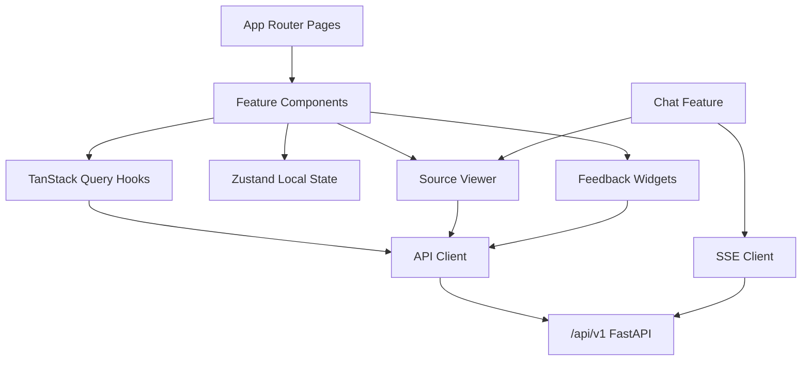
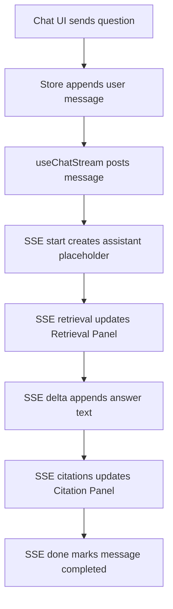

# KnowWeave 前端实现规格说明书

版本：v0.1
日期：2026-05-25
状态：草案
关联文档：`docs/07-search-and-chat-spec.md`、`docs/08-frontend-spec.md`、`docs/09-acceptance-test-spec.md`、`docs/10-evaluation-spec.md`、`docs/11-backend-implementation-spec.md`

## 0. 文档边界

本文定义 KnowWeave P0 前端如何从交互规格落到可开发代码，包括：

- Next.js App Router 项目结构。
- 页面路由、布局、组件边界和状态边界。
- API client、错误处理、分页、缓存和表单提交。
- SSE Chat 消费、引用展示、Source Viewer 和反馈提交。
- 文件上传、解析状态、chunk 治理、Wiki 编辑、Search 和 Evaluation Candidate 的实现路径。
- 前端测试、Mock Service、可访问性和性能要求。

本文不负责：

- 页面信息架构和详细交互规则，见 `docs/08-frontend-spec.md`。
- 后端 API、Service 和数据库实现，见 `docs/11-backend-implementation-spec.md`。
- Docker Compose、部署脚本和演示数据，见后续 `13-devops-and-demo-spec.md`。
- 完整设计系统、权限系统、多租户和复杂协作编辑；这些属于 P1/P2。

## 1. 实现目标

第 12 篇的目标是让前端开发可以直接开工，不需要重新解释前端交互和后端 API 的衔接方式。

P0 前端必须做到：

- 通过浏览器完成文件上传、解析、chunk 查看、chunk 编辑、搜索、Chat、Wiki、Feedback 和 Evaluation Sample Candidate 主链路。
- 统一消费 `/api/v1` 后端接口，不在页面组件中散落 `fetch` 细节。
- 稳定消费 Chat SSE，展示 start、retrieval、delta、citations、done、error 状态。
- 所有答案、Wiki、chunk 和反馈入口都能跳转到 Source Viewer 或 citation panel。
- 所有反馈统一提交到 `POST /api/v1/feedback`。
- 为 P1 的向量检索、任务 WebSocket、模型配置、Evaluation Runs 和权限控制保留扩展口。

## 2. 技术栈决策

第 08 篇将 React + TypeScript / Vite 作为交互阶段推荐方案，并把 Next.js 作为可选项。第 12 篇进入工程实现阶段，采用 Next.js App Router 作为 P0 落地方案。

| 类型 | P0 选择 | 说明 |
| --- | --- | --- |
| Framework | Next.js 14+ App Router | 统一路由、布局、服务端边界和后续部署路径 |
| Runtime | Node.js 20+ | 与 Next.js 和测试生态匹配 |
| Language | TypeScript | API DTO、组件 props、状态类型必须显式 |
| Styling | Tailwind CSS + CSS Modules 可选 | P0 以工具类和少量模块样式为主 |
| UI Primitives | shadcn/ui 或 Radix UI | 表单、Dialog、Tabs、Popover、Toast 等基础组件 |
| Icons | lucide-react | 操作按钮、状态和空状态图标 |
| Server State | TanStack Query | 列表、详情、提交、缓存失效和轮询 |
| Local State | Zustand | 布局状态、Source Viewer、Chat draft 和临时筛选器 |
| Forms | React Hook Form + Zod | 表单校验、API DTO 映射 |
| Markdown | react-markdown + remark-gfm + rehype-sanitize | Chat、Wiki、chunk preview |
| SSE | 原生 EventSource 或 fetch stream | Chat 流式输出，优先封装成 hook |
| Test | Vitest + Testing Library + Playwright | 单元、组件、端到端冒烟 |
| Mock | MSW | 本地前端开发和组件测试 |

约束：

- 页面组件不得直接拼接 API URL。
- 后端 DTO 类型集中放在 `src/entities` 或 `src/shared/api`。
- 表格、筛选、分页和状态标签必须复用基础组件。
- P0 不做复杂主题系统，但颜色、间距和状态表达必须统一。

## 3. 前端目录结构

建议前端目录放在 `frontend/` 下：

```text
frontend/
  app/
    layout.tsx
    page.tsx
    files/
      page.tsx
      [fileId]/
        page.tsx
    chunks/
      page.tsx
      [chunkId]/
        page.tsx
    knowledge-units/
      page.tsx
    wiki/
      page.tsx
      [wikiPageId]/
        page.tsx
    search/
      page.tsx
    chat/
      page.tsx
      [sessionId]/
        page.tsx
    evaluation/
      page.tsx
    settings/
      page.tsx
  src/
    app-shell/
      AppSidebar.tsx
      TopBar.tsx
      RouteBreadcrumbs.tsx
      CommandMenu.tsx
    shared/
      api/
        client.ts
        errors.ts
        pagination.ts
        queryKeys.ts
        sse.ts
      config/
        env.ts
        routes.ts
      ui/
        Button.tsx
        DataTable.tsx
        StatusBadge.tsx
        EmptyState.tsx
        ConfirmDialog.tsx
        ToastProvider.tsx
      hooks/
        useDebouncedValue.ts
        useDisclosure.ts
        useUrlState.ts
    entities/
      files.ts
      blocks.ts
      chunks.ts
      search.ts
      chat.ts
      wiki.ts
      feedback.ts
      evaluation.ts
      common.ts
    features/
      file-upload/
      file-detail/
      chunk-workspace/
      source-viewer/
      search/
      chat/
      wiki-editor/
      feedback/
      evaluation-candidate/
    mocks/
      handlers.ts
      browser.ts
      fixtures/
    tests/
      setup.ts
  public/
  package.json
  next.config.mjs
  tsconfig.json
  playwright.config.ts
```

目录原则：

- `app/` 只承载路由、布局和页面组装。
- `features/` 承载业务组件和局部状态。
- `entities/` 承载领域类型、状态枚举和 DTO 转换。
- `shared/api/` 负责 HTTP、SSE、错误映射、分页和 query key。
- `shared/ui/` 只放不感知业务对象的基础组件。
- `mocks/` 必须能支撑无后端的前端开发和测试。

## 4. 页面路由

P0 路由统一使用 App Router。

| 页面 | 路径 | P0 | 主要组件 |
| --- | --- | --- | --- |
| Dashboard | `/` | 是 | `DashboardOverview`、`RecentActivity`、`ActionQueue` |
| File List | `/files` | 是 | `FileUploadDropzone`、`FileTable`、`FileFilters` |
| File Detail | `/files/[fileId]` | 是 | `FileSummary`、`BlockList`、`FileChunkTable`、`FileWikiPanel` |
| Chunk Workspace | `/chunks` | 是 | `ChunkFilterBar`、`ChunkDataTable`、`BulkActionBar` |
| Chunk Detail | `/chunks/[chunkId]` | 是 | `ChunkEditor`、`SourceSpanPanel`、`RelatedObjectsPanel` |
| Knowledge Units | `/knowledge-units` | 是 | `KnowledgeUnitTable`、`KuSourcePanel` |
| Wiki List | `/wiki` | 是 | `WikiTable`、`WikiStatusFilters` |
| Wiki Detail | `/wiki/[wikiPageId]` | 是 | `WikiReader`、`WikiEditor`、`CitationList` |
| Search | `/search` | 是 | `SearchBox`、`SearchResultList`、`RetrievalRunPanel` |
| Chat | `/chat` | 是 | `SessionList`、`ChatComposer`、`MessageList` |
| Chat Session | `/chat/[sessionId]` | 是 | `MessageList`、`CitationPanel`、`FeedbackBar` |
| Evaluation | `/evaluation` | P0 candidate / P1 run | `EvaluationCandidateTable` |
| Settings | `/settings` | P1 | `ProviderConfigPanel` |

路由规则：

- P0 不做深层嵌套路由，详情页通过页面内 Tabs 组织信息。
- 筛选、搜索词、排序、页码写入 URL query，保证可分享和可回退。
- Source Viewer 使用右侧 Drawer，不单独占用主路由；P1 可扩展为 `/sources`.

## 5. 模块关系



关键边界：

- `features/chat` 可以依赖 `features/source-viewer` 和 `features/feedback`。
- `features/source-viewer` 不依赖 Chat，只消费 citation、chunk、source span DTO。
- `features/feedback` 不关心来源页面，只接收 target 和 metadata。
- `shared/api` 不依赖 React 组件。

## 6. API Client

### 6.1 基础配置

环境变量：

| 变量 | 必填 | 示例 | 说明 |
| --- | --- | --- | --- |
| `NEXT_PUBLIC_API_BASE_URL` | 否 | `http://localhost:8000/api/v1` | 浏览器访问后端 API |
| `NEXT_PUBLIC_APP_ENV` | 否 | `development` | UI 环境标识 |
| `NEXT_PUBLIC_ENABLE_MOCKS` | 否 | `false` | 是否启用 MSW |

`apiClient` 规则：

- 自动拼接 `/api/v1`。
- 自动解析 `{ data, error, request_id }` 响应包装。
- 后端返回 `error` 时抛出 `ApiError`。
- 支持 `AbortSignal`。
- 文件上传使用 `FormData`，不得手动设置 multipart boundary。

### 6.2 错误映射

| 后端错误码 | 前端展示 |
| --- | --- |
| `VALIDATION_ERROR` | 表单字段错误或 toast |
| `FILE_TYPE_NOT_SUPPORTED` | 上传组件内联错误 |
| `FILE_TOO_LARGE` | 上传组件内联错误 |
| `FILE_NOT_FOUND` | 详情页 Not Found 状态 |
| `SOURCE_UNAVAILABLE` | Source Viewer 显示来源不可用 |
| `SEARCH_FAILED` | Search 结果区错误状态 |
| `CHAT_STREAM_FAILED` | Chat message 标记 failed，允许重试 |
| `PROVIDER_TIMEOUT` | Chat toast + message failed |
| `PROVIDER_AUTH_FAILED` | Settings 或系统配置提示 |

前端不得直接展示后端堆栈、Provider 原始异常或 API Key。

### 6.3 Query Key

Query key 必须稳定：

```text
files.list(filters)
files.detail(fileId)
files.blocks(fileId)
files.chunks(fileId, filters)
chunks.list(filters)
chunks.detail(chunkId)
search.run(retrievalRunId)
wiki.list(filters)
wiki.detail(wikiPageId)
chat.sessions()
chat.session(sessionId)
evaluation.samples(filters)
```

Mutation 成功后的失效规则：

| Mutation | 失效 |
| --- | --- |
| upload file | `files.list`、`dashboard.summary` |
| parse file | `files.detail`、`files.blocks`、`files.chunks` |
| edit chunk | `chunks.detail`、`chunks.list`、`files.chunks`、`search` |
| ignore / verify chunk | `chunks.list`、`chunks.detail`、`dashboard.summary` |
| generate wiki | `wiki.list`、`wiki.detail`、`files.detail` |
| edit wiki | `wiki.detail`、`wiki.list` |
| submit feedback | `feedback.list`、`evaluation.samples`、`dashboard.summary` |

## 7. 页面实现规格

### 7.1 Dashboard

Dashboard 用于快速判断系统状态和待处理事项。

P0 内容：

- 文件总数、解析成功数、解析失败数。
- chunk 总数、低质量 chunk 数、ignored chunk 数。
- Wiki draft / verified 数。
- 最近上传文件。
- 最近负反馈。
- 待处理入口：解析失败、低质量 chunk、citation_wrong、wiki_needs_update。

Dashboard 不做：

- P0 不展示复杂趋势图。
- P0 不实现团队维度权限统计。

### 7.2 Files

File List 必须支持：

- 上传 txt、md、pdf、docx。
- 显示文件名、类型、大小、状态、chunk count、wiki count、更新时间。
- 按状态、类型、关键词筛选。
- 进入 File Detail。
- 软删除文件。

File Detail 必须支持：

- 展示 metadata、parse status、parse warnings。
- 展示 Document Blocks。
- 展示文件内 chunks。
- 触发 parse、reparse 或 rechunk。
- 触发 Document Wiki 生成。

### 7.3 Chunk Workspace

Chunk Workspace 是 P0 前端重点。

必须支持：

- 按文件、状态、质量 flag、关键词筛选。
- 展示 raw_content preview、edited_content preview、source locator、status、quality_flags。
- 批量 ignore / verify。
- 进入 Chunk Detail。
- 从 Chunk Detail 打开 Source Viewer。
- 编辑 chunk 时明确区分 raw_content 和 edited_content。

编辑规则：

- 保存前展示 dirty 状态。
- 保存成功后失效 chunk、search 和 file chunk query。
- 如果 source unavailable，允许编辑内容但 Source Viewer 显示不可用。

### 7.4 Source Viewer

Source Viewer 使用 Drawer 或 Split Panel。

输入：

```text
file_id
chunk_id
source_span_id
page_number
source_selector
preview_text
```

P0 展示：

- 文件名、类型、页码或块号。
- source span preview。
- 当前 chunk / citation 高亮。
- 来源不可用状态。

P1 扩展：

- PDF.js bbox 高亮。
- DOCX paragraph 定位。
- Markdown 行号定位。
- 图片、表格、公式 typed block 预览。

### 7.5 Search

Search 页面必须支持：

- 输入 query。
- 选择 target types：file、chunk、knowledge_unit、wiki_page。
- 设置 top_k。
- 展示 retrieval_run_id。
- 展示 result type、title、snippet、score、source_available。
- 打开 Source Viewer 或对象详情页。
- 对检索结果提交 `retrieval_missing` 或 `retrieval_irrelevant` feedback。

Search API：

```text
POST /api/v1/search
GET  /api/v1/search/runs/{retrieval_run_id}
```

反馈统一：

```text
POST /api/v1/feedback
```

### 7.6 Chat

Chat 页面必须支持：

- 创建 session。
- 列出 session。
- 发送用户 message。
- 消费 SSE。
- 展示 retrieval event。
- 展示 streaming delta。
- 展示 citations。
- answer、citation、retrieval 均可提交 feedback。
- 负反馈可转 Evaluation Sample Candidate。

Chat 页面状态：

| 状态 | UI 表达 |
| --- | --- |
| idle | Composer 可输入 |
| submitting | Composer disabled，message pending |
| streaming | Answer message 显示流式内容 |
| done | 展示 citations 和 feedback |
| failed | 显示错误、允许 retry |
| partial | 显示 partial badge、允许 retry |

### 7.7 Wiki

Wiki List 必须支持：

- 按 status、source file、keyword 筛选。
- 展示 title、status、source_available、updated_at、citation count。
- 进入 Wiki Detail。

Wiki Detail 必须支持：

- Markdown 阅读。
- Markdown 编辑和 preview。
- citation list。
- status 更新。
- change_summary 必填。
- 打开 Source Viewer。
- 提交 `wiki_needs_update` feedback。

P0 不做多人协同编辑和富文本编辑器。

### 7.8 Evaluation Candidate

P0 Evaluation 页面只做候选样本管理，不做完整评测运行。

必须支持：

- 查看 candidate / draft / verified / rejected / archived。
- 从 Chat message 或 Feedback 创建 candidate。
- 编辑 expected_answer、expected_source_hint。
- 标记 verified 或 rejected。

P1 扩展 Evaluation Runs、指标趋势、失败样本分析。

## 8. SSE Chat 实现

### 8.1 事件协议

前端必须消费以下事件：

```text
start
retrieval
delta
citations
done
error
```

事件处理：

| 事件 | 前端动作 |
| --- | --- |
| `start` | 创建 assistant placeholder，保存 message_id 和 retrieval_run_id |
| `retrieval` | 写入 Retrieval Panel |
| `delta` | 追加 answer buffer |
| `citations` | 更新 Citation Panel |
| `done` | 标记 completed，失效 session query |
| `error` | 标记 failed 或 partial，显示错误 |

### 8.2 Hook 设计

建议封装：

```text
useChatStream(sessionId)
```

职责：

- 发送 message。
- 打开 SSE。
- 管理 AbortController。
- 将事件规约为前端 message state。
- 支持 retry。
- 组件 unmount 时关闭连接。

### 8.3 Chat 流程



## 9. Feedback 实现

所有反馈统一提交：

```text
POST /api/v1/feedback
```

前端 feedback target：

| 页面 | target_type | metadata |
| --- | --- | --- |
| Chat answer | `answer` | `message_id`、`retrieval_run_id` |
| Citation | `citation` | `message_id`、`retrieval_run_id` |
| Search result | `retrieval` | `retrieval_run_id`、`result_id` |
| Chunk | `chunk` | `chunk_id`、`file_id` |
| Wiki | `wiki` | `wiki_page_id` |

Feedback UI：

- thumbs up / thumbs down 用于快速反馈。
- citation_wrong、retrieval_missing、chunk_low_quality、wiki_needs_update 使用菜单或 dialog。
- 负反馈允许填写 comment。
- 提交成功后显示 toast，并提供“转为评测样本”入口。

## 10. 状态管理

### 10.1 Server State

以下数据必须走 TanStack Query：

- 文件列表和详情。
- blocks、chunks、wiki、search runs。
- chat sessions 和历史 messages。
- feedback list。
- evaluation samples。

轮询规则：

| 对象 | P0 轮询 |
| --- | --- |
| file parse status | running 时 2s |
| wiki generation | running 时 2s |
| evaluation sample list | 不轮询 |
| chat stream | SSE，不轮询 |

### 10.2 Local State

以下数据使用 Zustand 或 React local state：

- Sidebar open / collapsed。
- Source Viewer open state。
- 当前 active citation。
- Chat draft。
- chunk edit dirty state。
- command menu open state。

禁止把 server state 手动复制到 Zustand 长期保存。

## 11. UI 组件规范

基础组件：

| 组件 | 用途 |
| --- | --- |
| `DataTable` | 文件、chunk、wiki、evaluation 列表 |
| `StatusBadge` | parse、chunk、wiki、message 状态 |
| `SourceLink` | 打开 Source Viewer |
| `FeedbackMenu` | 统一反馈入口 |
| `MarkdownRenderer` | Chat 和 Wiki |
| `CitationList` | Answer 和 Wiki citation |
| `InlineError` | 表单和局部错误 |
| `EmptyState` | 空列表和无结果 |

UI 规则：

- 工具按钮使用图标 + tooltip。
- 危险操作必须确认。
- 表格列宽稳定，长文本使用 preview + drawer。
- 状态颜色保持一致：success、warning、error、muted。
- 所有图标按钮必须有 `aria-label`。

## 12. Mock 与开发模式

P0 必须提供 MSW mock：

- 文件列表。
- 文件详情。
- chunk 列表和详情。
- search results。
- chat SSE fake stream。
- wiki 列表和详情。
- feedback submit。
- evaluation candidate list。

Mock 数据必须覆盖：

- parse_succeeded。
- parse_failed。
- low_quality chunk。
- source_unavailable citation。
- streaming chat success。
- streaming chat error。

Mock 不是测试替代品，但必须支持前端无后端启动。

## 13. 测试策略

### 13.1 单元测试

必须覆盖：

- API error mapping。
- query key 生成。
- feedback payload builder。
- SSE event reducer。
- Source Viewer locator formatting。

### 13.2 组件测试

必须覆盖：

- File upload validation。
- Chunk editor dirty / save / error 状态。
- Search result list。
- Citation panel。
- Wiki editor change_summary 必填。
- Feedback dialog。

### 13.3 E2E 测试

P0 Playwright 冒烟：

1. 进入 Files，上传 Markdown 文件。
2. 等待 parse_succeeded。
3. 打开 chunks，编辑一个 chunk。
4. 执行 Search，打开 Source Viewer。
5. 进入 Chat，发送问题，等待 SSE done。
6. 对 citation 提交 citation_wrong feedback。
7. 将 feedback 转为 evaluation sample candidate。

## 14. 性能与可访问性

性能要求：

- 首屏工作台在本地开发环境 2s 内可交互。
- 长列表使用分页，不在 P0 引入无限滚动。
- Markdown 渲染使用 memo，避免每个 delta 触发全量重渲染。
- Chat delta 合并节流到 30 到 60ms 刷新 UI。
- Source Viewer 打开时懒加载大预览组件。

可访问性要求：

- 所有按钮可键盘访问。
- Dialog、Drawer、Popover 有焦点管理。
- 表单错误与字段关联。
- 状态不能只靠颜色表达。
- Streaming answer 区域设置合理的 live region，避免过度朗读。

## 15. 安全要求

- Markdown 必须 sanitize。
- 外链必须使用安全属性。
- 不在浏览器存储 API Key。
- 上传文件名仅用于展示，不参与前端路径拼接。
- 错误 toast 不展示后端堆栈。
- Source Viewer 不绕过后端权限检查。

## 16. P0 实现里程碑

| 顺序 | 任务 | 产出 | 验收 |
| --- | --- | --- | --- |
| 1 | 前端脚手架 | Next.js、TypeScript、Tailwind、基础布局 | `/` 可访问 |
| 2 | API Client | `apiClient`、错误映射、query keys | mock 和真实 API 可切换 |
| 3 | Files | 上传、列表、详情、parse 状态 | 文件主链路可见 |
| 4 | Chunks | 列表、详情、编辑、ignore、verify | chunk 治理可完成 |
| 5 | Source Viewer | Drawer、source locator、citation 高亮 | chunk/citation 可定位 |
| 6 | Search | query、filters、results、run panel | 检索结果可解释 |
| 7 | Chat SSE | session、composer、stream、citations | 流式回答可用 |
| 8 | Wiki | list、detail、editor、citation | Wiki 可读写 |
| 9 | Feedback | 统一 feedback payload | answer/citation/chunk/wiki 可反馈 |
| 10 | Evaluation Candidate | candidate list 和创建入口 | feedback/chat 可转样本 |
| 11 | E2E Smoke | Playwright 主链路 | P0 演示流程可跑 |

## 17. P0 验收标准

前端 P0 必须通过：

- 无后端时可以用 MSW 打开主要页面。
- 连接后端时可以完成文件上传和解析状态查看。
- chunk 可以查看、编辑、ignore、verify。
- Source Viewer 可以从 chunk、Search result、citation 打开。
- Search 可以返回 retrieval_run_id 和结果列表。
- Chat 可以消费 SSE 并展示 citations。
- Feedback 统一提交到 `POST /api/v1/feedback`。
- Wiki 可以生成后查看和编辑，编辑时 change_summary 必填。
- Evaluation Candidate 可以从 feedback 或 chat 创建。
- Playwright P0 smoke 通过。

## 18. 与前序文档对齐

| 来源文档 | 本文承接 |
| --- | --- |
| `07-search-and-chat-spec.md` | 落地 Search UI、Chat SSE、citation 和统一 feedback |
| `08-frontend-spec.md` | 落地页面路由、组件边界、Source Viewer 和治理工作台交互 |
| `09-acceptance-test-spec.md` | 落地 P0 前端冒烟路径 |
| `10-evaluation-spec.md` | 落地 Evaluation Sample Candidate 管理 |
| `11-backend-implementation-spec.md` | 落地 `/api/v1` API client、错误映射和 SSE 消费 |

## 19. 后续文档

第 12 篇完成后，DevOps 和 Demo 规格由以下文档承接：

1. `13-devops-and-demo-spec.md`
   - 定义 Docker Compose、PostgreSQL + pgvector 初始化、环境变量、前后端启动、演示数据和答辩流程。
2. 工程脚手架实现
   - 创建 `backend/`、`frontend/`、`docker-compose.yml`，并优先跑通 P0 smoke。
