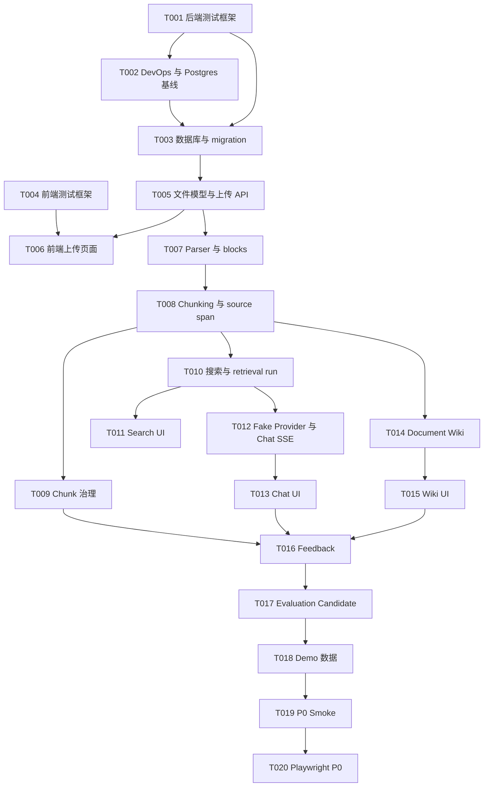

# KnowWeave TDD 任务拆解说明书

版本：v0.1
日期：2026-05-25
状态：草案
关联文档：`docs/09-acceptance-test-spec.md`、`docs/11-backend-implementation-spec.md`、`docs/12-frontend-implementation-spec.md`、`docs/13-devops-and-demo-spec.md`

## 0. 文档边界

本文定义 KnowWeave 从规格文档进入工程实现时的任务拆解和 TDD 执行顺序。

本文负责：

- 把 P0 工程实现拆成可执行、可验收、可回归的任务。
- 规定每个任务必须先补测试，再写实现，再跑验收。
- 明确后端、前端、DevOps、Smoke 的最小测试命令和完成标准。
- 让后续开发可以按任务逐项推进，而不是一次性堆叠代码。

本文不负责：

- 重新定义产品范围，产品范围以 `01-product-spec.md` 为准。
- 重新定义 API 和数据模型，API 与数据模型以 `04-data-model-spec.md`、`07-search-and-chat-spec.md`、`11-backend-implementation-spec.md` 为准。
- 替代验收规格，端到端验收仍以 `09-acceptance-test-spec.md` 和 `13-devops-and-demo-spec.md` 为准。

## 1. TDD 执行原则

KnowWeave P0 工程实现采用 Red / Green / Refactor 节奏。

| 阶段 | 要求 | 交付物 |
| --- | --- | --- |
| Red | 先写失败测试，测试必须表达需求和边界 | 单元、API、组件、E2E 或 smoke 测试 |
| Green | 写最少实现让测试通过 | 可运行代码和必要配置 |
| Refactor | 保持测试通过的前提下整理结构 | 更清晰的 Service、组件、Provider、脚本 |

硬性规则：

- 没有测试的业务任务不算完成。
- 每个任务至少有一个自动化验证入口。
- Provider、文件解析、SSE、feedback、evaluation candidate 必须有 fake/mock 路径，避免测试依赖真实外部服务。
- 后端任务优先写 pytest；前端任务优先写 Vitest / Testing Library；跨前后端任务使用 Playwright 或 `scripts/smoke-p0.ps1`。
- 数据库相关任务必须覆盖空库 migration 或测试库初始化。
- 任务完成时必须记录实际运行过的测试命令和结果。

## 2. 测试分层

| 层级 | 目的 | 工具 | 典型任务 |
| --- | --- | --- | --- |
| Unit | 验证纯函数、DTO、Provider adapter、chunking 策略 | pytest、Vitest | parser、chunking、API client、query key |
| Service | 验证业务规则和数据写入 | pytest + 测试数据库 | upload、parse、search、chat、wiki、feedback |
| API Contract | 验证 `/api/v1` 请求响应和错误码 | pytest + httpx/TestClient | files、chunks、search、chat、feedback |
| Component | 验证页面组件状态和交互 | Testing Library + MSW | Files、Chunk Workspace、Search、Chat、Wiki |
| E2E | 验证浏览器主链路 | Playwright + MSW 或真实后端 | 上传、治理、搜索、问答、反馈 |
| Smoke | 验证本地环境端到端可运行 | PowerShell + HTTP checks | health、migration、upload、search、chat、feedback |

## 3. 推荐工程测试命令

后续工程创建后，任务默认使用以下命令。若实际脚手架调整，必须同步更新本文。

```powershell
# 后端
cd backend
python -m pytest
python -m pytest tests/api/test_health.py
python -m pytest tests/service/test_file_service.py

# 前端
cd frontend
pnpm test
pnpm test:e2e
pnpm typecheck
pnpm lint

# DevOps / Smoke
docker compose up -d postgres
cd backend
alembic upgrade head
cd ..
powershell -ExecutionPolicy Bypass -File scripts/smoke-p0.ps1
```

## 4. 完成定义

每个任务完成必须同时满足：

1. 测试先于实现或与实现同一次提交中清晰对应。
2. 任务内列出的测试全部通过。
3. 没有真实 API Key、上传产物或本地日志被提交。
4. README 或开发命令在行为变化时同步更新。
5. 若任务引入新接口，至少有 API contract 测试。
6. 若任务引入新 UI 流程，至少有组件测试或 Playwright 测试。
7. 若任务影响 P0 主链路，必须更新或保持 `smoke-p0.ps1` 通过。

## 5. Sprint 0：工程骨架与测试基线

Sprint 0 的目标是让 KnowWeave 有可运行的前后端骨架、数据库基础和测试入口。此阶段不追求完整业务功能，但必须建立 TDD 的地基。

### T001 创建后端测试框架

目标：建立 FastAPI 后端测试基线。

先写测试：

- `backend/tests/api/test_health.py`
  - `GET /api/v1/health` 返回 200。
  - 响应包含 `status`、`service`、`version`。
- `backend/tests/unit/test_settings.py`
  - 缺省配置可以加载。
  - 测试环境不会要求真实 Qwen API Key。

实现范围：

- 创建 `backend/`、`app/main.py`、`app/api/v1/health.py`、`app/core/config.py`。
- 配置 pytest、pytest-asyncio、httpx/TestClient。
- 提供最小 FastAPI app factory。

验证命令：

```powershell
cd backend
python -m pytest tests/api/test_health.py tests/unit/test_settings.py
```

完成标准：

- health API 可访问。
- 测试环境不依赖数据库和外部 Provider。

### T002 创建 DevOps 与 Postgres 启动基线

目标：本地可以启动 PostgreSQL，并为后续 migration 测试提供稳定基础。

先写测试：

- `scripts/smoke-health.ps1`
  - 检查 postgres container 状态。
  - 在后端存在时检查 backend health。
  - 在前端存在时检查 frontend 首页 HTTP 200。
- `scripts/test-compose.ps1`
  - 检查 `docker-compose.yml` 语法可解析。
  - 检查 postgres 服务包含 pgvector image、端口、volume 和 init.sql 挂载。

实现范围：

- 创建 `docker-compose.yml`。
- 创建 `.env.example`。
- 创建 `docker/postgres/init.sql`，安装 pgvector。
- 创建 `scripts/dev-backend.ps1`、`scripts/dev-frontend.ps1`、`scripts/smoke-health.ps1`、`scripts/test-compose.ps1`。
- 创建或更新 `.gitignore`，排除上传文件、日志、`.env`、node_modules、缓存。

验证命令：

```powershell
powershell -ExecutionPolicy Bypass -File scripts/test-compose.ps1
docker compose up -d postgres
powershell -ExecutionPolicy Bypass -File scripts/smoke-health.ps1
```

完成标准：

- `docker compose up -d postgres` 可启动数据库。
- pgvector init SQL 已准备。
- smoke health 输出 pass / fail，并能在后端或前端尚未实现时给出明确 skipped 状态。

### T003 创建数据库与 migration 基线

目标：空数据库可以初始化 schema。

先写测试：

- `backend/tests/db/test_migration.py`
  - 测试数据库可以执行 `alembic upgrade head`。
  - pgvector extension 已安装或 init SQL 可安装。
- `backend/tests/db/test_session.py`
  - 可以打开并关闭数据库 session。

实现范围：

- 创建 SQLAlchemy session、base model、Alembic 配置。
- 创建第一版空 migration 或基础 metadata migration。

验证命令：

```powershell
docker compose up -d postgres
cd backend
alembic upgrade head
python -m pytest tests/db/test_migration.py tests/db/test_session.py
```

完成标准：

- 空库 migration 成功。
- 测试可以连接隔离数据库或测试 schema。

### T004 创建前端测试框架

目标：建立 Next.js 前端测试基线。

先写测试：

- `frontend/src/app-shell/AppShell.test.tsx`
  - 基础布局渲染导航和主内容区域。
- `frontend/src/shared/api/client.test.ts`
  - API client 正确拼接 base URL。
  - 错误响应映射为统一错误对象。

实现范围：

- 创建 `frontend/` Next.js App Router 项目结构。
- 配置 TypeScript、Tailwind、Vitest、Testing Library、MSW。
- 创建基础 AppShell、API client、环境变量读取。

验证命令：

```powershell
cd frontend
pnpm test
pnpm typecheck
```

完成标准：

- `/` 页面可以渲染。
- 前端测试和类型检查可运行。

## 6. Sprint 1：文件上传与解析入口

Sprint 1 的目标是让文件进入系统，并形成可追踪的文件记录、parse result 和 document block。

### T005 文件模型与上传 API

目标：支持上传文件并保存元数据。

先写测试：

- `backend/tests/api/test_files_upload.py`
  - 上传 Markdown 成功返回 `file_id`、`filename`、`status`。
  - 不支持文件类型返回明确错误码。
  - 文件内容保存到本地 storage。
- `backend/tests/service/test_file_service.py`
  - soft delete 不删除物理文件。
  - 文件路径不能由用户输入直接拼接。

实现范围：

- 创建 `knowledge_files` model 和 migration。
- 创建 `FileService`、`LocalStorageProvider`。
- 创建 `POST /api/v1/files`、`GET /api/v1/files`、`DELETE /api/v1/files/{file_id}`。

验证命令：

```powershell
cd backend
python -m pytest tests/api/test_files_upload.py tests/service/test_file_service.py
```

完成标准：

- Markdown / txt 可以上传。
- 上传记录和本地文件可追踪。

### T006 文件列表与前端上传页面

目标：用户可以在前端上传并查看文件。

先写测试：

- `frontend/src/features/file-upload/FileUpload.test.tsx`
  - 选择文件后调用 upload API。
  - 上传失败展示错误。
- `frontend/src/features/file-list/FileList.test.tsx`
  - 文件列表展示 filename、type、status、uploaded_at。

实现范围：

- 创建 `/files` 页面。
- 创建 FileUpload、FileList、FileStatusBadge。
- 使用 MSW mock 文件列表和上传响应。

验证命令：

```powershell
cd frontend
pnpm test -- file
pnpm typecheck
```

完成标准：

- 无后端时 MSW 可展示文件页面。
- 连接后端时可以上传 Markdown。

### T007 Parser adapter 与 document block

目标：上传后的文本类文件可以解析为 document blocks。

先写测试：

- `backend/tests/unit/test_text_parser.py`
  - txt 解析为段落 block。
  - md 保留标题、列表、表格的基本 block 类型。
- `backend/tests/service/test_parse_service.py`
  - parse 成功写入 parse_result 和 document_blocks。
  - parse 失败记录错误信息。

实现范围：

- 创建 `parse_results`、`document_blocks` model 和 migration。
- 创建 ParserProvider interface。
- 实现 TextParser、MarkdownParser。
- 创建 `POST /api/v1/files/{file_id}/parse`、`GET /api/v1/files/{file_id}/blocks`。

验证命令：

```powershell
cd backend
python -m pytest tests/unit/test_text_parser.py tests/service/test_parse_service.py
python -m pytest tests/api/test_file_parse.py
```

完成标准：

- Markdown 主链路可解析。
- 错误信息可追踪。

## 7. Sprint 2：Chunk 与 Source Span

Sprint 2 的目标是把 document blocks 转成可治理、可定位、可检索的 chunks。

### T008 Chunking 策略和 source span

目标：生成 text chunk 和来源定位。

先写测试：

- `backend/tests/unit/test_chunk_strategy.py`
  - 按 block 和长度生成 chunk。
  - chunk 保留 block id、line range 或 page locator。
- `backend/tests/service/test_chunk_service.py`
  - parse 后可以生成 chunks 和 source_spans。
  - ignored chunk 默认不参与搜索候选。

实现范围：

- 创建 `chunks`、`source_spans` model 和 migration。
- 创建 ChunkService。
- 创建 `POST /api/v1/files/{file_id}/chunks/build`、`GET /api/v1/chunks`。

验证命令：

```powershell
cd backend
python -m pytest tests/unit/test_chunk_strategy.py tests/service/test_chunk_service.py
python -m pytest tests/api/test_chunks.py
```

完成标准：

- 每个 chunk 可追溯到 source span。
- chunk 状态可表达 draft / verified / ignored。

### T009 Chunk 治理 API 与 UI

目标：用户可以查看、编辑、忽略、确认 chunk。

先写测试：

- `backend/tests/api/test_chunk_curation.py`
  - PATCH chunk 保存 `edited_content`，不覆盖 `raw_content`。
  - ignore 和 verify 状态更新成功。
- `frontend/src/features/chunk-workspace/ChunkWorkspace.test.tsx`
  - chunk 列表可筛选状态。
  - 编辑保存调用 API。
  - ignore 后状态标签变化。

实现范围：

- 创建 `PATCH /api/v1/chunks/{chunk_id}`。
- 创建 `/chunks` 页面和 ChunkWorkspace。
- 创建 SourceLocator 显示组件。

验证命令：

```powershell
cd backend
python -m pytest tests/api/test_chunk_curation.py
cd ../frontend
pnpm test -- chunk
```

完成标准：

- chunk raw / edited 分离。
- ignored chunk 在 UI 上明确可见。

## 8. Sprint 3：搜索与 Chat

Sprint 3 的目标是完成关键词检索、retrieval run、Chat SSE 和 citation 的闭环。

### T010 关键词搜索与 retrieval run

目标：关键词搜索返回可解释结果并记录检索过程。

先写测试：

- `backend/tests/service/test_search_service.py`
  - 搜索命中 chunk、file、wiki 候选。
  - ignored chunk 不返回。
  - 创建 retrieval_run 和 retrieved_contexts。
- `backend/tests/api/test_search.py`
  - `POST /api/v1/search` 返回 `retrieval_run_id` 和 results。

实现范围：

- 创建 `retrieval_runs`、`retrieved_contexts` model 和 migration。
- 创建 SearchService 和 PostgreSQL 关键词检索。
- 创建 `POST /api/v1/search`。

验证命令：

```powershell
cd backend
python -m pytest tests/service/test_search_service.py tests/api/test_search.py
```

完成标准：

- Search 结果可追溯到 retrieval run。
- 结果包含 source span 或 citation seed。

### T011 Search 前端页面

目标：用户可以搜索并理解结果来源。

先写测试：

- `frontend/src/features/search/SearchPage.test.tsx`
  - 输入 query 后展示结果。
  - 结果显示类型、摘要、score、source locator。
  - 点击结果打开 Source Viewer。

实现范围：

- 创建 `/search` 页面。
- 创建 SearchBox、SearchResultList、RetrievalRunPanel。
- 复用 Source Viewer 入口。

验证命令：

```powershell
cd frontend
pnpm test -- search
pnpm typecheck
```

完成标准：

- 搜索结果不是纯文本列表，必须展示来源和解释信息。

### T012 Fake Provider 与 Chat SSE

目标：Chat 可以在不调用真实 Qwen 的情况下稳定流式输出。

先写测试：

- `backend/tests/unit/test_fake_llm_provider.py`
  - Fake Provider 返回固定 delta。
  - Provider 错误被转换为统一错误。
- `backend/tests/api/test_chat_sse.py`
  - `POST /api/v1/chat` 返回 SSE start、retrieval、delta、citations、done。
  - Chat 完成后保存 message 和 citation。

实现范围：

- 创建 LLMProvider interface。
- 实现 FakeLLMProvider。
- 创建 chat session、chat message、citation model 和 migration。
- 创建 ChatService 和 SSE endpoint。

验证命令：

```powershell
cd backend
python -m pytest tests/unit/test_fake_llm_provider.py tests/api/test_chat_sse.py
```

完成标准：

- Chat 测试不依赖真实 Qwen。
- SSE 事件顺序符合 `07-search-and-chat-spec.md`。

### T013 Chat 前端流式消费

目标：前端可以消费 SSE 并展示 citations。

先写测试：

- `frontend/src/features/chat/useChatStream.test.ts`
  - start、delta、citations、done 正确更新状态。
  - error 事件展示可读错误。
- `frontend/src/features/chat/ChatPage.test.tsx`
  - 发送问题后展示流式回答。
  - citation 可点击打开 Source Viewer。

实现范围：

- 创建 `/chat` 页面。
- 创建 `useChatStream`、ChatComposer、MessageList、CitationPanel。
- 接入 feedback 入口占位。

验证命令：

```powershell
cd frontend
pnpm test -- chat
pnpm typecheck
```

完成标准：

- Chat UI 可以用 mock SSE 跑通。
- citation 展示和 source viewer 打通。

## 9. Sprint 4：Wiki、Feedback 与 Evaluation Candidate

Sprint 4 的目标是把问答和检索结果沉淀为可维护 Wiki，并把反馈转为评测样本候选。

### T014 Document Wiki 生成与编辑

目标：基于文件和 chunks 生成 Document Wiki draft。

先写测试：

- `backend/tests/service/test_wiki_service.py`
  - 生成 wiki draft 时引用 chunks。
  - 编辑 wiki 必须填写 `change_summary`。
- `backend/tests/api/test_wiki.py`
  - 创建、读取、编辑 wiki。
  - wiki citations 可返回 source span。

实现范围：

- 创建 wiki page、wiki citation model 和 migration。
- 创建 WikiService。
- 使用 Fake Provider 生成 deterministic wiki draft。
- 创建 `POST /api/v1/files/{file_id}/wiki`、`GET /api/v1/wiki`、`PATCH /api/v1/wiki/{wiki_id}`。

验证命令：

```powershell
cd backend
python -m pytest tests/service/test_wiki_service.py tests/api/test_wiki.py
```

完成标准：

- Wiki draft 可生成、读取、编辑。
- 编辑必须记录 change_summary。

### T015 Wiki 前端页面

目标：用户可以查看和编辑 Document Wiki。

先写测试：

- `frontend/src/features/wiki/WikiPage.test.tsx`
  - wiki 列表和详情可展示。
  - 编辑保存时 change_summary 必填。
  - citation 可打开 Source Viewer。

实现范围：

- 创建 `/wiki` 页面。
- 创建 WikiList、WikiEditor、WikiCitationPanel。
- 接入 markdown preview。

验证命令：

```powershell
cd frontend
pnpm test -- wiki
pnpm typecheck
```

完成标准：

- Wiki 是可编辑知识资产，不只是生成结果展示。

### T016 Feedback 统一入口

目标：answer、citation、chunk、wiki 都能提交统一 feedback。

先写测试：

- `backend/tests/service/test_feedback_service.py`
  - feedback 可以关联 message、citation、chunk、wiki。
  - 无效 target 返回明确错误。
- `backend/tests/api/test_feedback.py`
  - `POST /api/v1/feedback` 保存反馈并返回 feedback_id。
- `frontend/src/features/feedback/FeedbackDialog.test.tsx`
  - 选择 feedback type 后提交统一 payload。

实现范围：

- 创建 feedback model 和 migration。
- 创建 FeedbackService。
- 创建 `POST /api/v1/feedback`。
- 前端创建 FeedbackDialog 并接入 Chat、Search、Chunk、Wiki。

验证命令：

```powershell
cd backend
python -m pytest tests/service/test_feedback_service.py tests/api/test_feedback.py
cd ../frontend
pnpm test -- feedback
```

完成标准：

- feedback payload 统一。
- 前后端 target 类型一致。

### T017 Evaluation Sample Candidate

目标：feedback 或 chat 可以沉淀为 evaluation sample candidate。

先写测试：

- `backend/tests/service/test_evaluation_service.py`
  - citation_wrong feedback 可转样本候选。
  - chat message 可转样本候选并保留 retrieved_contexts。
- `backend/tests/api/test_evaluation_candidates.py`
  - 创建和列表查询 candidate。
- `frontend/src/features/evaluation/EvaluationCandidatePage.test.tsx`
  - candidate list 展示 query、answer、source、status。

实现范围：

- 创建 evaluation_samples model 和 migration。
- 创建 EvaluationService。
- 创建 `POST /api/v1/evaluation/candidates`、`GET /api/v1/evaluation/candidates`。
- 创建 `/evaluation` 页面。

验证命令：

```powershell
cd backend
python -m pytest tests/service/test_evaluation_service.py tests/api/test_evaluation_candidates.py
cd ../frontend
pnpm test -- evaluation
```

完成标准：

- feedback 不是死数据，能进入评测闭环。

## 10. Sprint 5：P0 Smoke 与演示闭环

Sprint 5 的目标是把前面所有任务串成可演示、可回归的 P0 主链路。

### T018 Demo 数据与 seed 脚本

目标：准备可提交的演示数据和可重复导入脚本。

先写测试：

- `scripts/test-demo-data.ps1`
  - 检查 `data/demo/company_policy.md`、`notes.txt` 存在。
  - 检查文件不为空且包含可搜索关键词。
- `backend/tests/service/test_seed_demo_data.py`
  - seed 后数据库出现 demo file records。

实现范围：

- 创建 `data/demo/`。
- 创建 `scripts/seed-demo-data.ps1`。
- 准备 Markdown 和 txt 主链路 demo；PDF / docx 可后续补充。

验证命令：

```powershell
powershell -ExecutionPolicy Bypass -File scripts/test-demo-data.ps1
powershell -ExecutionPolicy Bypass -File scripts/seed-demo-data.ps1
```

完成标准：

- demo 数据可重复导入。
- 不包含真实敏感信息。

### T019 P0 Smoke 脚本

目标：自动验证上传、解析、chunk、search、chat、feedback、evaluation candidate。

先写测试：

- `scripts/smoke-p0.ps1` 先以 failing checks 写出完整步骤。
- smoke 输出必须包含 `backend_health`、`migration_ok`、`file_id`、`chunk_count`、`retrieval_run_id`、`chat_message_id`、`feedback_id`、`evaluation_sample_id`、`result`。

实现范围：

- 用 HTTP 请求串联后端主链路。
- 默认使用 Markdown demo 和 Fake Provider。
- 输出 JSON 或稳定文本，便于答辩和回归记录。

验证命令：

```powershell
powershell -ExecutionPolicy Bypass -File scripts/smoke-p0.ps1
```

完成标准：

- smoke 返回 pass。
- 任一步失败都输出明确失败点。

### T020 Playwright P0 主链路

目标：浏览器端验证 P0 演示路径。

先写测试：

- `frontend/e2e/p0-smoke.spec.ts`
  - 打开 dashboard。
  - 上传 demo Markdown。
  - 查看 chunk。
  - 执行 search。
  - 发起 chat。
  - 提交 feedback。
  - 打开 evaluation candidate 页面。

实现范围：

- 配置 Playwright。
- 使用真实后端或 MSW E2E 模式。
- 在 README 中记录运行方式。

验证命令：

```powershell
cd frontend
pnpm test:e2e
```

完成标准：

- 浏览器主链路可跑。
- 失败截图和 trace 可用于定位问题。

## 11. 后续 P1/P2 不进入当前任务

以下内容不进入 P0 TDD 任务主线：

- pgvector 语义检索质量调优。
- Topic Wiki / FAQ Wiki。
- Wiki Revision diff / rollback UI。
- Web 模型配置页面。
- Celery / Redis / WebSocket 任务推送。
- 多租户权限系统。
- 图片、公式、音视频深度解析。
- 自动化评测运行平台。

这些可以在 P0 smoke 通过后单独建立 P1/P2 任务文档。

## 12. 推荐执行顺序



## 13. 开发记录模板

每完成一个任务，在 PR、提交说明或开发日志中记录：

```text
Task: Txxx - <任务名>
Red: <先写的测试文件和失败原因>
Green: <实现文件>
Refactor: <整理内容，没有则写 none>
Commands:
  - <实际运行的测试命令>
Result:
  - pass / fail
Notes:
  - <风险、降级、后续任务>
```

## 14. 第一批建议执行任务

工程开发开始时建议只领取以下 4 个任务：

1. T001 创建后端测试框架。
2. T002 创建 DevOps 与 Postgres 启动基线。
3. T003 创建数据库与 migration 基线。
4. T004 创建前端测试框架。

原因：

- 这 4 个任务建立测试、数据库、前端和启动脚本的底座。
- 后续业务任务都依赖这些基础能力。
- 先做业务功能会导致测试和脚本被动补齐，容易偏离 TDD。
