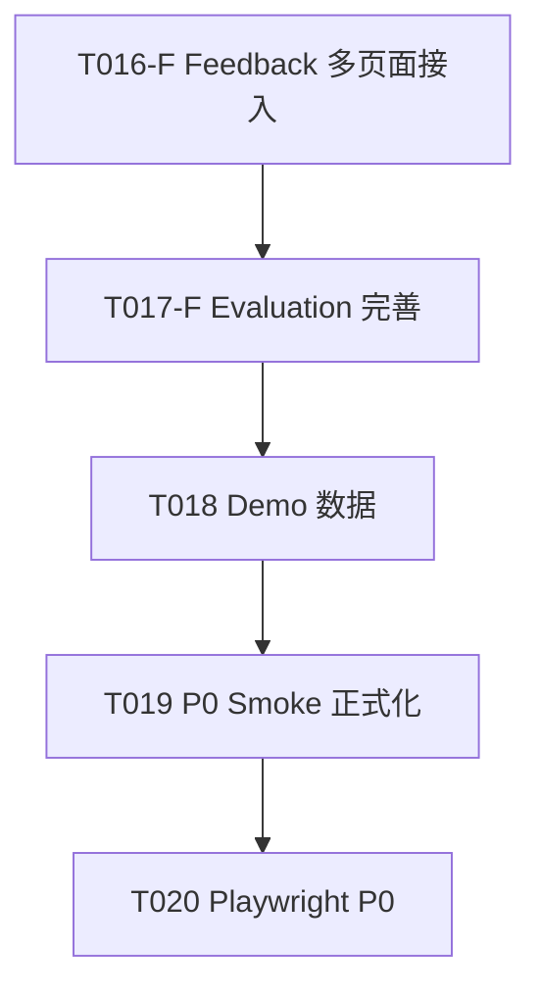

# KnowWeave Sprint 5 — P0 收尾与演示闭环

版本：v0.1
日期：2026-06-16
状态：草案
依赖文档：`01-product-spec.md`、`09-acceptance-test-spec.md`、`14-tdd-task-breakdown.md`

## 0. 文档目的

本文定义 KnowWeave 从当前状态到 P0 演示闭环的最后一公里。

核心目标：**让 Feedback 不仅可提交，还能被"看见"——在 Search/Chunk/Wiki 页面也能提交反馈；让 Evaluation Candidate 成为可用的评测资产而非空壳页面。**

## 1. 当前状态基线

以下是 2026-06-16 的实测状态（浏览器全链路测试 + 自动化测试结果）。

### 1.1 已完成（不再重复施工）

| 模块 | 后端 | 前端 | 测试 |
|------|:---:|:---:|:---:|
| 文件上传/解析 | ✅ | ✅ | ✅ |
| Chunk 构建/治理 | ✅ | ✅ | ✅ |
| LLM 知识提取 | ✅ | ✅ | ✅ |
| Wiki 生成/编辑 | ✅ | ✅ | ✅ |
| 全文搜索 | ✅ | ✅ | ✅ |
| AI 问答 (SSE+RAG) | ✅ | ✅ | ✅ |
| 对话会话管理 | - | ✅ | ✅ |
| 系统设置/模型配置 | ✅ | ✅ | - |
| Feedback 提交 (仅 Chat) | ✅ | 🔄 | ✅ |
| Evaluation Candidate | ✅ | 🔄 | ✅ |

### 1.2 已完成但散布未统一的

| 项目 | 现状 |
|------|------|
| Feedback 入口 | **仅 ChatPage** 的 AI 气泡底部有"反馈"按钮。Search/Chunk/Wiki 页面完全没有反馈入口 |
| Evaluation 页面 | 只展示候选列表（question + answer + status），无详情、无编辑、无指标 |
| Chat→Candidate 按钮 | 前端 Chat 页面没有"转为评测样本"按钮，但后端 API 已就绪 |
| P0 Smoke 脚本 | `scripts/smoke-e2e.py` 验证 8 步通过，但非 PowerShell 版本 |
| Demo 数据 | `data/demo/` 下有文件但无 seed 脚本，依赖手动上传 |

### 1.3 测试基线

```powershell
# 后端全部通过
conda activate knowweave
cd backend
python -m pytest tests/service/test_feedback_service.py        # 2 passed
python -m pytest tests/service/test_evaluation_service.py       # 2 passed
python -m pytest tests/api/test_feedback.py                     # 3 passed
python -m pytest tests/api/test_evaluation_candidates.py        # 2 passed

# 前端全部通过
cd frontend
npx vitest run src/features/feedback/FeedbackDialog.test.tsx    # 1 passed
npx vitest run src/features/chat/useChatStream.test.ts          # 3 passed
npx tsc --noEmit                                                # 0 errors
```

## 2. Sprint 5 任务拆解

### T016-F: Feedback 多页面接入

**现状**：FeedbackDialog 组件已存在，但只在 ChatPage 中使用。

**目标**：Search 搜索结果、Chunk 详情、Wiki 详情页面都能提交反馈。

**范围**：

| 页面 | 反馈入口 | target_type | 触发场景 |
|------|---------|-------------|---------|
| Chat | ✅ 已有 | `chat_message` | AI 回答气泡底部 |
| Search | ❌ 新增 | `chunk` / `knowledge_unit` | 每条搜索结果旁放小旗子图标 |
| Chunk | ❌ 新增 | `chunk` | 分块详情面板底部 |
| Wiki | ❌ 新增 | `wiki_page` | Wiki 详情页底部 |

**实现要点**：

1. Search 页面：每个搜索结果卡片加一个 `Flag` 图标按钮，点击弹出 FeedbackDialog
2. Chunk 页面：`ChunkWorkspace` 详情面板底部加反馈按钮（复用 `chunk_low_quality` 等类型）
3. Wiki 页面：Wiki 详情页底部加反馈按钮
4. 不需要新建组件——FeedbackDialog 是通用组件，只需传 `targetType` + `targetId`

**测试**：

```
frontend/src/features/search/__tests__/SearchFeedback.test.tsx    (NEW)
frontend/src/features/chunk-workspace/__tests__/ChunkFeedback.test.tsx (NEW)
frontend/src/features/wiki/__tests__/WikiFeedback.test.tsx        (NEW)
```

### T017-F: Evaluation Candidate 完善

**现状**：`EvaluationCandidatePage` 只做列表展示。后端 API 完备。

**目标**：评测候选可查看详情、编辑字段、转正/拒绝，展示基础指标。

**范围**：

1. 列表页增强：
   - 每个候选显示：question / expected_answer（截断）/ source 标签 / status badge / created_from
   - 状态筛选：全部 / candidate / verified / rejected
   - 选中后右侧显示详情面板

2. 详情面板（NEW）：
   - 问题文本（可编辑）
   - 预期答案（可编辑）
   - 来源文件列表
   - 来源 chunk 列表
   - 难度标记
   - 状态流转按钮：candidate → verified / rejected
   - metadata 折叠展示

3. 指标区（顶部卡片）：
   - 候选总数 / 已验证 / 待审核
   - 来源分布（feedback / chat_message / manual）

4. Chat→Candidate 入口：
   - ChatPage 的 AI 气泡底部加"转为评测"按钮，调用 `POST /chat/messages/{id}/to-evaluation-sample`

**前端 API 函数补充**（knowweave.ts）：

```ts
// 已存在
listEvaluationSamples(status?: string)
createEvaluationSampleFromFeedback(feedbackId: string)

// 需新增
getEvaluationSample(sampleId: string)
updateEvaluationSample(sampleId: string, input: {...})
getEvaluationMetrics()
createEvaluationSampleFromChatMessage(messageId: string)
```

### T018: Demo 数据与 Seed 脚本

**目标**：一键灌入可演示的完整数据集。

**范围**：

1. `scripts/seed-demo.ps1`：
   - 调用 `POST /files/upload` 上传 `data/demo/` 下文件
   - 自动解析 → 分块 → AI 提取知识单元 → 生成 Wiki
   - 自动提交几条 Feedback
   - 自动生成 2-3 个 Evaluation Sample Candidates
   - 输出 JSON 报告

2. Demo 数据文件（已有）：
   - `data/demo/company_policy.md` ✅
   - `data/demo/attendance.md` ✅
   - 考虑加一个 `data/demo/faq.md`

### T019: P0 Smoke 正式化

**现状**：`scripts/smoke-e2e.py` 已覆盖 8 步。

**目标**：重写为 `scripts/smoke-p0.ps1`，输出结构化 JSON。

**范围**：

1. 健康检查 → 上传 → 解析 → 分块 → 搜索 → Chat SSE → Feedback → 评测候选
2. 每步输出 `{"step": "...", "status": "pass|fail", "detail": {...}}`
3. 最终输出 `{"result": "pass|fail", "failed_steps": [...]}`
4. 支持 `-Provider Fake` 和 `-Provider Qwen` 两种模式

### T020: Playwright P0 演示脚本

**目标**：浏览器端自动跑一遍 P0 主链路，替代手工测试。

**范围**：

1. `frontend/e2e/p0-smoke.spec.ts`：
   - 打开 Dashboard → 验证统计数字
   - 进入文件管理 → 上传 demo 文件
   - 进入分块工作台 → 查看/编辑 chunk
   - 进入知识单元 → 点击 AI 提取 → 验证结果
   - 进入 Wiki → 创建 Topic Wiki → 查看内容
   - 进入搜索 → 搜索"审批" → 验证结果 > 0
   - 进入 AI 问答 → 发送问题 → 等待回答完成
   - 提交 Feedback → 确认成功
   - 进入评测 → 确认有候选样本

## 3. 执行顺序



T016 和 T017 共享 Feedback→Evaluation 链路，先做完 Feedback 接入才能验证整个闭环。

## 4. 验收标准

Sprint 5 结束时必须满足：

1. ✅ Search/Chunk/Wiki 页面均有可用的 Feedback 提交入口
2. ✅ Evaluation 页面可查看候选详情、编辑字段、变更状态
3. ✅ Chat 页面可一键将回答转为评测候选
4. ✅ `scripts/seed-demo.ps1` 一键灌入完整演示数据
5. ✅ `scripts/smoke-p0.ps1` 全链路自动验证通过
6. ✅ `pnpm test:e2e` Playwright 全部通过
7. ✅ 所有后端测试 + 前端测试通过
8. ✅ TypeScript 0 错误

## 5. 不进入本次范围

- pgvector 语义检索质量调优（P1）
- Wiki Revision diff / rollback UI（P1）
- 多租户权限系统（P1）
- 自动化评测运行平台（P2）
- 评测指标可视化大屏（P2）
