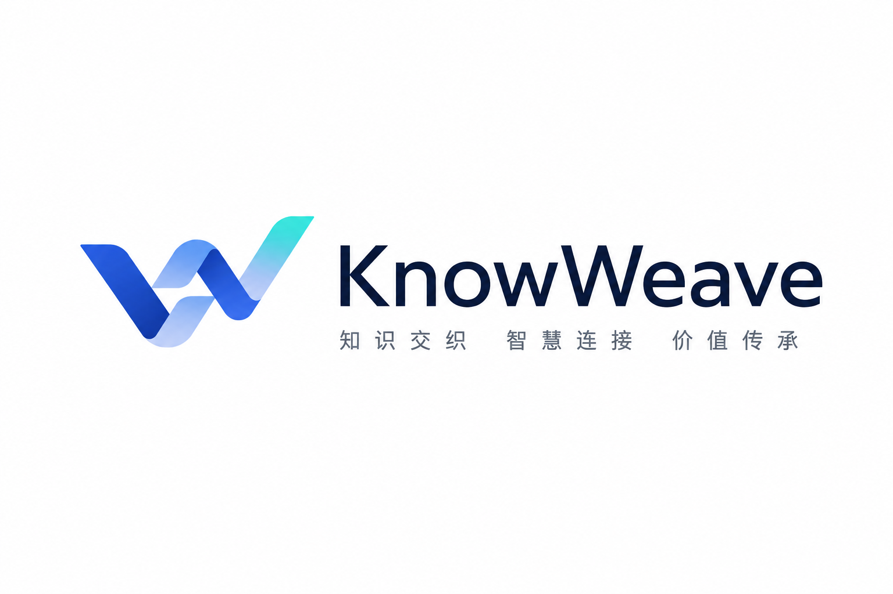

# KnowWeave 文档索引

本文档用于说明 `docs` 目录下各规格文档的阅读顺序和职责边界。

## 阅读顺序

| 文档 | 当前版本 | 职责 |
| --- | --- | --- |
| `00-project-dashboard.md` | v0.5 | 项目定位、生命周期、架构边界、路线图、任务拆分和评估指标的可视化入口 |
| `01-product-spec.md` | v1.2 | 产品定位、用户角色、核心概念、MVP 范围和验收标准 |
| `02-knowledge-lifecycle-spec.md` | v1.1 | 上传、解析、分块、检索、沉淀、评估的生命周期管理 |
| `03-system-architecture-spec.md` | v0.9 | 系统架构、模块边界、技术选型、数据流和扩展策略 |
| `04-data-model-spec.md` | v0.8 | 核心数据实体、关系、状态、索引、软删除、source span 定位和 Wiki Revision |
| `05-ingestion-spec.md` | v0.3 | 文件上传、解析、Document Block、chunking、source span 和重新处理 |
| `06-llm-wiki-spec.md` | v0.1 | LLM Wiki 生成、页面结构、引用、状态、修订历史和反馈闭环 |
| `07-search-and-chat-spec.md` | v0.4 | 搜索、RAG 问答、上下文组织、SSE 流式输出、引用和反馈评估闭环 |
| `08-frontend-spec.md` | v0.3 | 页面信息架构、chunk 治理 UI、Source Viewer、Chat/Wiki/Search 交互和流式 Markdown 渲染 |
| `09-acceptance-test-spec.md` | v0.2 | P0/P1/P2 验收测试、演示剧本、检查清单、失败分级和验收报告模板 |
| `10-evaluation-spec.md` | v0.2 | 评测样本、评测集、评测运行、指标计算、失败分析和回归评估 |
| `11-backend-implementation-spec.md` | v0.1 | FastAPI 后端实现、Service 边界、Provider 抽象、迁移、SSE 和测试策略 |

0. `00-project-dashboard.md`
   - 用图、表、路线图和任务拆分说明 KnowWeave 的整体定位。
   - 回答“评审或新成员如何在 5 分钟内看懂项目”。

1. `01-product-spec.md`
   - 定义 KnowWeave 的产品定位、用户角色、核心概念、MVP 范围和验收标准。
   - 回答“为什么做、为谁做、第一阶段做到什么程度”。

2. `02-knowledge-lifecycle-spec.md`
   - 定义知识从上传、解析、分块、检索、沉淀到评估的完整生命周期。
   - 回答“用户如何对知识处理过程进行细粒度管理，以及系统如何形成闭环”。

3. `03-system-architecture-spec.md`
   - 定义 KnowWeave 的系统架构、模块边界、技术选型、数据流和扩展策略。
   - 回答“前端、后端、存储、AI Provider 和各业务模块如何协作”。

4. `04-data-model-spec.md`
   - 定义 File、Parse Result、Document Block、Chunk、Source Span、Knowledge Unit、Wiki、Chat、Feedback 和 Evaluation Sample 的数据模型。
   - 回答“核心对象如何落表，以及软删除、引用失效、检索索引和后续向量能力如何预留”。

5. `05-ingestion-spec.md`
   - 定义文件上传、解析、Document Block 生成、chunking、source span 写入和重新处理。
   - 回答“原始文件如何稳定进入 KnowWeave，并变成可检索、可引用、可治理的 chunk”。

6. `06-llm-wiki-spec.md`
   - 定义 Document Wiki、Topic Wiki、FAQ Wiki 的页面结构、生成流程、引用规则、状态流转和修订历史。
   - 回答“KnowWeave 如何把 RAG 的临时上下文沉淀为长期可维护的 LLM Wiki”。

7. `07-search-and-chat-spec.md`
   - 定义 Search Result、RAG 上下文组织、SSE 协议、Citation 返回格式、Feedback 和 Evaluation Sample 沉淀。
   - 回答“KnowWeave 如何把检索、问答、引用和反馈连接成可评估的知识消费闭环”。

8. `08-frontend-spec.md`
   - 定义 Dashboard、Files、Chunks、Knowledge Units、Wiki、Search、Chat、Evaluation 等页面的交互边界。
   - 回答“用户如何在界面中细粒度查看、编辑、定位、反馈和沉淀知识”。

9. `09-acceptance-test-spec.md`
   - 定义 P0 MVP 的端到端验收剧本、模块检查清单、数据验收、失败分级和报告模板。
   - 回答“如何判断 KnowWeave 的第一阶段是真的跑通，而不是只完成了文档或局部功能”。

10. `10-evaluation-spec.md`
    - 定义评测样本、评测集、评测运行、指标计算、失败分析和回归评估。
    - 回答“如何判断知识库、检索、回答和引用在迭代后是否变好或回退”。

11. `11-backend-implementation-spec.md`
    - 定义 FastAPI、PostgreSQL + pgvector、SQLAlchemy/Alembic、Service 层、Provider 抽象、SSE 和测试策略。
    - 回答“前 10 篇 Spec 如何落到可开发、可测试、可演示的后端代码”。

## 文档边界

- 产品规格文档保持高层、稳定，不展开过多技术实现细节。
- 生命周期规格文档负责描述业务过程、用户操作和扩展方向，但不直接定义数据库表结构或 API 字段细节。
- 本阶段文档可以包含必要的 API 草案和验收场景；已完成搜索与问答 API 初稿、前端交互规格、验收测试规格、评测闭环规格和后端实现规格。

## 后续计划

建议后续进入工程实现拆分：

1. `12-frontend-implementation-spec.md`：Next.js 页面路由、组件结构、API client、状态管理和前端测试策略。
2. `13-devops-and-demo-spec.md`：Docker Compose、环境变量、演示数据和启动脚本。
